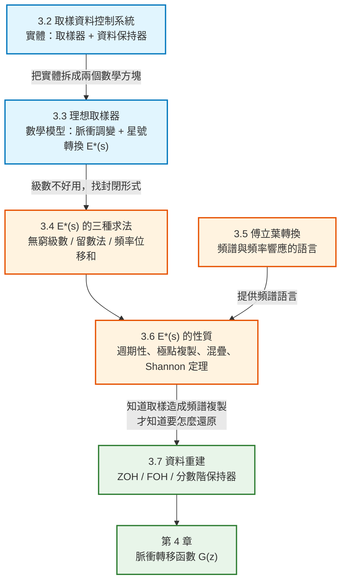

# 數位控制系統第三章：取樣與重建（Sampling and Reconstruction）筆記

本文件彙整教材第 3 章「Sampling and Reconstruction」的完整內容：取樣資料控制系統的實體架構（3.2）、理想取樣器與星號轉換的數學模型（3.3）、$E^*(s)$ 的三種求法（3.4）、傅立葉轉換的預備結果（3.5）、$E^*(s)$ 的兩個關鍵性質與 Shannon 取樣定理（3.6），以及三種資料保持器——零階、一階、分數階（3.7）。每個概念與公式均回答「它是什麼／為什麼需要它／怎麼推導／符號代表什麼／物理意義是什麼」，並附上 MATLAB / Octave 對照。

> **本章在全書的位置**：第 1 章把物理系統寫成連續時間模型，第 2 章建立離散時間系統與 z 轉換的數學工具。**本章是連接兩者的橋**——回答「把一個連續訊號每隔 $T$ 秒取樣一次，到底發生了什麼事？取樣後又怎麼還原回連續訊號？」第 4 章才能用這些結果推導開迴路離散系統的脈衝轉移函數。

> **符號說明**：原書使用 $\varepsilon$ 表示自然指數（即 $e$），並用 $\omega$ 表示角頻率。本筆記統一寫成 $e^{-Ts}$ 與 $\omega$，以符合現行通用寫法。原書以 $\delta(t)$ 表示單位脈衝函數。

---

## 全章架構



---

## 全章符號總表

| 符號 | 型別 | 意義 | 單位 |
|---|---|---|---|
| $e(t)$ | 純量函數 | 進入取樣器的連續時間訊號 | 視物理量而定 |
| $T$ | 純量 | **取樣週期**（sample period） | s |
| $e(kT)$ | 純量 | 第 $k$ 個取樣瞬間的訊號值 | — |
| $e^*(t)$ | 廣義函數 | 理想取樣器的輸出（脈衝串），**非物理訊號** | — |
| $E^*(s)$ | 複變函數 | **星號轉換**（starred transform），$e^*(t)$ 的拉氏轉換 | — |
| $\bar{e}(t)$ | 純量函數 | 零階保持器的輸出（階梯狀訊號），**是物理訊號** | — |
| $\delta(t)$ | 廣義函數 | 單位脈衝函數（Dirac delta） | — |
| $\delta_T(t)$ | 廣義函數 | 週期脈衝串，$\delta_T(t)=\sum_n\delta(t-nT)$ | — |
| $u(t)$ | 純量函數 | 單位步階函數 | — |
| $\omega$ | 純量 | 角頻率 | rad/s |
| $\omega_s$ | 純量 | **取樣角頻率**，$\omega_s=2\pi/T$ | rad/s |
| $E(j\omega)$ | 複變函數 | $e(t)$ 的傅立葉轉換（**頻譜**） | — |
| $G_{h0}(s)$ | 複變函數 | **零階保持器**（ZOH）轉移函數 | — |
| $G_{h1}(s)$ | 複變函數 | **一階保持器**（FOH）轉移函數 | — |
| $G_{hk}(s)$ | 複變函數 | **分數階保持器**轉移函數，$0\le k\le1$ | — |
| $\lambda$ | 複變數 | 留數法中的積分變數（原書用 $\nu$） | — |

---

## 一、導論 (3.1 Introduction)

第 2 章建立了「離散時間系統由差分方程式描述、系統內訊號是數列 $\{e(k)\}$」的觀念。這些數列有一部分是**對連續時間訊號取樣**得到的——數位控制系統正是如此。

因此，若要徹底理解數位控制系統的運作，就必須先弄清楚：

> **對一個連續時間訊號取樣，會對它的資訊內容造成什麼影響？**

這就是本章要回答的問題。

---

## 二、取樣資料控制系統 (3.2 Sampled-Data Control Systems)

### 1. 實體場景：雷達追蹤系統

教材用第 1 章介紹過的雷達追蹤系統（Fig. 3-1）來引入。只考慮航向角 $\psi_R(t)$ 的控制，閉迴路系統要自動追蹤飛機：

| 符號 | 意義 |
|---|---|
| $\psi_R(t)$ | 天線的航向指向角（**系統輸出**） |
| $\psi_A(t)$ | 飛機所在的角度（**參考輸入**） |
| $e(t)=\psi_A(t)-\psi_R(t)$ | 追蹤誤差 |

**關鍵限制**：雷達每 $T$ 秒才發射一次，因此**誤差 $e(t)$ 只在每隔 $T$ 秒才「已知」**。但雷達接收機必須**每一個時刻**都輸出電壓給功率放大器。

於是產生一個必須回答的問題：

> 既然只知道 $e(kT)$，那麼在 $t\neq kT$ 的時刻，要餵什麼訊號給功率放大器？

### 2. 為什麼需要「資料保持器」

一個直覺的想法是：只在取樣瞬間送出窄脈衝，其他時間送 0（Fig. 3-2 的脈衝串形式）。**但這是不可行的**——這種訊號含有大量高頻成分，直接餵給受控體會激發不想要的高頻動態。

因此必須在取樣器後面插入一個**資料重建裝置**，稱為**資料保持器**（data hold）：

> **資料保持器的目的**：把取樣後的訊號重建成「盡可能接近取樣前訊號」的形式。

最簡單、也是**目前最普遍**的資料保持器是**零階保持器**（zero-order hold, ZOH）：

> **零階保持器的動作**：把輸出訊號**夾持**在「取樣瞬間輸入訊號的值」，直到下一個取樣瞬間才更新。

```text
輸入 e(t)：平滑曲線
                    ↓  取樣器（每 T 秒看一眼）
取樣值 e(0), e(T), e(2T), ...
                    ↓  零階保持器（夾持住不變）
輸出 ē(t)：階梯狀訊號
```

### 3. 階梯訊號的數學式（式 3-1）

零階保持器的輸出 $\bar{e}(t)$ 可以用一連串「方波」疊加來表示——每一段方波是「在 $nT$ 升起、在 $(n+1)T$ 落下」，高度為 $e(nT)$：

$$
\bar{e}(t) = e(0)[u(t)-u(t-T)] + e(T)[u(t-T)-u(t-2T)] + e(2T)[u(t-2T)-u(t-3T)] + \cdots
$$

**符號解讀**：$u(t)$ 是單位步階函數。$[u(t-nT)-u(t-(n+1)T)]$ 這一組合就是「從 $nT$ 到 $(n+1)T$ 之間為 1、其餘為 0」的方窗。乘上高度 $e(nT)$，就是第 $n$ 段階梯。

### 4. 關鍵推導：分解出「取樣」與「保持」兩個獨立部分（式 3-2）

對式 (3-1) 取拉普拉斯轉換。利用 $\mathcal{L}[u(t-a)]=e^{-as}/s$：

$$
\bar{E}(s) = e(0)\left[\frac{1}{s}-\frac{e^{-Ts}}{s}\right] + e(T)\left[\frac{e^{-Ts}}{s}-\frac{e^{-2Ts}}{s}\right] + e(2T)\left[\frac{e^{-2Ts}}{s}-\frac{e^{-3Ts}}{s}\right] + \cdots
$$

把共同因子 $\dfrac{1-e^{-Ts}}{s}$ 提出來：

$$
\bar{E}(s) = \left[\frac{1-e^{-Ts}}{s}\right]\left[e(0)+e(T)e^{-Ts}+e(2T)e^{-2Ts}+\cdots\right]
$$

$$
\boxed{\;\bar{E}(s) = \underbrace{\left[\sum_{n=0}^{\infty}e(nT)e^{-nTs}\right]}_{\text{只和訊號 }e(t)\text{ 有關}}\underbrace{\left[\frac{1-e^{-Ts}}{s}\right]}_{\text{只和取樣週期 }T\text{ 有關}}\;}
$$

**這個分解是整章的核心。** 它告訴我們：一個「取樣器 + 零階保持器」的實體裝置，在數學上**恰好可以拆成兩個獨立方塊的串聯**：

| 因子 | 意義 | 對應方塊 |
|---|---|---|
| $\sum_{n=0}^{\infty}e(nT)e^{-nTs}$ | 只由訊號取樣值決定，與硬體無關 | **理想取樣器**（一個開關符號） |
| $\dfrac{1-e^{-Ts}}{s}$ | 與 $e(t)$ 完全無關，只由 $T$ 決定 | **資料保持器**（一個轉移函數方塊） |

### 5. 星號轉換的定義（式 3-3）

第一個因子被單獨命名：

$$
\boxed{\;E^*(s) \triangleq \sum_{n=0}^{\infty}e(nT)e^{-nTs}\;}
$$

稱為 $e(t)$ 的**星號轉換**（starred transform）。

```text
       ┌─────────────┐         ┌──────────────────┐
e(t)   │  理想取樣器  │  E*(s)  │  (1 - e^{-Ts})/s │   ē(t)
─────► │   （開關）   ├────────►│   資料保持器      ├──────►
E(s)   └─────────────┘         └──────────────────┘
```

> **💡 觀念解析與白話文（教材特別強調的一點）**
> - **$E^*(s)$ 在實體系統中「並不存在」**——它只是把式 (3-2) 做因式分解之後跑出來的一個中間量。
> - Fig. 3-5 中的開關**不是**在模擬一個實體取樣器，那個方塊也**不是**在模擬一個實體保持器。
> - **但兩者串聯起來，確實準確描述了「取樣器–資料保持器」這個實體裝置的輸入輸出特性。** 這正是上面那個因式分解所證明的事。
> - 為什麼要這樣拆？因為拆開之後，「取樣」這件事被隔離成一個純數學運算 $E^*(s)$，可以獨立分析它的性質（第 3.6 節），而「保持」變成一個普通的轉移函數，可以用一般的頻率響應工具分析（第 3.7 節）。

### 6. 取樣器沒有轉移函數（重要限制）

$$
\text{取樣器的輸出只取決於 } e(t) \text{ 在 } t=kT \text{ 的值}
$$

因此**許多不同的輸入訊號可以產生完全相同的輸出 $E^*(s)$**（只要它們在取樣點上的值一樣）。

但「轉移函數」的定義要求：**每一個不同的 $E(s)$ 必須對應到一個不同的 $E^*(s)$**。既然多對一，就不存在這樣的轉移函數。

> **這個限制是第 4 章一切困難的根源。** 因為取樣器沒有轉移函數，我們不能像連續系統那樣把方塊圖直接相乘化簡，必須另外推導脈衝轉移函數。

### 7. 補充：為什麼回授路徑常畫成單位增益

教材附帶說明：實際系統的回授路徑上會有感測器的轉移函數。但感測器的頻寬通常遠大於受控體，因此在系統分析與設計時可以視為**常數增益**，進而歸一化成 1。

---

## 三、理想取樣器 (3.3 The Ideal Sampler)

### 1. $e^*(t)$ 是一串脈衝（式 3-4）

對式 (3-3) 取反拉普拉斯轉換。因為 $e^{-nTs}$ 對應時域的「延遲 $nT$」，而常數對應脈衝：

$$
e^*(t)=\mathcal{L}^{-1}[E^*(s)] = e(0)\delta(t)+e(T)\delta(t-T)+e(2T)\delta(t-2T)+\cdots
$$

**物理意義**：$e^*(t)$ 是一串**脈衝函數**，每根脈衝出現在取樣瞬間，其**權重（面積）等於訊號在該瞬間的值**。

> **注意**：脈衝函數在發生瞬間的振幅是無限大，所以 Fig. 3-6 中箭頭的長度代表的是**權重**而不是振幅。$e^*(t)$ **不是物理訊號**。正因為輸出含有非物理的脈衝函數，這個取樣器才被稱為**理想取樣器**（ideal sampler），也稱為**脈衝調變器**（impulse modulator）。

### 2. 脈衝調變的觀點（式 3-5、3-6）

定義週期脈衝串：

$$
\delta_T(t)=\sum_{n=0}^{\infty}\delta(t-nT)=\delta(t)+\delta(t-T)+\delta(t-2T)+\cdots
$$

則：

$$
e^*(t)=e(t)\,\delta_T(t)=e(t)\delta(t)+e(t)\delta(t-T)+\cdots = e(0)\delta(t)+e(T)\delta(t-T)+\cdots
$$

（用到脈衝的**篩選性質**：$e(t)\delta(t-a)=e(a)\delta(t-a)$。）

**這個形式明確顯示：取樣就是一種調變。**

| 調變術語 | 對應本式 |
|---|---|
| **載波**（carrier） | $\delta_T(t)$，週期脈衝串 |
| **調變訊號**（modulating signal） | $e(t)$，原始連續訊號 |
| **已調變訊號** | $e^*(t)$ |

> **💡 為什麼「取樣 = 調變」這個觀點重要？** 因為調變在頻域的效果是**把訊號頻譜搬到載波頻率附近複製一份**。載波是週期為 $T$ 的脈衝串，它的頻譜本身也是脈衝串（間隔 $\omega_s$）。所以取樣的頻域效果就是**把原訊號頻譜以 $\omega_s$ 為間隔複製無限多份**——這正是第 3.6 節要證明的結果，也是混疊現象的來源。

### 3. 不連續點的處理（式 3-7 的定義）

如果 $e(t)$ 在 $t=kT$ 剛好不連續（例如單位步階在 $t=0$），$e(0)$ 到底該取 0 還是 1？教材給出明確定義：

> **定義**：理想取樣器的輸出訊號，定義為其拉氏轉換為
> $$E^*(s)=\sum_{n=0}^{\infty}e(nT)e^{-nTs}$$
> 的那個訊號。若 $e(t)$ 在 $t=kT$ 不連續，則 $e(kT)$ 取 **$e(kT^+)$**——也就是**從右側逼近**的值。

**唯一的例外**：若被取樣的訊號在取樣瞬間本身含有脈衝函數，則取樣訊號的拉氏轉換不存在。但實務上的連續訊號不會含脈衝函數，因此這個限制無實際影響。

### 4. 零階保持器的轉移函數（式 3-8）

把式 (3-2) 的第二個因子單獨拿出來命名：

$$
\boxed{\;G_{h0}(s)=\frac{1-e^{-Ts}}{s}\;}
$$

> **教材強調**：式 (3-7) 定義的取樣運算，**必須搭配**式 (3-8) 的保持器轉移函數，兩者合起來才會得到式 (3-2) 那個正確的「取樣–保持」數學描述。**單獨任何一個都不是實體元件的模型。**

### 範例 3.1：單位步階的星號轉換

$e(t)=u(t)$，因此 $e(nT)=1$ 對所有 $n\ge0$。代入式 (3-7)：

$$
E^*(s)=1+e^{-Ts}+e^{-2Ts}+\cdots
$$

利用幾何級數公式（收斂條件 $|x|<1$）：

$$
\frac{1}{1-x}=1+x+x^2+\cdots
$$

令 $x=e^{-Ts}$，得到**封閉形式**：

$$
E^*(s)=\frac{1}{1-e^{-Ts}},\qquad |e^{-Ts}|<1
$$

> **對照第 4 章**：把 $z=e^{Ts}$ 代入，$E^*(s)=\dfrac{1}{1-z^{-1}}=\dfrac{z}{z-1}$——正是單位步階的 z 轉換。這就是第 4 章式 (4-3) 要建立的關係。

### 範例 3.2：指數衰減訊號

$e(t)=e^{-t}$，因此 $e(nT)=e^{-nT}$：

$$
E^*(s)=1+e^{-T}e^{-Ts}+e^{-2T}e^{-2Ts}+\cdots = 1+e^{-(1+s)T}+\left(e^{-(1+s)T}\right)^2+\cdots
$$

同樣用幾何級數：

$$
E^*(s)=\frac{1}{1-e^{-(1+s)T}},\qquad \left|e^{-(1+s)T}\right|<1
$$

---

## 四、$E^*(s)$ 的求法 (3.4 Evaluation of $E^*(s)$)

### 為什麼需要別的求法

式 (3-7) 定義的 $E^*(s)$ 是一個**無窮級數**，分析上用途有限。但對許多常用的時間函數，$E^*(s)$ 可以寫成**封閉形式**。教材另外給出兩個表示式。

### 1. 留數法（式 3-10）

$$
\boxed{\;E^*(s)=\sum_{\text{at poles of }E(\lambda)}\left[\text{residues of } E(\lambda)\frac{1}{1-e^{-T(s-\lambda)}}\right]\;}
$$

**符號解讀**：

| 符號 | 意義 |
|---|---|
| $\lambda$ | 積分變數（原書寫 $\nu$），把 $E(s)$ 的 $s$ 換成 $\lambda$ |
| residue | 留數，定義見第 2.7 節。單極點 $\lambda=p$ 的留數為 $\lim_{\lambda\to p}(\lambda-p)F(\lambda)$ |
| 求和範圍 | 對 $E(\lambda)$ 的**所有極點**求和 |

**用途**：這個式子主要用來**產生星號轉換表**（也就是 z 轉換表）。

**推導出處**：由式 (3-9) $e^*(t)=e(t)\delta_T(t)$ 出發，用**複數摺積積分**取拉氏轉換而得（詳細推導在原書 Appendix III）。

### 2. 頻率位移和（式 3-11）

$$
\boxed{\;E^*(s)=\frac{1}{T}\sum_{n=-\infty}^{\infty}E(s+jn\omega_s)+\frac{e(0)}{2}\;}
$$

其中 $\omega_s=\dfrac{2\pi}{T}$ 是**取樣角頻率**。

**物理意義**：這個式子直接說出了「取樣造成頻譜複製」——$E^*(s)$ 是把原訊號頻譜 $E(s)$ 沿虛軸每隔 $\omega_s$ 複製一份、再全部加起來，並乘上 $1/T$。**第 3.6 節的混疊分析、Shannon 取樣定理，全部從這一式推出。**

> **$e(0)/2$ 這一項哪來的？** 它是為了處理 $e(t)$ 在 $t=0$ 不連續的情形（例如步階）。若 $e(t)$ 在所有取樣瞬間都連續，這一項為零（見式 3-21）。

### 範例 3.3：用留數法求 $E^*(s)$

給定 $E(s)=\dfrac{1}{(s+1)(s+2)}$，兩個單極點在 $\lambda=-1$ 與 $\lambda=-2$。

$$
E(\lambda)\frac{1}{1-e^{-T(s-\lambda)}}=\frac{1}{(\lambda+1)(\lambda+2)\left(1-e^{-T(s-\lambda)}\right)}
$$

取 $\lambda=-1$ 的留數（把 $(\lambda+1)$ 消掉再代入）：$\dfrac{1}{(-1+2)(1-e^{-T(s+1)})}=\dfrac{1}{1-e^{-T(s+1)}}$

取 $\lambda=-2$ 的留數：$\dfrac{1}{(-2+1)(1-e^{-T(s+2)})}=\dfrac{-1}{1-e^{-T(s+2)}}$

相加：

$$
E^*(s)=\frac{1}{1-e^{-T(s+1)}}-\frac{1}{1-e^{-T(s+2)}}
$$

### 範例 3.4：正弦訊號

$e(t)=\sin(\omega_0 t)$，$E(s)=\dfrac{\omega_0}{s^2+\omega_0^2}=\dfrac{\omega_0}{(s-j\omega_0)(s+j\omega_0)}$，兩個極點在 $\pm j\omega_0$。

取兩個留數並用**尤拉關係**

$$
\cos\omega_0T=\frac{e^{j\omega_0T}+e^{-j\omega_0T}}{2},\qquad \sin\omega_0T=\frac{e^{j\omega_0T}-e^{-j\omega_0T}}{2j}
$$

化簡後得到：

$$
E^*(s)=\frac{e^{-Ts}\sin\omega_0T}{1-2e^{-Ts}\cos\omega_0T+e^{-2Ts}}
$$

> **對照第 4 章**：代入 $z=e^{Ts}$ 得 $\dfrac{z\sin\omega_0T}{z^2-2z\cos\omega_0T+1}$，正是 $\sin$ 的 z 轉換。

### 範例 3.5：兩種方法互相驗證

$e(t)=1-e^{-t}$，$E(s)=\dfrac{1}{s(s+1)}$。

**方法一（定義式 3-3）**：

$$
E^*(s)=\sum_{n=0}^{\infty}(1-e^{-nT})e^{-nTs}=\sum_{n=0}^{\infty}e^{-nTs}-\sum_{n=0}^{\infty}e^{-(1+s)nT}=\frac{1}{1-e^{-Ts}}-\frac{1}{1-e^{-(1+s)T}}
$$

**方法二（留數法 3-10）**：對極點 $\lambda=0$ 與 $\lambda=-1$ 求留數，得到完全相同的結果。

### 範例 3.6：含時間延遲的訊號

若訊號帶有延遲，$e(t)=e_1(t-t_0)u(t-t_0)$，由拉氏轉換的位移性質：

$$
E(s)=e^{-t_0 s}\mathcal{L}[e_1(t)]=e^{-t_0 s}E_1(s)
$$

**式 (3-10) 對這種訊號不適用**，需要特別的技巧——那就是第 4 章要發展的**修正 z 轉換**（modified z-transform）。

但有一個特例可以直接處理：**延遲量剛好是取樣週期的整數倍**時，

$$
\left[e^{-kTs}E_1(s)\right]^*=e^{-kTs}\sum_{\text{at poles of }E_1(\lambda)}\left[\text{residues of }E_1(\lambda)\frac{1}{1-e^{-T(s-\lambda)}}\right]
$$

其中 $k$ 為正整數。

**範例**：求 $e(t)=[1-e^{-(t-1)}]u(t-1)$ 的星號轉換，$T=0.5$ s。

先寫出 $E(s)=\dfrac{e^{-s}}{s}-\dfrac{e^{-s}}{s+1}=\dfrac{e^{-s}}{s(s+1)}$。因為延遲 1 秒 $=2T$，所以 $k=2$、$E_1(s)=\dfrac{1}{s(s+1)}$。代入後：

$$
\left[\frac{e^{-s}}{s(s+1)}\right]^*=e^{-s}\left[\frac{1}{1-e^{-0.5s}}-\frac{1}{1-e^{-0.5(s+1)}}\right]=\frac{(1-e^{-0.5})e^{-1.5s}}{(1-e^{-0.5s})(1-e^{-0.5(s+1)})}
$$

---

## 五、傅立葉轉換的結果 (3.5 Results from the Fourier Transform)

本節不是新理論，而是**替第 3.6 節準備語言**。

### 1. 傅立葉轉換的定義（式 3-14）

$$
\mathcal{F}[e(t)]=E(j\omega)=\int_{-\infty}^{\infty}e(t)e^{-j\omega t}\,dt
$$

### 2. 與拉氏轉換的關係（式 3-15、3-16）

單邊拉氏轉換為 $\mathcal{L}[e(t)]=E(s)=\displaystyle\int_{0}^{\infty}e(t)e^{-st}dt$。

若 $e(t)$ 在 $t<0$ 時為零，則傅立葉轉換的積分下限 $-\infty\to0$ 那一段貢獻為零，於是：

$$
\boxed{\;\mathcal{F}[e(t)u(t)]=\mathcal{L}[e(t)u(t)]\Big|_{s=j\omega}\;}
$$

> **這解釋了為什麼要把傅立葉轉換寫成 $E(j\omega)$ 而不是 $E(\omega)$**——因為它就是拉氏轉換把 $s$ 換成 $j\omega$ 的結果。（前提：兩個轉換都存在。有些函數拉氏轉換存在但傅立葉轉換不存在。）

### 3. 頻譜（frequency spectrum）

$E(j\omega)$ 的圖形稱為 $e(t)$ 的**頻譜**。通常拆成大小與相位兩張圖：

$$
E(j\omega)=|E(j\omega)|\,e^{j\phi(j\omega)}
$$

| 圖 | 名稱 | 意義 |
|---|---|---|
| $| E(j\omega)|$ 對 $\omega$ | **振幅頻譜** | 訊號在各頻段的相對含量 |
| $\phi(j\omega)$ 對 $\omega$ | **相位頻譜** | 各頻率成分的相位 |

### 4. 頻率響應（式 3-17）

考慮類比系統 $Y(s)=G(s)E(s)$。若輸入是單位脈衝 $\delta(t)$，則 $E(s)=1$、$Y(s)=G(s)$，因此 $g(t)=\mathcal{L}^{-1}[G(s)]$ 就是**單位脈衝響應**。

實體系統不可能在輸入施加之前就有反應，所以 $g(t)=0$ 對 $t<0$——這樣的系統稱為**因果系統**（causal system）。因此由式 (3-16)：

$$
Y(j\omega)=G(j\omega)E(j\omega)
$$

$G(j\omega)$ 稱為**頻率響應**（frequency response），它決定了「輸入頻譜如何被修改成輸出頻譜」。

---

## 六、$E^*(s)$ 的性質 (3.6 Properties of $E^*(s)$)

本節的兩個性質**在後續各章會被大量使用**。

### 性質 1：$E^*(s)$ 對 $s$ 是週期函數，週期為 $j\omega_s$

$$
\boxed{\;E^*(s+jm\omega_s)=E^*(s),\qquad m \text{ 為整數}\;}
$$

**證明**（由定義式 3-3）：

$$
E^*(s+jm\omega_s)=\sum_{n=0}^{\infty}e(nT)e^{-nT(s+jm\omega_s)}
$$

關鍵在於 $\omega_s T=\dfrac{2\pi}{T}\cdot T=2\pi$，由尤拉關係 $e^{j\phi}=\cos\phi+j\sin\phi$：

$$
e^{-jnm\omega_s T}=e^{-jnm2\pi}=1\qquad (m,n \text{ 為整數})
$$

因此該因子恆為 1，代回得：

$$
E^*(s+jm\omega_s)=\sum_{n=0}^{\infty}e(nT)e^{-nTs}=E^*(s)
$$

### 性質 2：極點以 $j\omega_s$ 為間隔複製

$$
\boxed{\;E(s)\text{ 在 }s=s_1\text{ 有極點}\;\Longrightarrow\;E^*(s)\text{ 在 }s=s_1+jm\omega_s\text{ 都有極點},\quad m=0,\pm1,\pm2,\dots\;}
$$

**證明**（由式 3-11）：若 $e(t)$ 在所有取樣瞬間都連續，則

$$
E^*(s)=\frac{1}{T}\sum_{n=-\infty}^{\infty}E(s+jn\omega_s)=\frac{1}{T}\Big[E(s)+E(s+j\omega_s)+E(s+2j\omega_s)+\cdots+E(s-j\omega_s)+\cdots\Big]
$$

若 $E(s)$ 在 $s=s_1$ 有極點，則上式**每一項**都會在 $s=s_1+jm\omega_s$ 貢獻一個極點。

> **⚠️ 注意：零點沒有對應的結論。** $E(s)$ 的零點位置**無法**唯一決定 $E^*(s)$ 的零點位置。不過由性質 1，零點位置仍然是以 $j\omega_s$ 為週期重複的。

### 主帶與互補帶（Primary / Complementary Strip）

$$
\text{主帶（primary strip）}:\quad -\frac{\omega_s}{2}\le\omega\le\frac{\omega_s}{2}
$$

**由性質 1 可知：只要知道 $E^*(s)$ 在主帶內的極零點位置，整個 $s$ 平面的極零點位置就全部確定了。** 主帶以外的區域稱為互補帶（complementary strip）。

```text
        jω
         │
   ────  │  ────   ← 互補帶 (ω > ωs/2)
  ───────┼──────  ω = ωs/2
         │
   ────  │  ────   ← 主帶 (-ωs/2 ≤ ω ≤ ωs/2)
         │
  ───────┼──────  ω = -ωs/2
   ────  │  ────   ← 互補帶
         │
```

### 兩個訊號、同一組取樣值：混疊的起源

教材用 Fig. 3-9 舉了一個關鍵例子。取 $\omega_1=\dfrac{\omega_s}{4}$（也就是 $\omega_s=4\omega_1$），比較兩個訊號：

$$
e_1(t)=\cos\omega_1 t,\qquad e_2(t)=\cos3\omega_1 t
$$

**它們在每一個取樣瞬間的值完全相同，因此星號轉換相同。** 從極點也看得出來：

| 訊號 | 拉氏轉換 | 極點 |
|---|---|---|
| $e_1(t)=\cos\omega_1t$ | $\dfrac{s}{(s+j\omega_1)(s-j\omega_1)}$ | $s=\pm j\omega_1$ |
| $e_2(t)=\cos3\omega_1t$ | $\dfrac{s}{(s+j3\omega_1)(s-j3\omega_1)}$ | $s=\pm j3\omega_1$ |

而 $j3\omega_1 = j(-\omega_1+\omega_s)$、$-j3\omega_1=j(\omega_1-\omega_s)$——**兩組極點相差恰好 $\omega_s$**，由性質 2，它們產生完全相同的 $E^*(s)$ 極點。

> **💡 白話文**：取樣之後，**高頻訊號會偽裝成低頻訊號**。$3\omega_1$ 的餘弦波被每隔 $T$ 秒看一次，看起來就跟 $\omega_1$ 的餘弦波一模一樣——你無法從取樣值分辨它們。

### 頻譜複製（式 3-22）

把式 (3-21) 在 $s=j\omega$ 求值：

$$
E^*(j\omega)=\frac{1}{T}\Big[E(j\omega)+E(j\omega+j\omega_s)+E(j\omega+2j\omega_s)+\cdots+E(j\omega-j\omega_s)+\cdots\Big]+\frac{e(0)}{2}
$$

> **理想取樣的效果，就是把原頻譜複製到 $\omega_s$、$2\omega_s$、$-\omega_s$、$-2\omega_s$…等中心位置，並全部疊加。**

### Shannon 取樣定理

**理想濾波器**是通帶增益為 1、通帶外增益為 0 的濾波器（物理上不可實現）。

從頻譜複製圖可以看出：若原訊號的最高頻率小於 $\omega_s/2$，各複製版本**不會互相重疊**，此時用一個頻寬為 $\omega_s/2$ 的理想低通濾波器就能**完整還原** $E(j\omega)$，也就還原了 $e(t)$。

> **Shannon 取樣定理**：一個時變訊號 $e(t)$，若其傅立葉轉換不含高於 $f_0$ Hz 的頻率成分，則 $e(t)$ 可由**間隔 $\dfrac{1}{2f_0}$ 秒**的任一組取樣點唯一決定。

**反之**：若 $\omega_s$ 減小到讓 $E(j\omega)$ 的最高頻率成分**超過** $\omega_s/2$，各複製版本就會**重疊**——此時**無論用什麼濾波器（理想或可實現）都無法還原 $e(t)$**。

> **選取樣率的實務準則**：取樣頻率應大於「被取樣訊號中具有顯著振幅的最高頻率成分」的**兩倍**。

---

## 七、資料重建 (3.7 Data Reconstruction)

### 1. 為什麼要重建

在多數採用取樣資料的回授控制系統中，都必須從取樣訊號重建出連續時間訊號。理論上，若訊號帶限於 $\omega_s/2$ 以下，用理想低通濾波器就能完美還原——**但理想濾波器不存在**，因此只能用近似。

> **實務上的資料保持器，就是在某種意義下逼近理想低通濾波器的裝置。**

教材自問自答了一個好問題：

> **問**：既然要重建，為什麼一開始要取樣？
> **答**：(1) 許多既有控制系統因為硬體實作方式，本來就是這樣運作的；(2) 更重要的是，我們**之後會在取樣器與保持器之間插入數位補償器**來改善系統性能——那時就非有取樣器不可。

### 2. 多項式外插法（式 3-23 ~ 3-27）

常用的重建方法是**多項式外插**（polynomial extrapolation）。把 $e(t)$ 在 $t=nT$ 附近做泰勒級數展開：

$$
e(t)=e(nT)+e'(nT)(t-nT)+\frac{e''(nT)}{2!}(t-nT)^2+\cdots
$$

定義 $e_n(t)$ 為第 $n$ 個取樣區間內重建出來的訊號（也就是資料保持器的輸出）：

$$
e_n(t)\approx e(t),\qquad nT\le t<(n+1)T
$$

**問題**：$e(t)$ 只以取樣形式進入保持器，**導數的值是未知的**。

**解法**：用**後向差分**（backward difference）近似導數：

$$
e'(nT)=\frac{1}{T}\Big[e(nT)-e[(n-1)T]\Big]
$$

$$
e''(nT)=\frac{1}{T}\Big[e'(nT)-e'[(n-1)T]\Big]=\frac{1}{T^2}\Big[e(nT)-2e[(n-1)T]+e[(n-2)T]\Big]
$$

**接下來三種保持器，差別只在於「泰勒級數取幾項」。**

| 保持器 | 取到第幾項 | 外插形狀 | 需要記憶體？ |
|---|---|---|---|
| **零階保持器**（ZOH） | 只取常數項 | 水平線（階梯） | 否 |
| **一階保持器**（FOH） | 取到一次項 | 斜直線 | 是（需存前一筆） |
| **分數階保持器** | 一次項乘以 $k$ | 斜率打折的直線 | 是 |

### 3. 零階保持器（Zero-Order Hold）

#### 3.1 定義（式 3-28）

只取泰勒展開的第一項：

$$
\boxed{\;e_n(t)=e(nT),\qquad nT\le t<(n+1)T\;}
$$

假設 $e(t)$ 在取樣區間內約略為常數，值等於**前一個取樣瞬間**的函數值。**不需要記憶體，因此是最容易製作的資料保持器。**

#### 3.2 轉移函數（式 3-29）

教材用一個更簡潔的方法重新推導（這方法之後也能用在其他保持器上）：**利用 Fig. 3-5 的模型，保持器的輸入只會是脈衝函數**。若輸入 $e_i(t)=\delta(t)$，則輸出（Fig. 3-12）是一個寬度為 $T$、高度為 1 的方波：

$$
e_o(t)=u(t)-u(t-T)\quad\Longrightarrow\quad E_o(s)=\frac{1}{s}-\frac{e^{-Ts}}{s}
$$

因為 $E_i(s)=1$（脈衝的拉氏轉換），所以：

$$
\boxed{\;G_{h0}(s)=\frac{E_o(s)}{E_i(s)}=\frac{1-e^{-Ts}}{s}\;}
$$

與式 (3-2) 分解出來的結果一致。

> **再次強調**：這**不是**實體元件的轉移函數，因為推導時假設輸入是脈衝函數。必須式 (3-7) 的取樣定義搭配式 (3-29)，兩者合起來才構成正確的整體模型。

#### 3.3 頻率響應（式 3-30 ~ 3-33）

令 $s=j\omega$，並用「提出半角、湊尤拉公式」的技巧：

$$
G_{h0}(j\omega)=\frac{1-e^{-j\omega T}}{j\omega}\cdot\frac{e^{j(\omega T/2)}}{e^{j(\omega T/2)}}
=\frac{2e^{-j(\omega T/2)}}{\omega}\left[\frac{e^{j(\omega T/2)}-e^{-j(\omega T/2)}}{2j}\right]
=T\,\frac{\sin(\omega T/2)}{\omega T/2}\,e^{-j(\omega T/2)}
$$

由於 $\dfrac{\omega T}{2}=\dfrac{\omega}{2}\cdot\dfrac{2\pi}{\omega_s}=\dfrac{\pi\omega}{\omega_s}$，可改寫為：

$$
\boxed{\;G_{h0}(j\omega)=T\,\frac{\sin(\pi\omega/\omega_s)}{\pi\omega/\omega_s}\,e^{-j(\pi\omega/\omega_s)}\;}
$$

因此**振幅**與**相位**分別為：

$$
|G_{h0}(j\omega)|=T\left|\frac{\sin(\pi\omega/\omega_s)}{\pi\omega/\omega_s}\right|
$$

$$
\angle G_{h0}(j\omega)=-\frac{\pi\omega}{\omega_s}+\phi,\qquad
\phi=\begin{cases}0, & \sin(\pi\omega/\omega_s)>0\\ \pi, & \sin(\pi\omega/\omega_s)<0\end{cases}
$$

> **💡 觀念解析**
> - 這是一條 **sinc 函數**曲線：在 $\omega=0$ 時值為 $T$（最大），在 $\omega=k\omega_s$（$k$ 為非零整數）時為零。
> - $-\dfrac{\pi\omega}{\omega_s}$ 是**線性相位落後**，等效於**半個取樣週期的時間延遲**（$T/2$）。這是 ZOH 對控制系統穩定度造成傷害的主因：**它憑空引入了 $T/2$ 的延遲**，$T$ 越大，相位落後越嚴重。
> - $\phi$ 那個 0 或 $\pi$ 的跳變，來自取絕對值時把 $\sin$ 的負號搬到相位上。

#### 3.4 頻率混疊（frequency aliasing / foldover）

考慮輸入正弦波 $e(t)=2\cos\omega_1 t$，其中 $\omega_1<\omega_s/2$。它的傅立葉轉換是兩根脈衝：

$$
E(j\omega)=\mathcal{F}[2\cos\omega_1 t]=\delta(\omega-\omega_1)+\delta(\omega+\omega_1)
$$

取樣後由式 (3-22)，輸出含有 $\omega_1$、$\omega_s\pm\omega_1$、$2\omega_s\pm\omega_1$… 等頻率成分。

> **關鍵結論**：輸入頻率為
> $$\omega=k\omega_s\pm\omega_1,\qquad k=0,1,2,3,\dots$$
> 的訊號，會產生**完全相同**的輸出振幅頻譜。

因此**任何 $\omega>\omega_s/2$ 的頻率都會「摺返」到 $0<\omega<\omega_s/2$ 這個範圍內**，這個效應稱為**頻率摺返**（frequency foldover）或**頻率混疊**（frequency aliasing）。這些被反射進來的頻率，會被系統**誤判為 $e(t)$ 中的低頻資訊**，通常無法容忍。

**兩種防治方法**：

| 方法 | 做法 | 限制 |
|---|---|---|
| 提高取樣頻率 | 增大 $\omega_s$ | 受硬體運算能力限制 |
| **防混疊濾波器**（antialiasing filter） | 在取樣器**前面**加類比低通濾波器，濾掉 $>\omega_s/2$ 的成分 | 低通濾波器會引入**相位落後**，截止頻率不能訂得太低，否則會讓控制系統不穩定 |

**兩個補充觀察**：

- 當 $\omega_1\ll\omega_s/2$ 時，$E^*(j\omega)$ 的高頻成分剛好落在 $G_{h0}(j\omega)$ 的**零點附近**，因此取樣器與 ZOH 對訊號的影響很小。
- 當 $\omega_1=\omega_s/2$ 時，$\omega_1$ 與 $\omega_s-\omega_1$ 兩個成分**重合**，保持器輸出變成輸入正弦波**相位的函數**——振幅可能從 0 變化到大於輸入振幅。（這正是 Fig. 3-13 在 $k\omega_s+\omega_s/2$ 處標箭頭強調的原因。）

### 4. 一階保持器（First-Order Hold）

#### 4.1 定義（式 3-34、3-35）

取泰勒展開的前兩項：

$$
e_n(t)=e(nT)+e'(nT)(t-nT),\qquad nT\le t<(n+1)T
$$

$$
e'(nT)=\frac{e(nT)-e[(n-1)T]}{T}
$$

**意義**：區間內外插出來的是一條**直線**，其**斜率由前一個區間的兩個取樣值決定**。

> **需要記憶體**：因為在 $t=nT$ 時必須取用 $e[(n-1)T]$。

#### 4.2 轉移函數（式 3-36）

同樣假設輸入為單位脈衝，輸出（Fig. 3-16a）為：

$$
e_o(t)=u(t)+\frac{1}{T}tu(t)-2u(t-T)-\frac{2}{T}(t-T)u(t-T)+u(t-2T)+\frac{1}{T}(t-2T)u(t-2T)
$$

取拉氏轉換並整理：

$$
G_{h1}(s)=\frac{1}{s}-\frac{2e^{-Ts}}{s}+\frac{e^{-2Ts}}{s}+\frac{1}{Ts^2}\left(1-2e^{-Ts}+e^{-2Ts}\right)
$$

$$
\boxed{\;G_{h1}(s)=\frac{1+Ts}{T}\left[\frac{1-e^{-Ts}}{s}\right]^{2}\;}
$$

> **結構解讀**：括號裡就是 ZOH 的轉移函數，FOH 相當於「**ZOH 平方**」再乘上 $\dfrac{1+Ts}{T}$。

#### 4.3 頻率響應（式 3-37、3-38）

$$
G_{h1}(j\omega)=\frac{1+j\omega T}{T}\left[\frac{1-e^{-j\omega T}}{j\omega}\right]^2
$$

$$
|G_{h1}(j\omega)|=T\sqrt{1+\frac{4\pi^2\omega^2}{\omega_s^2}}\left[\frac{\sin(\pi\omega/\omega_s)}{\pi\omega/\omega_s}\right]^{2}
$$

$$
\angle G_{h1}(j\omega)=\tan^{-1}\!\left(\frac{2\pi\omega}{\omega_s}\right)-\frac{2\pi\omega}{\omega_s}
$$

#### 4.4 ZOH 與 FOH 誰比較好？（教材的重要結論）

| 頻率範圍 | 誰逼近理想低通濾波器比較好 |
|---|---|
| **零頻率附近** | **FOH 較好** |
| **較大的 $\omega$** | **ZOH 較好** |

因此：

- 若 $\omega_1\ll\omega_s/2$（訊號頻率遠低於半取樣頻率）→ **FOH 重建效果較佳**。
- 若 $\omega_1$ 與 $\omega_s/2$ 同一數量級 → **ZOH 反而可能較好**。

> **但實務上 ZOH 遠比 FOH 常用，主要理由是成本考量。**

> **💡 補充說明（本筆記依實測數值補充，教材未細分）**：教材只說「零頻附近 FOH 較接近理想低通濾波器」，但沒有點明是振幅還是相位。實際算出來會發現**優勢在相位**：
>
> | $\omega/\omega_s$ | $| G_{h0}|$ | $| G_{h1}|$ | $\angle G_{h0}$ | $\angle G_{h1}$ |
> |---|---|---|---|---|
> | 0.05 | 0.0996 | 0.1040 | $-9.00^\circ$ | $\mathbf{-0.56^\circ}$ |
> | 0.10 | 0.0984 | 0.1143 | $-18.0^\circ$ | $\mathbf{-3.86^\circ}$ |
> | 0.50 | 0.0637 | 0.1336 | $\mathbf{-90.0^\circ}$ | $-107.7^\circ$ |
> | 0.60 | $\mathbf{0.0504}$ | 0.0992 | $\mathbf{-108^\circ}$ | $-140.9^\circ$ |
>
> 理想低通濾波器在通帶內是「振幅 $=T$ **且相位 $=0$**」。低頻時 FOH 的相位落後只有 ZOH 的十幾分之一（$-0.56^\circ$ vs $-9^\circ$）——**這才是「較接近理想」的真正含意**。至於振幅，低頻時反而是 ZOH 比較平坦（ZOH 略低於 $T$，FOH 略高於 $T$，且 FOH 誤差較大）。
>
> 高頻時 ZOH 全面較優：阻帶（$\omega>\omega_s/2$，理想值為 0）ZOH 衰減到 0.050 而 FOH 只到 0.099；相位也是 ZOH 較佳。**特別注意 FOH 在中頻會把訊號放大**（$\omega/\omega_s=0.3$ 時 $| G_{h1}|=0.157$，比 $T=0.1$ 高出 57%）。

### 5. 分數階保持器（Fractional-Order Hold）

#### 5.1 想法

FOH 本質上是「用前一區間的斜率做線性外插」。這個做法的誤差，可以透過**只採用前一區間斜率的一部分**（乘上一個係數 $k$）來降低，其中 $0\le k\le1$。

#### 5.2 轉移函數（式 3-39）

$$
\boxed{\;G_{hk}(s)=(1-ke^{-Ts})\frac{1-e^{-Ts}}{s}+\frac{k}{Ts^2}\left(1-e^{-Ts}\right)^2\;}
$$

（此式的推導是原書習題 3.7-11。）

#### 5.3 兩個端點

| $k$ 值 | 退化成 |
|---|---|
| $k=0$ | **零階保持器** |
| $k=1$ | **一階保持器** |

> **用途**：雖然除了特定情況外很難決定最佳的 $k$，但分數階保持器可以用來**把保持器的頻率響應「配」到被取樣訊號的頻譜**，藉此產生誤差最小的外插。

---

## 八、本章總結 (3.8 Summary)

本章的內容是研究取樣資料控制系統的**基礎**。取樣與重建的過程是這類系統不可分割的一部分，在進入更進階的分析與設計主題之前，必須先充分理解。

**Fig. 3-5 的「取樣–保持」數學模型（理想取樣器 + $\dfrac{1-e^{-Ts}}{s}$），是所有數位控制系統分析與設計的根本。**

本章發展出的一個重要成果，是**為給定訊號選擇取樣週期 $T$ 的近似準則**。本章從「訊號的頻率內容」出發決定取樣率；後續章節會顯示，**系統本身的頻率響應**在決定取樣率時同樣重要。

### 全章公式速查

| 式號 | 公式 | 用途 |
|---|---|---|
| (3-2) | $\bar{E}(s)=E^*(s)\cdot\dfrac{1-e^{-Ts}}{s}$ | 取樣–保持的分解（全章核心） |
| (3-3) | $E^*(s)=\sum_{n=0}^{\infty}e(nT)e^{-nTs}$ | 星號轉換定義 |
| (3-6) | $e^*(t)=e(t)\delta_T(t)$ | 取樣即脈衝調變 |
| (3-8) | $G_{h0}(s)=\dfrac{1-e^{-Ts}}{s}$ | ZOH 轉移函數 |
| (3-10) | 留數法 | 產生 z 轉換表 |
| (3-11) | $E^*(s)=\dfrac1T\sum_n E(s+jn\omega_s)+\dfrac{e(0)}2$ | 頻譜複製（推出混疊） |
| (3-20) | $E^*(s+jm\omega_s)=E^*(s)$ | 性質 1：週期性 |
| (3-22) | 頻譜以 $\omega_s$ 為間隔複製 | 混疊分析 |
| — | Shannon 取樣定理 | $\omega_s>2\omega_{\max}$ |
| (3-32) | $| G_{h0}|=T|\mathrm{sinc}(\pi\omega/\omega_s)|$ | ZOH 振幅響應 |
| (3-33) | $\angle G_{h0}=-\pi\omega/\omega_s+\phi$ | ZOH 相位（等效 $T/2$ 延遲） |
| (3-36) | $G_{h1}(s)=\dfrac{1+Ts}{T}\left[\dfrac{1-e^{-Ts}}{s}\right]^2$ | FOH 轉移函數 |
| (3-39) | $G_{hk}(s)$ | 分數階保持器 |

---

## 九、MATLAB / Octave 實作驗證

> **需要 Control System Toolbox**（Octave 使用者請先 `pkg load control`）。
>
> **關於本節**：原教材第 3 章**沒有提供 MATLAB 程式碼**。以下程式是為了讓讀者能親手驗證本章的公式與現象而設計的**補充內容**，所有數學式都直接對應上文的式號，不引入教材以外的新理論或新系統。

完整可執行版見 [`chp3.m`](chp3.m)，逐格教學版見 [`chp3.ipynb`](chp3.ipynb)。

### 實驗一覽

| # | 對應章節 | 驗證什麼 |
|---|---|---|
| 1 | 3.2 / 3.7 | 取樣器 + ZOH 的時域波形（Fig. 3-3） |
| 2 | 3.3 | 理想取樣器輸出 $e^*(t)$ 的脈衝串（Fig. 3-6） |
| 3 | 3.3（例 3.1） | 星號轉換無窮級數 vs 封閉形式 |
| 4 | 3.6 | 兩個訊號、同一組取樣值（Fig. 3-9） |
| 5 | 3.6 | Shannon 取樣定理：足夠 / 不足的取樣率 |
| 6 | 3.7 | ZOH 頻率響應（式 3-32、3-33，Fig. 3-13） |
| 7 | 3.7 | FOH 頻率響應與 ZOH 比較（式 3-37、3-38，Fig. 3-17） |
| 8 | 3.7 | 分數階保持器 $k=0,0.2,0.6,1$（Fig. 3-19） |
| 9 | 3.7 | ZOH 等效 $T/2$ 延遲的驗證 |

### 數學 ↔ MATLAB 對照（本章重點語法）

| 數學 | MATLAB / Octave | 說明 |
|---|---|---|
| $\omega_s=\dfrac{2\pi}{T}$ | `ws = 2*pi/T;` | `pi` 是內建常數 |
| 取樣：只取 $t=kT$ 的值 | `tk = 0:T:tend;  ek = e_fun(tk);` | `a:b:c` 建立等差向量 |
| ZOH 階梯輸出 | `stairs(tk, ek)` | **`stairs` 而非 `plot`**：階梯圖才忠實反映 ZOH |
| $\dfrac{\sin x}{x}$ | `sin(x)./x`（注意 `./`） | **`./` 是逐元素除法**，`/` 是矩陣除法 |
| $| G(j\omega)|$ | `abs(G)` | 複數取絕對值 |
| $\angle G(j\omega)$（度） | `angle(G)*180/pi` | `angle` 回傳弧度 |
| $G_{h0}(s)=\dfrac{1-e^{-Ts}}{s}$ 在 $s=j\omega$ | `(1 - exp(-1j*w*T)) ./ (1j*w)` | `1j` 是虛數單位（也可寫 `i`） |
| $e^{-Ts}$ | `exp(-T*s)` | **`exp()` 不是 `e^`** |
| $\left[\cdot\right]^2$（矩陣元素平方） | `(...).^2` | **`.^` 是逐元素次方**，`^` 是矩陣次方 |

> **⚠️ 初學者最常踩的坑**：$\omega=0$ 時 $\dfrac{\sin(\pi\omega/\omega_s)}{\pi\omega/\omega_s}$ 會變成 $0/0$，MATLAB 會回傳 `NaN`。數學上這個極限是 1，程式中必須手動補上（見 `chp3.m` 中的 `sinc_safe` 處理）。
