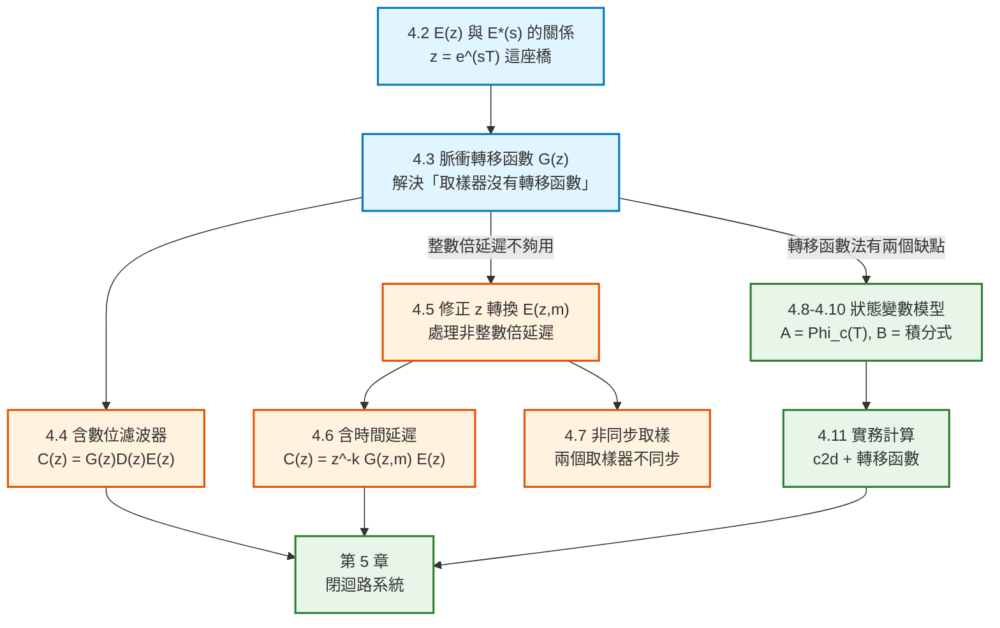

# 數位控制系統第四章：開迴路離散時間系統（Open-Loop Discrete-Time Systems）筆記

本文件彙整教材第 4 章「Open-Loop Discrete-Time Systems」的完整內容：$E(z)$ 與 $E^*(s)$ 的關係（4.2）、脈衝轉移函數（4.3）、含數位濾波器的系統（4.4）、修正 z 轉換（4.5）、含時間延遲的系統（4.6）、非同步取樣（4.7），以及狀態變數模型的三節（4.8～4.10）與實務計算（4.11）。每個概念與公式均回答「它是什麼／為什麼需要它／怎麼推導／符號代表什麼／物理意義是什麼」，並附上 MATLAB / Octave 對照。

> **本章在全書的位置**：第 3 章留下一個關鍵難題——**理想取樣器沒有轉移函數**，所以不能像連續系統那樣把方塊圖直接相乘化簡。本章就是要解決它：從星號轉換出發，推導出**脈衝轉移函數** $G(z)$，讓離散系統也能用「輸出 = 轉移函數 × 輸入」的方式分析。第 5 章才能把這些結果延伸到閉迴路系統。

> **符號說明**：原書用 $\varepsilon$ 表示自然指數（即 $e$）、用 $\mathcal{Z}[\cdot]$ 表示 z 轉換。本筆記統一寫成 $e^{-Ts}$ 與 $\mathcal{Z}[\cdot]$。原書的 $\Delta$ 與 $m$ 滿足 $m=1-\Delta$。

---

## 全章架構



---

## 全章符號總表

| 符號 | 型別 | 意義 |
|---|---|---|
| $E(z)$ | 複變函數 | 數列 $\{e(k)\}$ 的 **z 轉換** |
| $E^*(s)$ | 複變函數 | $e(t)$ 的**星號轉換**（第 3 章式 3-3） |
| $G_p(s)$ | 複變函數 | 受控體（plant）轉移函數 |
| $G(s)$ | 複變函數 | **資料保持器 × 受控體**的合併轉移函數 |
| $G(z)$ | 複變函數 | **脈衝轉移函數**（pulse transfer function） |
| $D(z)$ | 複變函數 | 數位濾波器（digital filter）轉移函數 |
| $T$ | 純量 | 取樣週期 |
| $\Delta$ | 純量 | 延遲佔取樣週期的比例，$0<\Delta<1$ |
| $m$ | 純量 | 修正 z 轉換參數，$m=1-\Delta$ |
| $E(z,\Delta)$ | 複變函數 | **延遲 z 轉換**（delayed z-transform） |
| $E(z,m)$ | 複變函數 | **修正 z 轉換**（modified z-transform） |
| $t_0$ | 純量 | 理想時間延遲量（秒） |
| $k$ | 整數 | 延遲的整數倍取樣週期數，$t_0=kT+\Delta T$ |
| $h$ | 純量 | 非同步取樣的偏移比例，$0<h<1$ |
| $\mathbf{v}(t)$ | $n\times1$ | **連續時間**狀態向量（原書用 $v$ 區別於離散的 $x$） |
| $\mathbf{x}(k)$ | $n\times1$ | **離散時間**狀態向量 |
| $A_c,B_c,C_c,D_c$ | 矩陣 | 連續時間狀態空間矩陣（下標 c = continuous） |
| $A,B,C,D$ | 矩陣 | 離散時間狀態空間矩陣（無下標） |
| $\Phi_c(t)$ | $n\times n$ | **狀態轉移矩陣**（state transition matrix），$=e^{A_ct}$ |

---

## 一、導論 (4.1 Introduction)

前幾章已經建立了離散時間系統、z 轉換、取樣與資料重建等主題。本章要用這些成果，推導**開迴路離散時間系統**的分析方法。

> **教材特別在括號裡點出動機**：「**這些推導是必要的，因為理想取樣器沒有轉移函數**。」

這正是第 3 章第 3.2 節留下的難題。分析技巧建立之後，接下來的章節才能延伸到閉迴路系統。

---

## 二、$E(z)$ 與 $E^*(s)$ 的關係 (4.2)

### 1. 兩個定義擺在一起看

第 2 章式 (2-7) 定義數列 $\{e(k)\}$ 的 **z 轉換**：

$$
\mathcal{Z}[\{e(k)\}]=E(z)=e(0)+e(1)z^{-1}+e(2)z^{-2}+\cdots
$$

第 3 章式 (3-7) 定義時間函數 $e(t)$ 的**星號轉換**：

$$
E^*(s)=e(0)+e(T)e^{-Ts}+e(2T)e^{-2Ts}+\cdots
$$

**兩者的相似性一目了然。**

### 2. 關鍵關係（式 4-3）

若假設數列 $\{e(k)\}$ 是對時間函數 $e(t)$ 取樣得到的（也就是 $e(k)=e(kT)$），並在星號轉換中令 $e^{sT}=z$，則星號轉換**恰好變成 z 轉換**：

$$
\boxed{\;E(z)=E^*(s)\Big|_{e^{sT}=z}\;}
$$

> **💡 這句話的份量**：**z 轉換可以視為拉普拉斯轉換的一個特例**。因此第 2 章對 z 轉換證明的所有定理（線性、實數平移、初值、終值…），**全部自動適用於星號轉換**。這也是為什麼教科書通常不另外列一張星號轉換表——直接用 z 轉換表，代入 $z=e^{Ts}$ 就好。

### 3. 為什麼要用 $E(z)$ 而不是 $E^*(s)$

| | $E^*(s)$ | $E(z)$ |
|---|---|---|
| 極點數 | **無限多個**（第 3 章性質 2：以 $j\omega_s$ 為間隔複製） | **有限個** |
| 分析方便性 | 極零點法幾乎無法使用 | 極零點法可直接使用 |

**範例 4.1**：$E(s)=\dfrac{1}{(s+1)(s+2)}$。查 z 轉換表得

$$
E(z)=\frac{z(e^{-T}-e^{-2T})}{(z-e^{-T})(z-e^{-2T})}
$$

反推回星號轉換（代入 $z=e^{Ts}$）：

$$
E^*(s)=\frac{e^{Ts}(e^{-T}-e^{-2T})}{(e^{Ts}-e^{-T})(e^{Ts}-e^{-2T})}
$$

與第 3 章範例 3.3 用留數法（式 3-10）算出的結果一致。

**注意**：$E^*(s)$ 在 $s$ 平面有**無限多個極點與零點**，但 $E(z)$ 只有 $z=0$ 的一個零點、以及 $e^{-T}$ 與 $e^{-2T}$ 兩個極點。**任何使用極零點方法的分析程序，都因為改用 z 轉換而大幅簡化。**

### 4. 由留數法直接算 $E(z)$（式 4-4）

把式 (3-10) 透過式 (4-3) 代換，得到直接產生 z 轉換表的公式：

$$
E(z)=\sum_{\text{at poles of }E(\lambda)}\left[\text{residues of }E(\lambda)\frac{1}{1-z^{-1}e^{T\lambda}}\right]
$$

---

## 三、脈衝轉移函數 (4.3 The Pulse Transfer Function)

### 1. 系統設定

考慮 Fig. 4-1(a) 的開迴路系統，$G_p(s)$ 是受控體。把**保持器與受控體合併**：

$$
G(s)=\frac{1-e^{-Ts}}{s}G_p(s)
$$

```text
        ┌───────┐              ┌──────────────────────────┐
E(s)    │   T   │    E*(s)     │  G(s) = (1-e^{-Ts})/s ·  │  C(s)
──────► │ 取樣器 ├─────────────►│         Gp(s)            ├──────►
        └───────┘              └──────────────────────────┘
```

> **重要慣例**：當系統畫成 Fig. 4-1(b) 這種形式時，**$G(s)$ 必定已經含有資料保持器的轉移函數**。教材說明：一般不把保持器單獨畫出來，而是把它與「保持器之後那部分系統」的轉移函數合併。

### 2. 推導（式 4-5 ~ 4-9）

**第一步**：由方塊圖，

$$
C(s)=G(s)E^*(s)
$$

**第二步**：假設 $c(t)$ 在所有取樣瞬間連續，套用第 3 章式 (3-11)：

$$
C^*(s)=\frac{1}{T}\sum_{n=-\infty}^{\infty}C(s+jn\omega_s)=\frac{1}{T}\sum_{n=-\infty}^{\infty}G(s+jn\omega_s)E^*(s+jn\omega_s)
$$

**第三步（關鍵）**：用第 3 章性質 1（式 3-20）的**週期性**：

$$
E^*(s+jn\omega_s)=E^*(s)
$$

因此 $E^*(s)$ **可以提到求和符號外面**：

$$
C^*(s)=E^*(s)\cdot\frac{1}{T}\sum_{n=-\infty}^{\infty}G(s+jn\omega_s)=E^*(s)\,G^*(s)
$$

**第四步**：由式 (4-3) 代入 $z=e^{Ts}$：

$$
\boxed{\;C(z)=G(z)E(z)\;}
$$

$G(z)$ 稱為**脈衝轉移函數**（pulse transfer function）。

> **💡 這一步為什麼是本章的核心**
> 第 3 章告訴我們「取樣器沒有轉移函數」，看起來離散系統沒辦法用轉移函數分析。但上面的推導證明：**只要在取樣瞬間看，輸入輸出之間確實存在一個轉移函數關係 $C(z)=G(z)E(z)$**。使這一切成立的關鍵，正是星號轉換的**週期性**——它讓 $E^*(s)$ 可以被提出求和符號。

### 3. ⚠️ 脈衝轉移函數的根本限制

> **脈衝轉移函數只給出「取樣瞬間」的輸出資訊，對取樣瞬間之間的 $c(t)$ 一無所知。**

式 (4-8) 與 (4-9) 都不包含這些資訊。教材的實務建議是：**通常會把取樣頻率選得夠高，讓取樣瞬間的響應能夠很好地反映取樣瞬間之間的響應。**

若真的需要取樣點之間的完整響應（實務上通常需要），一般用**模擬**（simulation）取得。

### 4. 一般化結果（式 4-10 ~ 4-13）

上面的推導完全一般化。給定任何可以寫成

$$
A(s)=B(s)F^*(s)
$$

的函數，其中 $F^*(s)$ 可以表示成 $F^*(s)=f_0+f_1e^{-Ts}+f_2e^{-2Ts}+\cdots$（也就是**$s$ 只以 $e^{Ts}$ 的形式出現**），則：

$$
A^*(s)=B^*(s)F^*(s)\qquad\Longrightarrow\qquad A(z)=B(z)F(z)
$$

其中 $B(z)=\mathcal{Z}[B(s)]$、$F(z)=F^*(s)\big|_{e^{Ts}=z}$。

**範例 4.2**：求 $A(s)=\dfrac{1-e^{-Ts}}{s(s+1)}$ 的 z 轉換。

拆成 $B(s)=\dfrac{1}{s(s+1)}$ 與 $F^*(s)=1-e^{-Ts}$，則 $F(z)=1-z^{-1}=\dfrac{z-1}{z}$。查表得 $B(z)=\dfrac{(1-e^{-T})z}{(z-1)(z-e^{-T})}$，因此：

$$
A(z)=B(z)F(z)=\frac{(1-e^{-T})z}{(z-1)(z-e^{-T})}\cdot\frac{z-1}{z}=\frac{1-e^{-T}}{z-e^{-T}}
$$

**範例 4.3**：Fig. 4-2 的系統，$G_p(s)=\dfrac{1}{s+1}$，輸入為單位步階。

$$
G(z)=\mathcal{Z}\left[\frac{1-e^{-Ts}}{s(s+1)}\right]=\frac{1-e^{-T}}{z-e^{-T}},\qquad E(z)=\mathcal{Z}[u(t)]=\frac{z}{z-1}
$$

$$
C(z)=G(z)E(z)=\frac{z(1-e^{-T})}{(z-1)(z-e^{-T})}=\frac{z}{z-1}-\frac{z}{z-e^{-T}}
$$

取反 z 轉換：

$$
c(kT)=1-e^{-kT}
$$

> **教材的重要提醒**：本例中輸入是單位步階，而**取樣器加零階保持器對步階訊號的重建是完全精確的**（步階進去、步階出來）。因此這個系統的響應其實就等於連續系統 $1/(s+1)$ 的步階響應 $c(t)=1-e^{-t}$。
>
> **但反過來不成立**：由 $c(t)$ 可以代入 $t=kT$ 求得 $c(kT)$；**但由 z 轉換分析得到的 $c(kT)$，一般不能把 $kT$ 換成 $t$ 就當作 $c(t)$**。

### 5. 直流增益（式 4-14）

**直流增益**（dc gain）＝ 常數輸入下的穩態增益。對 Fig. 4-1 的組態，單位步階輸入時由**終值定理**：

$$
c_{ss}(k)=\lim_{z\to1}(z-1)C(z)=\lim_{z\to1}(z-1)G(z)\frac{z}{z-1}=\lim_{z\to1}G(z)=G(1)
$$

又因為對常數輸入而言，取樣器加零階保持器的增益是 1，所以：

$$
\boxed{\;\text{dc gain}=\lim_{z\to1}G(z)=\lim_{s\to0}G_p(s)\;}
$$

> **💡 這個關係是最實用的檢查工具**：兩邊都很容易求值。你算出 $G(z)$ 之後，只要代 $z=1$，看看是否等於 $G_p(s)$ 代 $s=0$ 的值——**不相等就代表 $G(z)$ 算錯了**。
>
> 以範例 4.3 為例：$\lim_{z\to1}\dfrac{1-e^{-T}}{z-e^{-T}}=1$，而 $\lim_{s\to0}\dfrac{1}{s+1}=1$，吻合。

### 6. 三種串聯組態（式 4-15 ~ 4-21）

這一小節是本章最容易犯錯的地方。**同樣兩個受控體串聯，取樣器擺的位置不同，答案完全不同。**

#### 組態 (a)：兩個受控體之間**有**取樣器

```text
      T                    T
E ───/───► G1(s) ───A───/───► G2(s) ───► C
```

$$
A(z)=G_1(z)E(z),\qquad C(z)=G_2(z)A(z)\qquad\Longrightarrow\qquad C(z)=G_1(z)G_2(z)E(z)
$$

> **總轉移函數 = 各脈衝轉移函數的乘積。**

#### 組態 (b)：兩個受控體之間**沒有**取樣器

```text
      T
E ───/───► G1(s) ──► G2(s) ───► C
```

此時 $G_2(s)$ **不含**保持器轉移函數。

$$
C(s)=G_1(s)G_2(s)E^*(s)\qquad\Longrightarrow\qquad C(z)=\overline{G_1G_2}(z)E(z)
$$

其中

$$
\overline{G_1G_2}(z)=\mathcal{Z}[G_1(s)G_2(s)]
$$

**上方的橫線表示：必須先在 $s$ 域把兩個轉移函數相乘，然後才取 z 轉換。**

#### ⚠️ 全章最重要的警告（式 4-19）

$$
\boxed{\;\overline{G_1G_2}(z)\neq G_1(z)G_2(z)\;}
$$

> **函數乘積的 z 轉換，不等於各函數 z 轉換的乘積。**

**為什麼？** 因為兩者對應**物理上不同的系統**：組態 (a) 在中間多了一個取樣器加保持器，訊號在那裡被「階梯化」了一次；組態 (b) 中間是連續連接。**硬體不同，答案當然不同。**（第九節的 MATLAB 實驗會用數值明確展示這個差異。）

#### 組態 (c)：輸入先經過連續部分才被取樣

```text
E ───► G1(s) ───A───/───► G2(s) ───► C
                    T
```

$$
C(z)=G_2(z)\overline{G_1E}(z)
$$

**這個系統寫不出轉移函數**——無法把 $E(z)$ 從 $\overline{G_1E}(z)$ 中分離出來。

**原因**：$E(z)$ 只含 $e(t)$ 在 $t=kT$ 的值。但訊號 $a(t)$ 由摺積積分決定

$$
a(t)=\int_0^t g_1(t-\tau)e(\tau)\,d\tau
$$

**$a(t)$ 取決於 $e(t)$ 過去的所有值，而不只是取樣瞬間的值。**

> **一般結論**：若取樣資料系統的輸入**先施加到系統的連續部分、之後才被取樣**，則系統輸出的 z 轉換無法表示成輸入訊號 z 轉換的函數。（教材補充：這類系統在後續分析與設計中不會造成特別的困難。）

---

## 四、含數位濾波器的開迴路系統 (4.4)

### 1. 系統架構

```text
        ┌─────┐   {e(kT)}  ┌────────┐  {m(kT)}  ┌─────┐  m(t)  ┌───────┐  c(t)
e(t) ──►│ A/D ├───────────►│ 數位濾波器 ├─────────►│ D/A ├───────►│ Gp(s) ├──────►
        └─────┘            │   D(z)   │          └─────┘        └───────┘
                           └────────┘
```

| 元件 | 功能 |
|---|---|
| **A/D 轉換器** | 把連續訊號 $e(t)$ 轉成數列 $\{e(kT)\}$ |
| **數位濾波器 $D(z)$** | 處理數列，產生輸出數列 $\{m(kT)\}$ |
| **D/A 轉換器** | 把 $\{m(kT)\}$ 轉回連續訊號 $m(t)$ |

### 2. 推導（式 4-22 ~ 4-24）

第 2 章已證明：解常係數線性差分方程式的數位濾波器，可以用轉移函數 $D(z)$ 表示：

$$
M(z)=D(z)E(z)\qquad\Longleftrightarrow\qquad M^*(s)=D^*(s)E^*(s)
$$

**關鍵物理事實**：D/A 轉換器通常帶有**輸出資料保持暫存器**（output data-hold register），使 D/A 具有**零階保持器的特性**。因此由第 3 章式 (3-2)：

$$
M(s)=\frac{1-e^{-Ts}}{s}M^*(s)
$$

於是：

$$
C(s)=G_p(s)M(s)=G_p(s)\frac{1-e^{-Ts}}{s}D(z)\Big|_{z=e^{Ts}}E^*(s)
$$

$$
\boxed{\;C(z)=\mathcal{Z}\left[G_p(s)\frac{1-e^{-Ts}}{s}\right]D(z)E(z)=G(z)D(z)E(z)\;}
$$

> **⚠️ 教材強調的模型細節**：實作數位濾波器的電腦，處理的是**輸入資料樣本的數值** $\{e(kT)\}$；但我們的數學模型處理的是**權重為 $\{e(kT)\}$ 的脈衝序列**。因此**完整模型必須是「理想取樣器 + $D(z)$ + 零階保持器」三者的組合**——只有這個組合才能準確模擬「A/D + 數位濾波器 + D/A」的實體行為。

### 3. 範例 4.4：完整的一個例子

**設定**：濾波器由差分方程式

$$
m(kT)=2e(kT)-e[(k-1)T]
$$

描述，因此

$$
D(z)=\frac{M(z)}{E(z)}=2-z^{-1}=\frac{2z-1}{z}
$$

受控體 $G_p(s)=\dfrac{1}{s+1}$，輸入為單位步階。由範例 4.3 已知 $G(z)=\dfrac{1-e^{-T}}{z-e^{-T}}$，因此：

$$
C(z)=D(z)G(z)E(z)=\frac{2z-1}{z}\cdot\frac{1-e^{-T}}{z-e^{-T}}\cdot\frac{z}{z-1}=\frac{(2z-1)(1-e^{-T})}{(z-1)(z-e^{-T})}
$$

**部分分式展開**後取反 z 轉換：

$$
c(nT)=1+(e^{T}-2)e^{-nT},\qquad n=1,2,3,\dots
$$

$$
c(0)=1-e^{T}+1+e^{T}-2=0
$$

> **一個快速檢查技巧**：$c(0)=0$ 其實一眼就看得出來——**因為 $C(z)$ 的分子次數低於分母次數**。（分子 1 次、分母 2 次。）

### 4. 三重驗證（教材示範的好習慣）

**驗證一：終值定理**

$$
\lim_{n\to\infty}c(nT)=\lim_{z\to1}(z-1)C(z)=\lim_{z\to1}\frac{(2z-1)(1-e^{-T})}{z-e^{-T}}=1
$$

**驗證二：直流增益（式 4-14 的推廣）**

$$
\text{dc gain}=D(z)\Big|_{z=1}\cdot G_p(s)\Big|_{s=0}=\frac{2z-1}{z}\bigg|_{z=1}\cdot\frac{1}{s+1}\bigg|_{s=0}=1\times1=1
$$

因為穩態輸入是常數 1，所以穩態輸出 $=(\text{dc gain})\times(\text{常數輸入})=1\times1=1$。

**驗證三：從濾波器輸出看**

$$
M(z)=(2-z^{-1})E(z)\ \Longrightarrow\ m(kT)=2u(kT)-u[(k-1)T]
$$

穩態時 $m=2-1=1$，也就是**受控體輸入穩態為常數 1**。範例 4.3 已證明這個條件下穩態輸出為 1。

> **💡 這三種驗證方式值得學起來**：它們從三個完全不同的角度（z 域終值、增益相乘、訊號追蹤）得到同一個答案。**做完任何一個離散系統分析，至少要用其中一種檢查。**

---

## 五、修正 z 轉換 (4.5 The Modified z-Transform)

### 1. 為什麼需要它

前面的分析方法**不適用於含理想時間延遲的系統**。要分析這類系統，必須定義**延遲時間函數的 z 轉換**——這就是修正 z 轉換。

### 2. 延遲 z 轉換（式 4-25、4-26）

考慮時間函數 $e(t)$ 被延遲 $\Delta T$（其中 $0<\Delta\le1$），也就是 $e(t-\Delta T)u(t-\Delta T)$。

**⚠️ 關鍵前提：取樣本身沒有被延遲**——取樣瞬間仍然是 $t=0,T,2T,\dots$。

$$
\mathcal{Z}[e(t-\Delta T)u(t-\Delta T)]=\mathcal{Z}[E(s)e^{-\Delta Ts}]=\sum_{n=1}^{\infty}e(nT-\Delta T)z^{-n}
$$

**定義（延遲 z 轉換）**：

$$
E(z,\Delta)=\mathcal{Z}[e(t-\Delta T)u(t-\Delta T)]=\mathcal{Z}[E(s)e^{-\Delta Ts}]
$$

> **注意求和從 $n=1$ 開始**：因為訊號被延遲了，在 $t=0$ 時還沒有輸出。

**範例 4.5**：$e(t)=e^{-at}u(t)$，$\Delta=0.4$。

$$
E(z,\Delta)=e^{-0.6aT}z^{-1}+e^{-1.6aT}z^{-2}+e^{-2.6aT}z^{-3}+\cdots
$$

提出公因式後用幾何級數：

$$
=e^{-0.6aT}z^{-1}\left[1+e^{-aT}z^{-1}+e^{-2aT}z^{-2}+\cdots\right]=\frac{e^{-0.6aT}z^{-1}}{1-e^{-aT}z^{-1}}=\frac{e^{-0.6aT}}{z-e^{-aT}}
$$

### 3. 修正 z 轉換的定義（式 4-27、4-28）

**定義**：修正 z 轉換 = 延遲 z 轉換中把 $\Delta$ 換成 $1-m$。

$$
\boxed{\;E(z,m)=E(z,\Delta)\Big|_{\Delta=1-m}=\mathcal{Z}\left[E(s)e^{-\Delta Ts}\right]_{\Delta=1-m}\;}
$$

展開後：

$$
E(z,m)=e(mT)z^{-1}+e[(1+m)T]z^{-2}+e[(2+m)T]z^{-3}+\cdots
$$

> **💡 $m$ 的物理意義**：$m$ 是「**在每個取樣區間內往前推進的比例**」。$E(z,m)$ 給出的是訊號在 $t=mT,\ (1+m)T,\ (2+m)T,\dots$ 這些**取樣點之間的位置**上的值。
>
> **這正是修正 z 轉換最有價值的地方**：普通 z 轉換只看得到取樣瞬間；**修正 z 轉換讓你能看到取樣點「之間」的響應**——恰好補足了第 4.3 節指出的脈衝轉移函數限制。

### 4. 兩個端點性質（式 4-29、4-30）

$$
E(z,1)=E(z)-e(0)\qquad\text{（}m=1\text{：無延遲，但 }e(0)\text{ 不出現）}
$$

$$
E(z,0)=z^{-1}E(z)\qquad\text{（}m=0\text{：延遲一個完整取樣週期）}
$$

**範例 4.6**：$e(t)=e^{-t}$。

$$
E(z,m)=e^{-mT}z^{-1}+e^{-(1+m)T}z^{-2}+\cdots=\frac{e^{-mT}z^{-1}}{1-e^{-T}z^{-1}}=\frac{e^{-mT}}{z-e^{-T}}
$$

### 5. 留數形式（式 4-31、4-32）

普通 z 轉換表**不適用於**修正 z 轉換，必須另外推導專用表：

$$
E(z,m)=z^{-1}\mathcal{Z}\left[E(s)e^{mTs}\right]
$$

$$
E(z,m)=z^{-1}\sum_{\text{poles of }E(\lambda)}\text{residues of }E(\lambda)e^{mT\lambda}\frac{1}{1-z^{-1}e^{T\lambda}}
$$

**範例 4.7**：$e(t)=t$，$E(s)=\dfrac{1}{s^2}$，在 $s=0$ 有二階極點。用二階極點的留數公式（微分一次）：

$$
E(z,m)=z^{-1}\left[\frac{d}{d\lambda}\left(\frac{e^{mT\lambda}}{1-z^{-1}e^{T\lambda}}\right)\right]_{\lambda=0}=\frac{mT(z-1)+T}{(z-1)^2}
$$

### 6. 平移定理仍然適用（式 4-34、4-35）

因為修正 z 轉換就是「位移後函數的普通 z 轉換」，第 2 章的定理**只要小心運用就仍然適用**。特別是平移定理可直接使用：

$$
\mathcal{Z}_m\left[e^{-kTs}E(s)\right]=z^{-k}\mathcal{Z}_m[E(s)]=z^{-k}E(z,m),\qquad k\text{ 為正整數}
$$

---

## 六、含時間延遲的系統 (4.6 Systems with Time Delays)

### 1. 核心公式（式 4-36 ~ 4-39）

考慮 Fig. 4-8 含理想時間延遲 $t_0$ 秒的系統：

$$
C(s)=G(s)e^{-t_0s}E^*(s)\qquad\Longrightarrow\qquad C(z)=\mathcal{Z}\left[G(s)e^{-t_0s}\right]E(z)
$$

**關鍵技巧：把延遲拆成「整數倍取樣週期」加「零頭」**：

$$
\boxed{\;t_0=kT+\Delta T,\qquad 0<\Delta<1,\quad k\text{ 為正整數}\;}
$$

- **整數部分 $kT$** → 用平移定理處理，變成 $z^{-k}$
- **零頭 $\Delta T$** → 用修正 z 轉換處理，變成 $G(z,m)$，其中 $m=1-\Delta$

$$
\boxed{\;C(z)=z^{-k}\,G(z,m)\,E(z),\qquad m=1-\Delta\;}
$$

### 2. 範例 4.8

$t_0=0.4T$（所以 $k=0$、$\Delta=0.4$、$m=0.6$），$G(s)=\dfrac{1-e^{-Ts}}{s(s+1)}$，輸入為單位步階。

$$
G(z,m)=\frac{z-1}{z}\left[\frac{z(1-e^{-mT})+e^{-mT}-e^{-T}}{(z-1)(z-e^{-T})}\right]
$$

代入 $mT=0.6T$、$k=0$：

$$
C(z)=G(z,m)\frac{z}{z-1}=\frac{z(1-e^{-0.6T})+e^{-0.6T}-e^{-T}}{(z-1)(z-e^{-T})}
$$

用**冪級數法**（第 2.6 節）展開：

$$
C(z)=(1-e^{-0.6T})z^{-1}+(1-e^{-1.6T})z^{-2}+(1-e^{-2.6T})z^{-3}+\cdots
$$

**驗證**：範例 4.3 的無延遲響應是 $c(nT)=1-e^{-nT}$。把它延遲 $0.4T$：

$$
c(nT)=1-e^{-(n-0.4)T},\qquad n\ge1
$$

與冪級數展開的結果完全一致。（第九節的 MATLAB 實驗會用數值驗證這一點。）

### 3. 實務應用：數位電腦的運算時間（式 4-41 ~ 4-44）

修正 z 轉換也用來處理**電腦運算時間不可忽略**的情形。$n$ 階數位控制器每 $T$ 秒解一次差分方程式（式 2-4）：

$$
m(k)=b_ne(k)+b_{n-1}e(k-1)+\cdots+b_0e(k-n)-a_{n-1}m(k-1)-\cdots-a_0m(k-n)
$$

設運算需要 $t_0$ 秒。則 $t=0$ 的輸入要到 $t=t_0$ 才有輸出、$t=T$ 的輸入要到 $t=T+t_0$ 才有輸出……

> **建模方式**：把數位控制器模型化為「**無延遲的數位控制器 + 一個 $t_0$ 秒的理想時間延遲**」串聯（Fig. 4-9a）。

於是：

$$
C(z)=z^{-k}G(z,m)D(z)E(z),\qquad t_0=kT+\Delta T,\quad m=1-\Delta
$$

**範例 4.9**：即範例 4.4 的系統加上濾波器運算延遲。延遲 1 ms（$t_0=10^{-3}$ s），$T=0.05$ s，$D(z)=\dfrac{2z-1}{z}$。

---

## 七、非同步取樣 (4.7 Nonsynchronous Sampling)

### 1. 問題設定

Fig. 4-11 的系統有**兩個取樣器，但它們不同步**：

| 取樣器 | 取樣時刻 |
|---|---|
| 第一個 | $0,\ T,\ 2T,\ 3T,\dots$ |
| 第二個 | $hT,\ T+hT,\ 2T+hT,\dots$（其中 $0<h<1$） |

### 2. 關鍵推導（式 4-45 ~ 4-47）

在 $hT$ 偏移下取樣的保持器輸出為：

$$
\bar{e}(t)=e(hT)[u(t-hT)-u(t-T-hT)]+e(T+hT)[u(t-T-hT)-u(t-2T-hT)]+\cdots
$$

取拉氏轉換並整理（過程與第 3 章式 3-2 完全平行）：

$$
\bar{E}(s)=\frac{1-e^{-Ts}}{s}\,e^{Ts}\,e^{-hTs}\,E(z,m)\Big|_{m=h,\ z=e^{Ts}}
$$

> **💡 這個模型的巧妙之處**（Fig. 4-13）：它把「偏移取樣」改寫成
>
> $$\text{延遲 }(1-h)T\ \longrightarrow\ \text{同步取樣}\ \longrightarrow\ \text{超前 }T\ \longrightarrow\ \text{延遲 }hT$$
>
> **總延遲量恰好為零**：$-(1-h)T+T-hT=0$。因此這個模型與原系統等效，**但裡面的取樣器全部同步在 $t=0,T,2T,\dots$**——問題就化簡成第 4.3 節組態 (a) 的形式了。

### 3. 結果（式 4-48 ~ 4-51）

$$
A(z)=G_1(z,m)\Big|_{m=h}E(z),\qquad B(z)=zA(z),\qquad C(z)=G_2(z,m)\Big|_{m=1-h}B(z)
$$

$$
\boxed{\;C(z)=z\,E(z)\,G_1(z,m)\Big|_{m=h}\,G_2(z,m)\Big|_{m=1-h}\;}
$$

**範例 4.10**：$T=0.05$ s、$hT=0.01$ s（所以 $h=0.2$），$G_1(s)=\dfrac{1-e^{-Ts}}{s(s+1)}$、$G_2(s)=\dfrac{1-e^{-Ts}}{s^2}$。

---

## 八、狀態變數模型 (4.8 State-Variable Models)

### 1. 由轉移函數求離散狀態方程式

可用 z 轉移函數描述的系統，也可以用離散狀態方程式建模（第 2.8 節形式）：

$$
\mathbf{x}(k+1)=A\mathbf{x}(k)+B\mathbf{u}(k),\qquad \mathbf{y}(k)=C\mathbf{x}(k)+D\mathbf{u}(k)
$$

**三步驟程序**：

1. 由 z 轉移函數畫出**模擬圖**（simulation diagram）
2. 把**每個時間延遲的輸出**標為一個狀態變數
3. 從模擬圖寫出狀態方程式

**範例 4.11**：即範例 4.4 的系統（$G(z)=\dfrac{1-e^{-T}}{z-e^{-T}}$、$D(z)=\dfrac{2z-1}{z}$）。

> **注意教材的符號提醒**：這裡把輸出寫成 $Y(s)$ 而不是 $C(s)$，以免與 $C$ 矩陣混淆。

$$
\mathbf{x}(k+1)=\begin{bmatrix}e^{-T}&-1+e^{-T}\\0&0\end{bmatrix}\mathbf{x}(k)+\begin{bmatrix}2(1-e^{-T})\\1\end{bmatrix}e(k)
$$

$$
y(k)=\begin{bmatrix}1&0\end{bmatrix}\mathbf{x}(k)
$$

---

## 九、連續時間狀態變數複習 (4.9)

### 1. 轉移函數法的兩個缺點

教材用「無摩擦環境中單位質量的運動」來說明第一個缺點：

$$
\frac{d^2x(t)}{dt^2}=\ddot{x}(t)=f(t)
$$

自然的狀態變數選擇是**位置與速度**（也就是**物理變數**）：

$$
v_1(t)=x(t)=\text{位置},\qquad v_2(t)=\dot{v}_1(t)=\dot{x}(t)=\text{速度}
$$

$$
\begin{bmatrix}\dot{v}_1\\\dot{v}_2\end{bmatrix}=\begin{bmatrix}0&1\\0&0\end{bmatrix}\begin{bmatrix}v_1\\v_2\end{bmatrix}+\begin{bmatrix}0\\1\end{bmatrix}f(t)
$$

> **這正是第 1 章衛星模型、以及 Ackermann 範例用的同一個矩陣。**

| 缺點 | 說明 |
|---|---|
| **1. 失去自然狀態** | 用轉移函數法建立離散狀態模型時，很難把「速度」選為狀態變數——**系統自然的、也是最理想的狀態就被丟掉了** |
| **2. 高階系統困難** | 高階系統推導脈衝轉移函數本身就很困難 |

**因此第 4.10 節會給出一個完全不同的做法：直接從連續時間狀態變數出發。**

### 2. 連續時間狀態方程式（式 4-56）

$$
\dot{\mathbf{v}}(t)=A_c\mathbf{v}(t)+B_c\mathbf{u}(t),\qquad \mathbf{y}(t)=C_c\mathbf{v}(t)+D_c\mathbf{u}(t)
$$

> **符號慣例（教材明訂）**：**帶下標 $c$ 的矩陣＝連續時間；不帶下標的＝離散時間。** 這個慣例貫穿本章與後續各章。

### 3. 代數迴路（algebraic loop）

教材另外處理了一種特殊情形：模擬圖中**不含積分器的迴路**稱為**代數迴路**。此時狀態方程式初始寫成：

$$
\dot{\mathbf{x}}(t)=A_1\dot{\mathbf{x}}(t)+A_2\mathbf{x}(t)+B_1\mathbf{u}(t),\qquad \mathbf{y}(t)=C_1\dot{\mathbf{x}}(t)+C_2\mathbf{x}(t)+D_1\mathbf{u}(t)
$$

解出第一式：

$$
\dot{\mathbf{x}}(t)=[I-A_1]^{-1}A_2\mathbf{x}(t)+[I-A_1]^{-1}B_1\mathbf{u}(t)
$$

代入第二式：

$$
\mathbf{y}(t)=\left[C_1[I-A_1]^{-1}A_2+C_2\right]\mathbf{x}(t)+\left[C_1[I-A_1]^{-1}B_1+D_1\right]\mathbf{u}(t)
$$

得到標準形式的狀態方程式。

---

## 十、離散時間狀態方程式 (4.10)

**本節是全章最實用的部分，也是與第 1 章、Ackermann 範例直接接軌的地方。**

### 1. 目標

> 直接由**連續時間狀態方程式**求出**離散狀態方程式**，而且**連續模型的狀態就直接成為離散模型的狀態**——因此系統的自然狀態被保留下來。

### 2. 推導（式 4-64 ~ 4-69）

連續時間狀態方程式的解（式 4-65）：

$$
\mathbf{v}(t)=\Phi_c(t-t_0)\mathbf{v}(t_0)+\int_{t_0}^{t}\Phi_c(t-\tau)B_c\mathbf{u}(\tau)\,d\tau
$$

其中**狀態轉移矩陣**為（式 4-66）：

$$
\Phi_c(t-t_0)=\sum_{k=0}^{\infty}\frac{A_c^k(t-t_0)^k}{k!}=e^{A_c(t-t_0)}
$$

**關鍵步驟**：在 $t=kT+T$ 求值，並取 $t_0=kT$：

$$
\mathbf{v}(kT+T)=\Phi_c(T)\mathbf{v}(kT)+\mathbf{u}(kT)\int_{kT}^{kT+T}\Phi_c(kT+T-\tau)B_c\,d\tau
$$

> **⚠️ 為什麼 $\mathbf{u}$ 可以提到積分外面？** 因為在 $kT\le t<kT+T$ 這段區間內 $\mathbf{u}(t)=\mathbf{u}(kT)$ 是常數。**教材特別強調：這個推導只有在 $\mathbf{u}(t)$ 是零階保持器的輸出時才成立。** 這正是第 3 章 ZOH 假設在這裡的用途。

與離散狀態方程式對照，得到：

$$
\boxed{\;A=\Phi_c(T)=e^{A_cT},\qquad B=\int_{kT}^{kT+T}\Phi_c(kT+T-\tau)B_c\,d\tau\;}
$$

### 3. 化簡 $B$（式 4-71）

令 $kT-\tau=-\sigma$：

$$
B=\left[\int_0^T\Phi_c(T-\sigma)\,d\sigma\right]B_c
$$

再令 $\nu=T-\sigma$：

$$
\boxed{\;B=\left[\int_0^T\Phi_c(\nu)\,d\nu\right]B_c\;}
$$

### 4. 輸出矩陣（式 4-70）

在 $t=kT$ 求值：

$$
\mathbf{y}(kT)=C_c\mathbf{v}(kT)+D_c\mathbf{u}(kT)=C_c\mathbf{x}(kT)+D_c\mathbf{u}(kT)
$$

$$
\boxed{\;C=C_c,\qquad D=D_c\;}
$$

> **💡 離散化只改變 $A$ 和 $B$，不改變 $C$ 和 $D$。** 因為 $C$、$D$ 描述的是「量測關係」，與你多久看一次無關。

### 5. 級數展開法（式 4-72、4-74）

用拉氏轉換求 $\Phi_c(T)$ 通常很麻煩。實務上用**級數展開**由電腦計算：

$$
\Phi_c(T)=I+A_cT+\frac{A_c^2T^2}{2!}+\frac{A_c^3T^3}{3!}+\cdots
$$

$$
\int_0^T\Phi_c(\nu)\,d\nu=IT+\frac{A_cT^2}{2!}+\frac{A_c^2T^3}{3!}+\frac{A_c^3T^4}{4!}+\cdots
$$

$$
B=\left[IT+\frac{A_cT^2}{2!}+\frac{A_c^2T^3}{3!}+\cdots\right]B_c
$$

> **級數收斂，通常可以截斷。** 教材在範例 4.13 之後說明：**三位有效數字需要 3 項，六位有效數字需要 5 項。**
>
> **一個實作上的巧思**：比較兩個級數會發現，**計算 $\Phi_c(T)$ 的電腦程式稍加擴充就能同時算出積分項**——兩者的通項只差一個 $\dfrac{T}{k+1}$ 的因子。

### 6. 多輸入多輸出的情形

推導只考慮單輸入單輸出，但**多輸入多輸出的結果完全相同**，只是 $D_c$ 與 $D$ 變成矩陣。

> **⚠️ 多輸入的前提**：**每一個輸入都必須是零階保持器的輸出。** 若某些輸入不是（實務上會發生），這個程序仍可使用，得到的離散模型**只要那些輸入在一個取樣週期內變化緩慢，準確度就還可以接受**。

### 7. 範例 4.13（本章的核心計算例）

$T=0.1$ s，$G_p(s)=\dfrac{10}{s(s+1)}$（教材說明：這可以是第 1 章那種伺服馬達）。

連續狀態模型：

$$
\dot{\mathbf{x}}(t)=\begin{bmatrix}0&1\\0&-1\end{bmatrix}\mathbf{x}(t)+\begin{bmatrix}0\\10\end{bmatrix}u(t),\qquad y(t)=\begin{bmatrix}1&0\end{bmatrix}\mathbf{x}(t)
$$

因為是二階系統，可以直接求出 $\Phi_c(t)$：

$$
\Phi_c(t)=\mathcal{L}^{-1}\left[(sI-A_c)^{-1}\right]=\mathcal{L}^{-1}\begin{bmatrix}\dfrac1s&\dfrac{1}{s(s+1)}\\[4pt]0&\dfrac{1}{s+1}\end{bmatrix}=\begin{bmatrix}1&1-e^{-t}\\0&e^{-t}\end{bmatrix}
$$

$$
\int_0^T\Phi_c(\nu)\,d\nu=\begin{bmatrix}\nu&\nu+e^{-\nu}\\0&-e^{-\nu}\end{bmatrix}_0^T=\begin{bmatrix}T&T-1+e^{-T}\\0&1-e^{-T}\end{bmatrix}
$$

代入 $T=0.1$：

$$
A=\Phi_c(0.1)=\begin{bmatrix}1&0.0952\\0&0.905\end{bmatrix}
$$

$$
B=\begin{bmatrix}0.1&0.00484\\0&0.0952\end{bmatrix}\begin{bmatrix}0\\10\end{bmatrix}=\begin{bmatrix}0.0484\\0.952\end{bmatrix}
$$

**離散狀態方程式**：

$$
\mathbf{x}(k+1)=\begin{bmatrix}1&0.0952\\0&0.905\end{bmatrix}\mathbf{x}(k)+\begin{bmatrix}0.0484\\0.952\end{bmatrix}u(k),\qquad y(k)=\begin{bmatrix}1&0\end{bmatrix}\mathbf{x}(k)
$$

> **💡 教材的重要觀察**：把類比受控體的模擬圖（Fig. 4-20a）與離散模型的模擬圖（Fig. 4-20b）並排比較會發現——**雖然兩者的狀態、輸入、輸出在取樣瞬間完全相等，兩張圖卻長得完全不像。** 一般而言，這類系統的兩張模擬圖並不相似。

> **與 Ackermann 範例的關係**：本節推導的 $A=e^{A_cT}$、$B=\left[\int_0^T e^{A_c\nu}d\nu\right]B_c$ 就是 [`course/ackermann`](../ackermann/full-Ackermann-formula-example.md) 中步驟 2 使用的公式，也是 `c2d(sys, T, 'zoh')` 在背後做的事。差別只在：本例的 $A_c=\begin{bmatrix}0&1\\0&-1\end{bmatrix}$ 有摩擦項（右下角 $-1$），衛星那個例子的 $A_c=\begin{bmatrix}0&1\\0&0\end{bmatrix}$ 沒有。

---

## 十一、實務計算 (4.11 Practical Calculations)

### 四步驟程序

| 步驟 | 內容 | 公式 |
|---|---|---|
| **1** | 推導類比部分的狀態模型 | $\dot{\mathbf{x}}=A_c\mathbf{x}+B_c\mathbf{u}$，$\mathbf{y}=C_c\mathbf{x}+D_c\mathbf{u}$（式 4-75） |
| **2** | 若需要類比轉移函數 | $G_p(s)=C_c[sI-A_c]^{-1}B_c+D_c$（式 4-76） |
| **3** | 計算離散矩陣 | $A=I+A_cT+\dfrac{A_c^2T^2}{2}+\cdots$，$B=\left(IT+\dfrac{A_cT^2}{2!}+\cdots\right)B_c$，$C=C_c$，$D=D_c$（式 4-77） |
| **4** | 計算脈衝轉移函數 | $G(z)=C[zI-A]^{-1}B+D$（式 4-78） |

> **教材的重要說明**：這個程序**完全不需要用到 z 轉換表**，所有步驟都在電腦上完成。但**類比狀態模型仍然必須由人推導出來**。
>
> **高階系統必須用電腦計算**；低階系統也建議用電腦，以減少錯誤。

### 範例 4.14：教材給的 MATLAB 程式

```matlab
Ac = [0 1; 0 -1];
Bc = [0; 10];
C = [1 0];
D = 0;
T = 0.1;
[A,B] = c2d(Ac,Bc,T)
[numz,denz] = ss2tf(A,B,C,D)
Gz = tf(numz,denz,T)
```

其中 `numc`/`denc` 是 $G_p(s)$ 的分子分母多項式係數，`numz`/`denz` 則是 $G(z)$ 的。

### ⚠️ 原教材程式的相容性問題（本筆記補充）

> **這段程式在現行的 Octave 與現代 MATLAB 中都無法直接執行。** 實測結果：
>
> ```text
> [A,B] = c2d(Ac,Bc,T)   ->  error: 'c2d' undefined
> ss2tf(A,B,C,D)         ->  error: 'ss2tf' undefined
> ```
>
> **原因**：
> 1. `[A,B] = c2d(Ac,Bc,T)` 這種**傳入四個裸矩陣**的呼叫方式，是舊版 Control System Toolbox 的語法。現行版本的 `c2d` 只接受 **LTI 物件**（見 [`course/ackermann`](../ackermann/full-Ackermann-formula-example.md) 中「什麼時候該呼叫 `ss()`」一節的說明）。
> 2. Octave 的 `control` 套件**沒有提供 `ss2tf`**。
>
> **依照本課程的規範，不逕自改寫教材內容，而是保留原始寫法並提供可執行的修正版**：
>
> ```matlab
> Ac = [0 1; 0 -1];
> Bc = [0; 10];
> Cc = [1 0];
> Dc = 0;
> T  = 0.1;
>
> sys_c = ss(Ac, Bc, Cc, Dc);            % 步驟 1：打包成 LTI 物件
> Gp    = tf(sys_c)                      % 步驟 2：類比轉移函數（取代 ss2tf）
> sys_d = c2d(sys_c, T, 'zoh');          % 步驟 3：離散化
> [A, B, C, D] = ssdata(sys_d)           % 取出離散矩陣
> Gz    = tf(sys_d)                      % 步驟 4：脈衝轉移函數（取代 ss2tf）
> ```
>
> **數學內容完全相同**，只是換成現行 API。修正版的執行結果與教材範例 4.13 的手算結果一致（見第十三節實驗 6）。

### 數值誤差的警告

> **對某些系統，直接照式 (4-74) 與 (4-77) 寫程式會產生無法接受的數值誤差。** 這些情況下必須用不同的演算法計算離散 $A$、$B$ 矩陣（教材列出參考文獻 [4]–[6]）。
>
> 這也是為什麼實務上建議直接用 `c2d()`——它內部採用數值穩定的演算法（如 scaling-and-squaring 的矩陣指數），而不是天真的級數截斷。

---

## 十二、本章總結 (4.12 Summary)

本章檢視了開迴路離散時間系統的各個面向：

1. 討論**星號轉換**，說明它具有第 2 章所定義的 z 轉換的各項性質。
2. 用星號轉換求出開迴路系統的**脈衝轉移函數**。
3. 把脈衝轉移函數延伸到**含數位濾波器**的開迴路系統分析。
4. 為了分析**含理想時間延遲**的系統，推導出**修正 z 轉換**及其性質。
5. 提出求取樣資料系統**離散狀態變數模型**的技巧。
6. 上述發展構成了「用電腦計算離散狀態模型與脈衝轉移函數」的基礎。

**本章為開迴路系統建立的基礎，將成為第 5 章分析閉迴路離散時間系統的出發點。**

### 全章公式速查

| 式號 | 公式 | 用途 |
|---|---|---|
| (4-3) | $E(z)=E^*(s)\big|_{e^{sT}=z}$ | z 轉換與星號轉換的橋樑 |
| (4-9) | $C(z)=G(z)E(z)$ | **脈衝轉移函數**（本章核心） |
| (4-14) | $\lim_{z\to1}G(z)=\lim_{s\to0}G_p(s)$ | **直流增益檢查**（最實用的驗算） |
| (4-17) | $C(z)=G_1(z)G_2(z)E(z)$ | 中間**有**取樣器的串聯 |
| (4-18) | $C(z)=\overline{G_1G_2}(z)E(z)$ | 中間**沒有**取樣器的串聯 |
| (4-19) | $\overline{G_1G_2}(z)\neq G_1(z)G_2(z)$ | **最容易犯的錯** |
| (4-24) | $C(z)=G(z)D(z)E(z)$ | 含數位濾波器 |
| (4-26) | $E(z,\Delta)=\mathcal{Z}[E(s)e^{-\Delta Ts}]$ | 延遲 z 轉換 |
| (4-27) | $E(z,m)=E(z,\Delta)\big|_{\Delta=1-m}$ | **修正 z 轉換** |
| (4-39) | $C(z)=z^{-k}G(z,m)E(z)$ | 含時間延遲，$t_0=kT+\Delta T$ |
| (4-51) | $C(z)=zE(z)G_1(z,m)\big|_{m=h}G_2(z,m)\big|_{m=1-h}$ | 非同步取樣 |
| (4-69) | $A=\Phi_c(T)=e^{A_cT}$ | **離散化系統矩陣** |
| (4-71) | $B=\left[\int_0^T\Phi_c(\nu)d\nu\right]B_c$ | **離散化輸入矩陣** |
| (4-70) | $C=C_c,\ D=D_c$ | 量測關係不隨取樣改變 |
| (4-78) | $G(z)=C[zI-A]^{-1}B+D$ | 由狀態模型求脈衝轉移函數 |

---

## 十三、MATLAB / Octave 實作驗證

> **需要 Control System Toolbox**（Octave 使用者請先 `pkg load control`）。

完整可執行版見 [`chp4.m`](chp4.m)，逐格教學版見 [`chp4.ipynb`](chp4.ipynb)。

### 實驗一覽

| # | 對應章節 | 驗證什麼 |
|---|---|---|
| 1 | 4.3（例 4.2、4.3） | $G(z)=\dfrac{1-e^{-T}}{z-e^{-T}}$ 與 $c(kT)=1-e^{-kT}$ |
| 2 | 4.3（式 4-14） | 直流增益檢查：$G(1)=\lim_{s\to0}G_p(s)$ |
| 3 | 4.3（式 4-19） | **$\overline{G_1G_2}(z)\neq G_1(z)G_2(z)$** |
| 4 | 4.4（例 4.4） | 數位濾波器串聯，$c(nT)=1+(e^T-2)e^{-nT}$ |
| 5 | 4.6（例 4.8） | 修正 z 轉換與時間延遲，$c(nT)=1-e^{-(n-0.4)T}$ |
| 6 | 4.10、4.11（例 4.13、4.14） | 離散狀態矩陣 $A$、$B$ 與脈衝轉移函數 |
| 7 | 4.10（式 4-72、4-74） | 級數展開法 vs `c2d`，以及需要幾項才夠準 |

### 數學 ↔ MATLAB 對照（本章重點）

| 數學 | MATLAB / Octave | 說明 |
|---|---|---|
| $G_p(s)=\dfrac{1}{s+1}$ | `tf(1, [1 1])` | 分子 $[1]$、分母 $1\cdot s+1\to[1\ 1]$ |
| $G(z)=\mathcal{Z}\left[\dfrac{1-e^{-Ts}}{s}G_p(s)\right]$ | `c2d(Gp, T, 'zoh')` | **`'zoh'` 就是那個 $\dfrac{1-e^{-Ts}}{s}$** |
| $D(z)=\dfrac{2z-1}{z}$ | `tf([2 -1], [1 0], T)` | 第三引數 `T` 宣告這是離散系統 |
| $G_1(z)G_2(z)$ | `G1z * G2z` | 兩個離散物件相乘 |
| $\overline{G_1G_2}(z)$ | `c2d(G1s*G2s, T, 'zoh')` | **先在 $s$ 域相乘再離散化** |
| $\lim_{z\to1}G(z)$ | `dcgain(Gz)` | 離散系統代 $z=1$ |
| $A=e^{A_cT}$ | `expm(Ac*T)` | **`expm` 是矩陣指數，`exp` 是逐元素指數** |
| $[A,B,C,D]$ | `ssdata(sys_d)` | 從物件取出四個矩陣 |
| 反 z 轉換序列 | `filter(num, den, [1 0 0 ...])` | 見下方陷阱說明 |

> **⚠️ 三個實作陷阱**
>
> 1. **`expm` vs `exp`**：$e^{A_cT}$ 是**矩陣指數**，必須用 `expm(Ac*T)`。`exp(Ac*T)` 會對每個元素分別取指數，答案完全錯誤。
> 2. **Octave 的 `impulse` 對離散系統會乘上 $1/T$**：若要取得純粹的反 z 轉換係數，用 `filter(num, den, [1 zeros(1,N-1)])`，或把 `impulse` 的結果乘上 `T`。
> 3. **`filter` 的分子要補零對齊**：`filter` 把係數當成 $z^{-1}$ 的次冪。若分子次數低於分母，必須在分子前面補 0，否則結果會**整體提前一步**。
