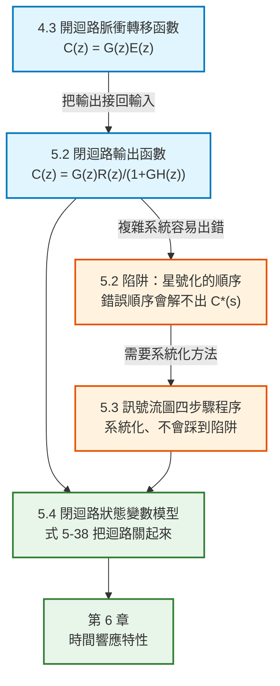

# 數位控制系統第五章：閉迴路系統（Closed-Loop Systems）筆記

本文件彙整教材第 5 章「Closed-Loop Systems」的完整內容：開迴路系統回顧與閉迴路輸出函數的推導（5.2）、用訊號流圖求轉移函數的系統化程序（5.3），以及閉迴路離散狀態變數模型的建立（5.4）。每個概念與公式均回答「它是什麼／為什麼需要它／怎麼推導／符號代表什麼／物理意義是什麼」，並附上 MATLAB / Octave 對照。

> **本章在全書的位置**：第 4 章建立了**開迴路**離散系統的脈衝轉移函數 $C(z)=G(z)E(z)$。本章把它延伸到**閉迴路**——也就是把輸出接回輸入端。這是所有實際控制系統的形態，第 6 章之後的暫態分析、穩定度分析、控制器設計，全都建立在本章的結果上。

> **符號說明**：原書用 $\varepsilon$ 表示自然指數（即 $e$）。本筆記統一寫成 $e^{-Ts}$。原書用 $\mathbf{v}(k)$ 表示狀態向量（第 5.4 節），以區別於連續時間的狀態。

---

## 全章架構



---

## 全章符號總表

| 符號 | 型別 | 意義 |
|---|---|---|
| $R(s),R(z)$ | 複變函數 | 參考輸入 |
| $C(s),C(z)$ | 複變函數 | 系統輸出 |
| $E(s),E^*(s)$ | 複變函數 | 誤差訊號與其星號轉換 |
| $G(s),G(z)$ | 複變函數 | 前向路徑（**含資料保持器**） |
| $H(s)$ | 複變函數 | 回授路徑（感測器） |
| $D(z)$ | 複變函數 | 數位控制器（濾波器） |
| $\overline{GH}(z)$ | 複變函數 | $\mathcal{Z}[G(s)H(s)]$，**先在 $s$ 域相乘再取 z 轉換** |
| $\mathbf{v}(k)$ | $n\times1$ | 離散狀態向量（本章用 $\mathbf v$） |
| $A_1,B_1,B_2$ | 矩陣 | 開迴路（尚未關迴路）的狀態矩陣 |
| $C_1,D_1$ | 矩陣 | **濾波器**的輸出方程式矩陣 |
| $C$ | 矩陣 | **受控體**的輸出矩陣，$y(k)=C\mathbf v(k)$ |
| $m(k)$ | 純量 | 濾波器輸出 = 受控體輸入 |
| $e(k)$ | 純量 | 誤差 $=u(k)-y(k)$ |
| $u(k)$ | 純量 | 系統參考輸入（本章第 5.4 節用 $u$ 而非 $r$） |

---

## 一、導論 (5.1)

第 4 章發展了求**開迴路**離散 LTI 系統輸出函數的技巧。本章把這些技巧延伸到**閉迴路**離散時間 LTI 系統，同時介紹閉迴路離散系統的狀態變數模型建立方法。

> **術語**：教材說明，為了方便起見，後續常把「discrete-time systems」簡稱為「discrete systems」。

---

## 二、預備概念 (5.2 Preliminary Concepts)

### 1. 先回顧開迴路的四種組態（式 5-1 ~ 5-4）

第 4 章的結果整理如下（Fig. 5-1）：

| 組態 | 描述 | 輸出 |
|---|---|---|
| (a) | 兩受控體之間**有**取樣器 | $C(z)=G_1(z)G_2(z)E(z)$ |
| (b) | 兩受控體之間**沒有**取樣器 | $C(z)=\overline{G_1G_2}(z)E(z)$ |
| (c) | 輸入先經連續元件才被取樣 | $C(z)=G_2(z)\overline{G_1E}(z)$，**無轉移函數** |
| (d) | 含數位控制器 | $C(z)=D(z)G(z)E(z)$ |

其中組態 (d) 的 $G(z)$ 有一個實用的等價寫法：

$$
G(z)=\mathcal{Z}\left[\frac{1-e^{-Ts}}{s}G_p(s)\right]=\frac{z-1}{z}\,\mathcal{Z}\left[\frac{G_p(s)}{s}\right]
$$

> **💡 這個寫法很好用**：把 $\dfrac{1-e^{-Ts}}{s}$ 拆成 $\left(1-e^{-Ts}\right)\cdot\dfrac{1}{s}$，其中 $\dfrac1s$ 併進 $G_p(s)$ 一起查表，而 $1-e^{-Ts}$ 對應 $1-z^{-1}=\dfrac{z-1}{z}$。**查表時只需要查 $G_p(s)/s$ 這一項。**

**組態 (c) 為什麼寫不出轉移函數**：因為 $E(z)$ 無法從 $\overline{G_1E}(z)$ 中分離出來。一般而言，**輸入先施加到類比元件再被取樣的系統，都寫不出轉移函數**。但教材強調：**輸出永遠可以表示成輸入的函數，這類系統在分析與設計上不會造成特別的困難。**

### 2. 閉迴路輸出函數的推導（式 5-5 ~ 5-11）

考慮 Fig. 5-2 的閉迴路取樣資料系統：

```text
R(s) ──►(+)──► E(s) ──/──► E*(s) ──► G(s) ──┬──► C(s)
         ▲(-)          T                     │
         └────────────── H(s) ◄──────────────┘
```

**第一步**：由方塊圖寫出兩個關係式

$$
C(s)=G(s)E^*(s)
$$

$$
E(s)=R(s)-H(s)C(s)
$$

**第二步**：把第一式代入第二式

$$
E(s)=R(s)-G(s)H(s)E^*(s)
$$

**第三步（關鍵）**：**對整個式子取星號轉換**。利用第 4 章式 (4-11) 的結果——$E^*(s)$ 只以 $e^{Ts}$ 的形式出現，可以被提出來：

$$
E^*(s)=R^*(s)-\overline{GH}^*(s)E^*(s)
$$

**第四步**：解出 $E^*(s)$

$$
E^*(s)=\frac{R^*(s)}{1+\overline{GH}^*(s)}
$$

**第五步**：代回得到連續輸出與取樣輸出

$$
C(s)=G(s)\frac{R^*(s)}{1+\overline{GH}^*(s)}
$$

$$
\boxed{\;C^*(s)=\frac{G^*(s)R^*(s)}{1+\overline{GH}^*(s)},\qquad C(z)=\frac{G(z)R(z)}{1+\overline{GH}(z)}\;}
$$

> **⚠️ 注意分母是 $\overline{GH}(z)$ 而不是 $G(z)H(z)$**——上面的橫線代表**必須先在 $s$ 域把 $G(s)H(s)$ 相乘，然後才取 z 轉換**。這是第 4 章式 (4-19) 那個警告在閉迴路的延續。**這是本章最容易寫錯的地方。**

### 3. 一個重要的實作假設

> **教材明訂的慣例**：因為 $E^*(s)$ 是一連串脈衝函數，我們**必須假設 $G(s)$ 是透過零階保持器接收這些脈衝的**。
>
> **只要對一個拉氏轉移函數套用星號轉換，就假設該轉移函數已經含有一個零階保持器來處理它的星號轉換輸入。** 除非另有說明，後續全部依此慣例。

### 4. ⚠️ 陷阱：星號化的順序會影響能不能解（式 5-12、5-13）

假設我們把式 (5-6) 先星號化再代入式 (5-5)：

$$
C(s)=G(s)R^*(s)-G(s)\overline{HC}^*(s)
$$

$$
C^*(s)=G^*(s)R^*(s)-G^*(s)\overline{HC}^*(s)
$$

**問題來了**：一般而言 $C^*(s)$ **無法從 $\overline{HC}^*(s)$ 中被提出來**，因此上式**解不出 $C^*(s)$**。

> **教材的一般性建議**：
>
> **在分析系統時，若某個系統訊號會因為星號化而失去「可被提出的因子」地位，就不應該對那個方程式取星號轉換。**
>
> 但對比上面更複雜的系統，光靠這條原則來解方程式會變得相當複雜。**因此第 5.3 節要發展一個更簡單、系統化的方法來避開這個問題。**

### 5. 輸入未經取樣的系統（式 5-14 ~ 5-19）

考慮 Fig. 5-3：輸入 $R(s)$ **直接送進類比元件 $G(s)$，沒有先被取樣**；取樣器在回授路徑上。

$$
C(s)=G(s)E(s),\qquad E(s)=R(s)-H(s)C^*(s)
$$

代入後：

$$
C(s)=G(s)R(s)-G(s)H(s)C^*(s)
$$

星號化：

$$
C^*(s)=\overline{GR}^*(s)-\overline{GH}^*(s)C^*(s)
$$

> **注意**：$R(s)$ **必然**在這裡失去因子地位（變成 $\overline{GR}^*$），因為 $r(t)$ 根本沒有被取樣。

解出：

$$
\boxed{\;C^*(s)=\frac{\overline{GR}^*(s)}{1+\overline{GH}^*(s)},\qquad C(z)=\frac{\overline{GR}(z)}{1+\overline{GH}(z)}\;}
$$

連續輸出則為：

$$
C(s)=G(s)R(s)-G(s)H(s)\frac{\overline{GR}^*(s)}{1+\overline{GH}^*(s)}
$$

**這個系統寫不出轉移函數**（因為 $R(z)$ 無法被提出），**但輸出仍然可以完整求出**。

### 6. 💡 為什麼這種系統很重要：飛機自動駕駛的例子

教材舉了一個很好的實務例子說明「為什麼要處理沒有轉移函數的系統」：

> 考慮一架以**閉迴路模式飛行**（自動駕駛）的飛機，而且自動駕駛是**數位實作**的。
>
> - **指令輸入**（例如改變高度）：透過 A/D 轉換器進入控制電腦，或甚至由電腦自己產生。**這個輸入是被取樣的**，因此**可以建立轉移函數**。
> - **風的垂直分量**：這也是高度控制系統的一個輸入，但它**不會被取樣**——風直接作用在飛機（類比部分）上。
>
> **結論**：從指令輸入到高度輸出，可以推導轉移函數；**但從風輸入到高度輸出，無法建立轉移函數**。

> **一般實務情境**：實際系統通常**不只一個輸入**。有些輸入被取樣（可寫轉移函數），有些不被取樣（寫不出轉移函數，但輸出仍可求）。**兩種情況都必須會處理。**

---

## 三、推導程序 (5.3 Derivation Procedure)

### 1. 為什麼需要一套系統化程序

> **取樣資料系統的轉移函數之所以難求，是因為理想取樣器沒有轉移函數。**

第 5.2 節示範了「代入 → 星號化 → 解方程式」的做法，但也暴露了**星號化順序會導致解不出來**的陷阱。本節用**訊號流圖**建立一套四步驟程序，**系統化地避開這個問題**。

### 2. 原始訊號流圖（original signal flow graph）

**關鍵構圖原則**：

> **在訊號流圖中把取樣器省略掉**，因為取樣器沒有轉移函數。
>
> **但取樣器的效果被保留了**——因為取樣器的輸出以星號形式 $E_1^*$ 出現，而且 **$E_1^*$ 被當作一個「輸入」（來源節點）來處理**。

### 3. 四步驟程序

以 Fig. 5-4 的系統（$G$ 在前向路徑、$H$ 在回授路徑、取樣器在誤差點之後）為例：

| 步驟 | 內容 |
|---|---|
| **1** | 建立原始訊號流圖 |
| **2** | **對每一個取樣器的輸入指定一個變數**；該取樣器的輸出就是這個變數加星號 |
| **3** | **把每個取樣器輸出視為來源節點（輸入）**，用「各取樣器輸出」與「系統輸入」表示出「各取樣器輸入」與「系統輸出」 |
| **4** | 對這些方程式取星號轉換，再用任何方便的方法求解 |

**套用到 Fig. 5-4**：

步驟 2：取樣器的輸入是 $E_1$，輸出是 $E_1^*$。

步驟 3（**注意：$E_1^*$ 被當成輸入**）：

$$
E_1=R-GHE_1^*
$$

$$
C=GE_1^*
$$

步驟 4（星號化）：

$$
E_1^*=R^*-\overline{GH}^*E_1^*
$$

$$
C^*=G^*E_1^*
$$

解出：

$$
E_1^*=\frac{R^*}{1+\overline{GH}^*}\qquad\Longrightarrow\qquad C^*(s)=\frac{G^*(s)}{1+\overline{GH}^*(s)}R^*(s)
$$

> **💡 為什麼這個程序不會踩到 5.2 節的陷阱？** 因為步驟 3 強制你**先把所有東西寫成「取樣器輸出」的函數**，再星號化。這樣一來，星號化時被提出的因子必定是取樣器的輸出（本來就是星號形式），**不可能發生「訊號失去因子地位」的問題**。

### 4. 多個取樣器的處理

> **若系統中有超過一個取樣器**，這些星號變數的聯立方程式可以用 **Cramer 法則**或任何解線性聯立方程式的方法求解。

### 5. 取樣訊號流圖與 Mason 增益公式

另一種解法是**由這些方程式再畫一張訊號流圖**（稱為**取樣訊號流圖**，sampled signal flow graph），然後套用 **Mason 增益公式**。

> **教材的評語**：這個方法有時優於 Cramer 法則，**前提是取樣訊號流圖夠簡單、所有迴路都容易辨識**。

由 Fig. 5-6 的取樣訊號流圖可同時讀出（式 5-26、5-27）：

$$
C^*(s)=\frac{G^*(s)}{1+\overline{GH}^*(s)}R^*(s),\qquad C(s)=\frac{G(s)}{1+\overline{GH}^*(s)}R^*(s)
$$

**注意第二式的分子是 $G(s)$ 而不是 $G^*(s)$**——這給出了**連續輸出**。

### 範例 5.1：含數位控制器的閉迴路系統

系統：$R\to(+)\to E\to$ 取樣器 $\to D(z)\to$ 保持器 $\to G_p(s)\to C$，回授路徑 $H(s)$。

步驟 3（$E^*$、$D^*E^*$ 等視為輸入）：

$$
E=R-\overline{GH}\,D^*E^*,\qquad C=GD^*E^*
$$

星號化並解出：

$$
E^*=R^*-\overline{GH}^*D^*E^*\ \Longrightarrow\ E^*=\frac{R^*}{1+D^*\overline{GH}^*}
$$

$$
\boxed{\;C(z)=\frac{D(z)G(z)}{1+D(z)\overline{GH}(z)}R(z)\;}
$$

> **這是數位控制系統最標準的閉迴路轉移函數**，後續各章（尤其是第 8、9 章的控制器設計）會反覆用到。

### 範例 5.2：兩個取樣器的系統

系統（Fig. 5-9）有**兩個取樣器**，分別在外迴路與內迴路。

步驟 3：

$$
E_1=R-G_2E_2^*,\qquad E_2=G_1E_1^*-G_2HE_2^*,\qquad C=G_2E_2^*
$$

星號化：

$$
E_1^*=R^*-G_2^*E_2^*,\qquad E_2^*=G_1^*E_1^*-\overline{G_2H}^*E_2^*,\qquad C^*=G_2^*E_2^*
$$

畫出取樣訊號流圖後套用 Mason 增益公式：

$$
C(z)=\frac{G_1(z)G_2(z)}{1+G_1(z)G_2(z)+\overline{G_2H}(z)}R(z)
$$

連續輸出為：

$$
C(s)=\frac{G_2(s)G_1^*(s)}{1+G_1^*(s)G_2^*(s)+\overline{G_2H}^*(s)}R^*(s)
$$

### 範例 5.3：輸入未經取樣（寫不出轉移函數）

系統（Fig. 5-12）中，輸入 $R(s)$ **未經取樣就到達 $G_2(s)$**，因此**無法推導轉移函數**。但輸出仍可求：

$$
E_1=R-C,\qquad C=E_1+G_2\left[G_1E_1^*-C\right]
$$

整理：

$$
[1+1+G_2]C=R+G_1G_2E_1^*
$$

$$
C=\frac{R}{2+G_2}+\frac{G_1G_2}{2+G_2}E_1^*,\qquad E_1=R-C=\frac{(1+G_2)R}{2+G_2}-\frac{G_1G_2}{2+G_2}E_1^*
$$

星號化：

$$
C^*=\left[\frac{R}{2+G_2}\right]^*+\left[\frac{G_1G_2}{2+G_2}\right]^*E_1^*,\qquad E_1^*=\frac{\left[\dfrac{(1+G_2)R}{2+G_2}\right]^*}{1+\left[\dfrac{G_1G_2}{2+G_2}\right]^*}
$$

> **注意**：這裡出現的星號項如 $\left[\dfrac{R}{2+G_2}\right]^*$ **必須整體取星號轉換**，不能拆開。這正是「輸入未被取樣」造成的後果——$R$ 與 $G_2$ 糾纏在一起，無法分離。

---

## 四、狀態變數模型 (5.4 State-Variable Models)

### 1. 為什麼要用狀態變數法

如第 4 章所述，離散狀態變數模型可以直接由轉移函數產生，**但這個做法的缺點是：類比系統的物理變數一般不會成為離散狀態變數**（第 4.9 節詳述過）。

**因此本節採用第 4.10 節「把連續狀態方程式轉成離散狀態方程式」的技巧，並延伸到閉迴路系統。**

### 2. 一般程序（以 Fig. 5-17 的系統為例）

| 步驟 | 內容 |
|---|---|
| **1** | 把系統重畫，使**零階保持器的輸出成為「輸入」**，而**取樣器輸入與系統輸出成為「輸出」** |
| **2** | 針對這個「類比部分」寫出**連續狀態方程式** |
| **3** | 用第 4.10 節的方法轉成**離散狀態方程式**（式 5-28 的形式） |
| **4** | 由這些狀態方程式畫出**離散模擬圖或流程圖**，**必須包含閉迴路中所有位於模擬圖外部的連接路徑** |
| **5** | 由模擬圖寫出系統的離散狀態方程式 |

式 (5-28) 的形式：

$$
\mathbf{v}(k+1)=A_1\mathbf{v}(k)+B_1\begin{bmatrix}e_1(k)\cr e_2(k)\end{bmatrix},\qquad
\begin{bmatrix}y(k)\cr e_2(k)\end{bmatrix}=C_1\mathbf{v}(k)+D_1\begin{bmatrix}e_1(k)\cr e_2(k)\end{bmatrix}
$$

### 3. ⚠️ 一個必須注意的前提

> **每一個系統輸入都必須在施加到系統的類比部分之前被取樣。**
>
> 若不是這樣，式 (5-30) 就無法只寫成 $r(k)$ 的函數，**離散模型根本不存在**。
>
> **實務上的折衷**：若某個未被取樣的輸入在一個取樣週期內變化緩慢（訊號只含低頻成分），**通常仍假設它有被取樣**，儘管得到的離散模型會有些許誤差。

### 4. 含數位控制器的系統：把迴路關起來（式 5-32 ~ 5-38）

**這是本章最實用的結果。**

**做法**：把**數位濾波器**與**受控體**分開處理，各自寫狀態方程式：

- 受控體分配狀態 $v_1(k)\sim v_i(k)$（$i$ = 受控體階數）
- 濾波器分配狀態 $v_{i+1}(k)\sim v_n(k)$（$n-i$ = 濾波器階數）

**三組方程式**：

$$
\mathbf{v}(k+1)=A_1\mathbf{v}(k)+B_1m(k)+B_2e(k)\qquad\text{（式 5-32，}m\text{ 與 }e\text{ 都是輸入）}
$$

$$
m(k)=C_1\mathbf{v}(k)+D_1e(k)\qquad\text{（式 5-33，濾波器輸出）}
$$

$$
y(k)=C\mathbf{v}(k)\qquad\text{（式 5-34，受控體輸出）}
$$

**回授路徑**（式 5-35）：

$$
e(k)=u(k)-y(k)=u(k)-C\mathbf{v}(k)
$$

**消去 $m(k)$ 與 $e(k)$**：先由 (5-33)、(5-35) 得

$$
m(k)=C_1\mathbf{v}(k)+D_1[u(k)-C\mathbf{v}(k)]=[C_1-D_1C]\mathbf{v}(k)+D_1u(k)
$$

代入 (5-32)：

$$
\mathbf{v}(k+1)=A_1\mathbf{v}(k)+B_1\left[(C_1-D_1C)\mathbf{v}(k)+D_1u(k)\right]+B_2\left[u(k)-C\mathbf{v}(k)\right]
$$

整理成標準形式 $\mathbf{v}(k+1)=A\mathbf{v}(k)+Bu(k)$，得到**本章的核心公式**：

$$
\boxed{\;A=A_1+B_1C_1+(-B_2-B_1D_1)C,\qquad B=B_1D_1+B_2\;}
$$

> **💡 這條公式在做什麼**：$A_1,B_1,B_2,C_1,D_1,C$ 全部是**迴路還沒接起來**時各方塊的矩陣。這條公式**用一次矩陣運算就把回授迴路「關」起來**，得到閉迴路的 $A$、$B$。**不需要畫模擬圖、不需要查 z 轉換表。**

### 範例 5.7：完整的一個例子

**受控體**（來自第 4 章例 4.13，$G_p(s)=\dfrac{10}{s(s+1)}$，$T=0.1$ s）：

$$
\begin{bmatrix}v_1(k+1)\cr v_2(k+1)\end{bmatrix}=\begin{bmatrix}1&0.0952\cr0&0.905\end{bmatrix}\begin{bmatrix}v_1(k)\cr v_2(k)\end{bmatrix}+\begin{bmatrix}0.0484\cr0.952\end{bmatrix}m(k)
$$

$$
y(k)=\begin{bmatrix}1&0\end{bmatrix}\begin{bmatrix}v_1(k)\cr v_2(k)\end{bmatrix}
$$

**濾波器**（$D(z)=\dfrac{0.9z-0.8}{z-0.9}$）：

$$
v_3(k+1)=0.9v_3(k)+e(k)
$$

$$
m(k)=(0.81-0.8)v_3(k)+0.9e(k)=0.01v_3(k)+0.9e(k)
$$

**合併後的三階系統**：

$$
\mathbf{v}(k+1)=\begin{bmatrix}1&0.0952&0\cr0&0.905&0\cr0&0&0.9\end{bmatrix}\mathbf{v}(k)+\begin{bmatrix}0.0484\cr0.952\cr0\end{bmatrix}m(k)+\begin{bmatrix}0\cr0\cr1\end{bmatrix}e(k)
$$

**對照式 (5-32)~(5-35) 讀出各矩陣**：

$$
A_1=\begin{bmatrix}1&0.0952&0\cr0&0.905&0\cr0&0&0.9\end{bmatrix},\quad
B_1=\begin{bmatrix}0.0484\cr0.952\cr0\end{bmatrix},\quad
B_2=\begin{bmatrix}0\cr0\cr1\end{bmatrix}
$$

$$
C_1=\begin{bmatrix}0&0&0.01\end{bmatrix},\quad D_1=0.9,\quad C=\begin{bmatrix}1&0&0\end{bmatrix}
$$

**代入式 (5-38)**：

$$
A=\begin{bmatrix}0.9564&0.0952&0.000484\cr-0.8568&0.905&0.00952\cr-1&0&0.9\end{bmatrix},\qquad
B=\begin{bmatrix}0.04356\cr0.8568\cr1\end{bmatrix}
$$

$$
y(k)=\begin{bmatrix}1&0&0\end{bmatrix}\mathbf{v}(k)
$$

### 教材給的 MATLAB 程式

```matlab
% Use (5-38) to close the loop
A1=[1 0.0952 0;0 0.905 0;0 0 0.9];
B1=[0.0484;0.952;0]; B2=[0;0;1];
C1=[0 0 0.01]; C=[1 0 0]; D1=0.9; T=0.1;
A=A1+B1*C1+(-B2-D1*B1)*C     % Closed-loop A matrix
B=D1*B1+B2                   % Closed-loop B matrix
C=C                          % Closed-loop C matrix
D=0                          % Closed-loop D matrix
```

接著驗證閉迴路轉移函數：

```matlab
T=0.1; [num,den]=ss2tf(A,B,C,D,1);
Tz=tf(num,den,T)
% Check the result by computing T(z) using G(z) and D(z)
Gp=tf([10],[1 1 0]);
Gz=c2d(Gp,T);
Dz=tf([0.9 -0.8],[1 -0.9],T);
Tz_check=feedback(Dz*Gz,1)
```

教材給出的結果：

$$
T(z)=\frac{0.04356z^2+0.003426z-0.03746}{z^3-2.761z^2+2.623z-0.852}
$$

$$
T_{\text{check}}(z)=\frac{0.04354z^2+0.00341z-0.03743}{z^3-2.761z^2+2.623z-0.8518}
$$

### ⚠️ 原教材程式的相容性問題（本筆記補充）

> **第一段程式（式 5-38 的矩陣運算）在 Octave 完全可以執行**，實測結果與教材完全相同。
>
> **但第二段的 `ss2tf` 在 Octave 中不存在**：
>
> ```text
> [num,den]=ss2tf(A,B,C,D,1)   ->  error: 'ss2tf' undefined
> ```
>
> 這與第 4 章範例 4.14 遇到的是同一個問題。**修正版**（數學內容完全相同）：
>
> ```matlab
> Tz = tf(ss(A, B, C, 0, T));       % 取代 ss2tf + tf
> ```
>
> `feedback(Dz*Gz, 1)` 那一段在 Octave 可以直接執行，不需要修改。

### 💡 為什麼兩種方法的結果有微小差異

教材自己的輸出就顯示：$0.04356$ vs $0.04354$、$-0.852$ vs $-0.8518$。

**原因不是誰算錯了，而是輸入資料的精度不同**：

| 路徑 | 使用的數值 |
|---|---|
| 狀態空間法 | 用**教材四捨五入過的** $A_1$、$B_1$（$0.0952$、$0.905$、$0.0484$、$0.952$） |
| 轉移函數法 | `c2d` 內部用**全精度**值（$0.0951626$、$0.9048374$、$0.0483742$、$0.9516258$） |

**這正好是一個很好的教訓**：手算時的四捨五入會一路傳播到最終結果。第十節的實驗會用數值展示這個差異有多大。

### 教材的最後提醒

> 例 5.6 與 5.7 示範了數位控制系統離散狀態模型的推導。當然，有些系統比這些例子更複雜。不過**式 (5-38) 的推導技巧可以用在更複雜的系統上**。
>
> 例如，**若式 (5-34) 中的 $y(k)$ 也是 $m(k)$ 的函數**（也就是受控體有直接傳遞項），推導會稍微複雜一些。

---

## 五、本章總結 (5.5 Summary)

本章把第 4 章的開迴路分析技巧延伸到閉迴路離散時間系統：

1. **回顧開迴路的四種組態**，並指出「輸入未經取樣就進入類比元件」的系統寫不出轉移函數（但輸出仍可求）。
2. **推導閉迴路輸出函數** $C(z)=\dfrac{G(z)R(z)}{1+\overline{GH}(z)}$，並警告分母必須是 $\overline{GH}(z)$ 而非 $G(z)H(z)$。
3. **指出星號化順序的陷阱**，並建立**訊號流圖四步驟程序**系統化地避開它。
4. **建立閉迴路離散狀態變數模型**，核心是式 (5-38) 的「關迴路」公式。

### 全章公式速查

| 式號 | 公式 | 用途 |
|---|---|---|
| (5-1) | $C(z)=G_1(z)G_2(z)E(z)$ | 中間**有**取樣器 |
| (5-2) | $C(z)=\overline{G_1G_2}(z)E(z)$ | 中間**沒有**取樣器 |
| (5-11) | $C(z)=\dfrac{G(z)R(z)}{1+\overline{GH}(z)}$ | **標準閉迴路輸出**（本章核心） |
| (5-18) | $C(z)=\dfrac{\overline{GR}(z)}{1+\overline{GH}(z)}$ | 輸入未經取樣（無轉移函數） |
| (5-25) | $C^*=\dfrac{G^*}{1+\overline{GH}^*}R^*$ | 四步驟程序的結果 |
| 例 5.1 | $C(z)=\dfrac{D(z)G(z)}{1+D(z)\overline{GH}(z)}R(z)$ | **數位控制系統標準式** |
| (5-38) | $A=A_1+B_1C_1+(-B_2-B_1D_1)C$，$B=B_1D_1+B_2$ | **閉迴路狀態矩陣（關迴路公式）** |

---

## 六、MATLAB / Octave 實作驗證

> **需要 Control System Toolbox**（Octave 使用者請先 `pkg load control`）。

完整可執行版見 [`chp5.m`](chp5.m)，逐格教學版見 [`chp5.ipynb`](chp5.ipynb)。

### 實驗一覽

| # | 對應章節 | 驗證什麼 |
|---|---|---|
| 1 | 5.2（式 5-11） | 閉迴路輸出 $C(z)=\dfrac{G(z)R(z)}{1+\overline{GH}(z)}$，用 `feedback` |
| 2 | 5.2 | **$\overline{GH}(z)\neq G(z)H(z)$** 在閉迴路的後果 |
| 3 | 例 5.1 | 含數位控制器的標準閉迴路式 |
| 4 | 5.4（式 5-38） | **關迴路公式**，重現例 5.7 的 $A$、$B$ |
| 5 | 例 5.7 | 狀態空間法 vs 轉移函數法，兩條路徑交叉驗證 |
| 6 | 例 5.7 | **四捨五入誤差的傳播**：用教材數值 vs 用全精度數值 |

### 數學 ↔ MATLAB 對照

| 數學 | MATLAB / Octave | 說明 |
|---|---|---|
| $\dfrac{G(z)}{1+G(z)}$ | `feedback(Gz, 1)` | 單位負回授 |
| $\dfrac{G(z)}{1+G(z)H(z)}$ | `feedback(Gz, Hz)` | 一般負回授 |
| $\dfrac{D(z)G(z)}{1+D(z)G(z)}$ | `feedback(Dz*Gz, 1)` | 含控制器 |
| $\overline{GH}(z)$ | `c2d(Gs*Hs, T, 'zoh')` | **先在 $s$ 域相乘** |
| $G(z)H(z)$ | `c2d(Gs,T,'zoh')*c2d(Hs,T,'zoh')` | 各自離散化後相乘 |
| $A_1+B_1C_1+(-B_2-B_1D_1)C$ | `A1+B1*C1+(-B2-D1*B1)*C` | 式 (5-38) |
| `ss2tf(A,B,C,D)`（教材） | `tf(ss(A,B,C,D,T))` | **Octave 沒有 `ss2tf`** |

> **⚠️ `feedback` 的符號慣例**：`feedback(sys1, sys2)` 預設是**負回授**，回傳 $\dfrac{sys1}{1+sys1\cdot sys2}$。若要正回授需寫 `feedback(sys1, sys2, +1)`。
