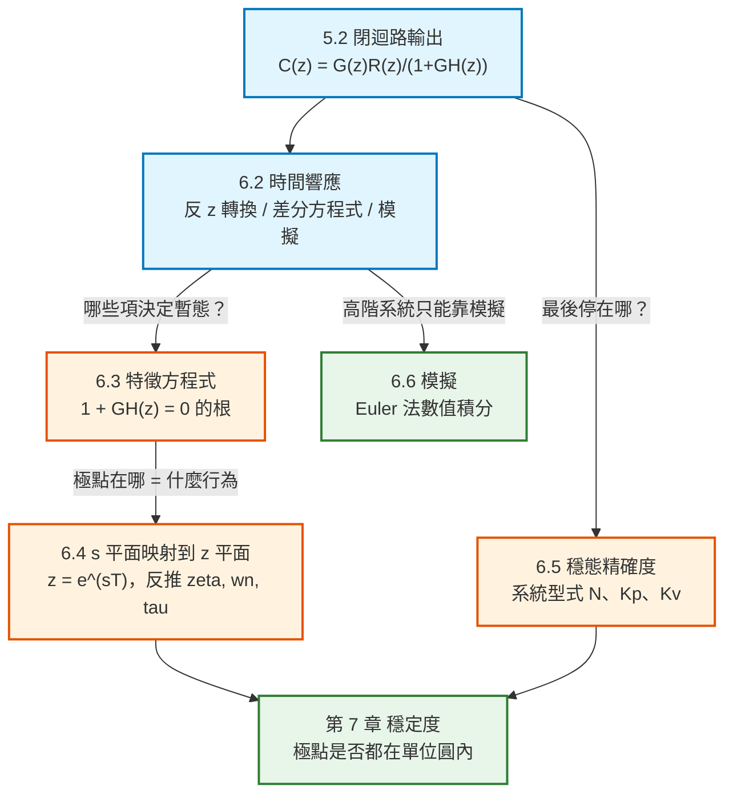

# 數位控制系統第六章：系統時間響應特性（System Time-Response Characteristics）筆記

本文件彙整教材第 6 章「System Time-Response Characteristics」的完整內容：離散系統時間響應的求法（6.2）、系統特徵方程式（6.3）、$s$ 平面映射到 $z$ 平面（6.4）、穩態精確度與系統型式（6.5）、數值模擬（6.6）與控制軟體（6.7）。每個概念與公式均回答「它是什麼／為什麼需要它／怎麼推導／符號代表什麼／物理意義是什麼」，並附上 MATLAB / Octave 對照。

> **本章在全書的位置**：第 5 章建立了閉迴路的 $C(z)=\dfrac{G(z)R(z)}{1+\overline{GH}(z)}$。本章要回答的是——**知道了 $C(z)$，系統實際上會怎麼動？** 這包括暫態（多快、震不震盪）與穩態（最後停在哪、誤差多大）。第 7 章的穩定度分析、第 8、9 章的控制器設計，用的都是本章建立的語言。

> **教材導論的五個主題**：(1) 離散系統的時間響應；(2) 把 $s$ 平面的區域映射到 $z$ 平面；(3) 用兩個平面的對應關係討論閉迴路 $z$ 平面極點對暫態響應的影響；(4) 系統轉移特性對穩態誤差的影響；(5) 類比與離散系統的模擬。

> **符號說明**：原書用 $\varepsilon$ 表示自然指數（即 $e$）、$\zeta$ 表示阻尼比、$\omega_n$ 表示自然頻率、$\tau$ 表示時間常數、$\theta$ 表示 $z$ 平面極點的輻角。

---

## 全章架構



---

## 全章符號總表

| 符號 | 型別 | 意義 |
|---|---|---|
| $T(z)$ | 複變函數 | 閉迴路轉移函數 $C(z)/R(z)$ |
| $z_1=r\angle\pm\theta$ | 複數 | $z$ 平面的一對共軛極點 |
| $r$ | 純量 | $z$ 平面極點的**絕對值** |
| $\theta$ | 純量 | $z$ 平面極點的**輻角**（弧度） |
| $\zeta$ | 純量 | **阻尼比**（damping ratio） |
| $\omega_n$ | 純量 | **自然頻率**（natural frequency） |
| $\tau$ | 純量 | **時間常數**（time constant） |
| $\sigma$ | 純量 | $s$ 平面極點的實部 |
| $\omega_s$ | 純量 | 取樣角頻率 $=2\pi/T$ |
| $T_d$ | 純量 | 正弦訊號的週期 |
| $N$ | 整數 | **系統型式**（system type），$G(z)$ 在 $z=1$ 的極點數 |
| $K_{dc}$ | 純量 | 開迴路 dc 增益（**扣掉 $z=1$ 的極點後**） |
| $K_P$ | 純量 | **位置誤差常數** |
| $K_v$ | 純量 | **速度誤差常數** |
| $e_{ss}$ | 純量 | 穩態誤差 |
| $H$ | 純量 | **數值積分步長**（注意：不是回授轉移函數！） |

> **⚠️ 符號衝突警告**：第 6.6 節的 $H$ 是**數值積分的步長**（integration increment），與第 5 章回授路徑的 $H(s)$ **完全無關**。教材沿用了同一個字母。

---

## 一、導論 (6.1)

本章考慮五個重要主題：

1. **離散時間系統的時間響應**
2. 把 **$s$ 平面的區域映射到 $z$ 平面**
3. 利用兩平面區域的對應關係，討論**閉迴路 $z$ 平面極點對系統暫態響應的影響**
4. **系統轉移特性對穩態誤差的影響**
5. **類比與離散時間系統的模擬**

---

## 二、系統時間響應 (6.2 System Time Response)

### 範例 6.1：一階系統（含教材的 MATLAB 程式）

**系統**：單位回授，受控體 $G_p(s)=\dfrac{4}{s+2}$，$T=0.1$ s。

> **教材的物理背景說明**：溫度控制系統的受控體常被模型化為一階系統（見第 1.6 節），所以這個系統可以視為一個溫控系統的模型。

**第一步：求 $G(z)$**

$$
G(z)=\mathcal{Z}\left[\frac{1-e^{-Ts}}{s}\cdot\frac{4}{s+2}\right]=\frac{z-1}{z}\mathcal{Z}\left[\frac{4}{s(s+2)}\right]
$$

$$
=\frac{z-1}{z}\cdot\frac{2(1-e^{-2T})z}{(z-1)(z-e^{-2T})}=\frac{0.3625}{z-0.8187},\qquad T=0.1\text{ s}
$$

**第二步：閉迴路轉移函數**

$$
T(z)=\frac{G(z)}{1+G(z)}=\frac{0.3625}{z-0.4562}
$$

**第三步：階躍響應**（$R(z)=\dfrac{z}{z-1}$）

$$
C(z)=\frac{0.3625z}{(z-1)(z-0.4562)}=\frac{0.667z}{z-1}+\frac{-0.667z}{z-0.4562}
$$

取反 z 轉換：

$$
\boxed{\;c(kT)=0.667\left[1-(0.4562)^k\right]\;}
$$

**穩態值為 $0.667$**（不是 1，有穩態誤差——第 6.5 節會解釋原因）。

### 教材給的 MATLAB 程式

```matlab
T = 0.1; Gs = tf([4],[1 2]); Gz = c2d(Gs,T);
Tz = feedback(Gz,1); Rz = tf([1 0],[1 -1],T);
Cz = zpk(Rz*Tz)

[r,p,k] = residue([0.3625],[1 -1.4562 0.4562])
```

輸出：

```text
Cz = 0.3625 z / ((z-1)(z-0.4562))

r = [0.6666; -0.6666]      % 部分分式的留數
p = [1.0000; 0.4562]       % 極點
k = []                     % 直接項（無）
```

> **`residue` 在做什麼**：把 $\dfrac{C(z)}{z}$ 做**部分分式展開**，回傳三樣東西：
> - `r`：各項的**留數**（分子）
> - `p`：各項的**極點**（分母的根）
> - `k`：**直接項**（分子次數 $\ge$ 分母次數時才有）
>
> 展開結果：$\dfrac{C(z)}{z}=\dfrac{0.6666}{z-1}+\dfrac{-0.6666}{z-0.4562}$，兩邊乘 $z$ 就得到上面的 $C(z)$。

### 範例 6.2：拿掉取樣器的類比系統（對照組）

把取樣器與零階保持器**移除**，得到純類比閉迴路：

$$
T_a(s)=\frac{G_p(s)}{1+G_p(s)}=\frac{4}{s+6}
$$

$$
C_a(s)=\frac{4}{s(s+6)}=\frac{0.667}{s}+\frac{-0.667}{s+6}\quad\Longrightarrow\quad c_a(t)=0.667\left(1-e^{-6t}\right)
$$

**兩者的穩態值相同（都是 0.667），但暫態不同**——這正是取樣造成的影響。

### 範例 6.4：二階系統與差分方程式解法

**系統**：$G_p(s)=\dfrac{1}{s(s+1)}$，單位回授，$T=1$ s。

$$
T(z)=\frac{G(z)}{1+G(z)}=\frac{0.368z+0.264}{z^2-z+0.632}
$$

**用差分方程式解**（式 6-2 ~ 6-4）：把 $T(z)$ 改寫成 $z^{-1}$ 的形式

$$
\frac{C(z)}{R(z)}=\frac{0.368z^{-1}+0.264z^{-2}}{1-z^{-1}+0.632z^{-2}}
$$

交叉相乘：

$$
C(z)\left[1-z^{-1}+0.632z^{-2}\right]=R(z)\left[0.368z^{-1}+0.264z^{-2}\right]
$$

取反 z 轉換（$z^{-1}$ 對應延遲一步）：

$$
\boxed{\;c(kT)=0.368\,r(kT-T)+0.264\,r(kT-2T)+c(kT-T)-0.632\,c(kT-2T)\;}
$$

**這就是一條可以直接寫成程式的遞迴式。** 初始條件：$c(kT)$ 與 $r(kT)$ 在 $k<0$ 時為零，因此 $c(0)=0$、$c(1)=0.368$。

### 教材給的 MATLAB 程式（解差分方程式）

```matlab
% Note that r=r(kT), rm1=r(kT-T), rm2=r(kT-2T), etc.
rm1=0; rm2=0; cm1=0; cm2=0;
for kk=1:14
  k=kk-1;
  r=1;
  c=0.368*rm1+0.264*rm2+cm1-0.632*cm2;
  [k,c]
  cm2=cm1; cm1=c; rm2=rm1; rm1=r;   % Time delay
end
```

> **💡 這段程式的核心是最後一行**：`cm2=cm1; cm1=c; rm2=rm1; rm1=r;` 就是在**做「延遲一步」的動作**——把「現在」變成「上一步」、「上一步」變成「上上步」。**這正是 $z^{-1}$ 在程式裡的樣子**，也是所有數位濾波器實作的基本手法。
>
> **順序很重要**：必須先更新 `cm2` 再更新 `cm1`，否則會覆蓋掉還要用的值。

### 阻尼比與超越量的關係

若轉移函數是標準二階形式

$$
\frac{C(s)}{R(s)}=\frac{\omega_n^2}{s^2+2\zeta\omega_ns+\omega_n^2}
$$

則階躍響應的**百分比超越量**為：

$$
\boxed{\;\text{百分比超越量}=e^{-\zeta\pi/\sqrt{1-\zeta^2}}\times100\%\;}
$$

> **教材的實用提醒**：對於**不是**標準二階形式的系統，這條關係仍然**給出一個指標**——若系統轉移函數有複數極點，Fig. 6-4 可以粗略預測響應會有多少超越量（或說有多「鬆」）。

### 💡 教材的重要方法論提醒

> **在許多範例中，取樣頻率被刻意選得很低，有兩個理由**：
> 1. 取樣週期取 1 秒讓數值計算比較簡單。
> 2. 取樣週期大時，$C(z)$ 的級數展開**只需要幾項就能看出響應的特性**。
>
> **在範例 6.4 中，若 $T=0.1$ s，取樣資料系統的響應與連續系統幾乎相同。但此時要得到 $t=0$ 到 $t=2$ s 的響應，$C(z)$ 的級數需要 21 項。**
>
> **因此對這種系統，唯一實用的計算方法是模擬**（通常都是如此）。

> **教材的總結**：由於牽涉的複雜度，讀者應該已經看出來——**一般而言我們不會去計算連續輸出**。系統響應通常由**數位模擬或混合模擬**求得，而不是用轉換法。**對高階系統，模擬是唯一實用的技術。**

---

## 三、系統特徵方程式 (6.3)

### 推導

對 Fig. 6-5 的單迴路系統：

$$
C(z)=\frac{G(z)R(z)}{1+\overline{GH}(z)}=\frac{K\prod_{i=1}^{m}(z-z_i)}{\prod_{i=1}^{n}(z-p_i)}R(z)
$$

用部分分式展開：

$$
C(z)=\frac{k_1z}{z-p_1}+\cdots+\frac{k_nz}{z-p_n}+C_R(z)
$$

其中 $C_R(z)$ 包含**源自輸入 $R(z)$ 極點**的那些項。

**前 $n$ 項是 $C(z)$ 的自然響應項**（natural response）——也就是**不論輸入是什麼都會出現**的項。若系統穩定，這些項也稱為**暫態響應**（transient response）。

第 $i$ 項的反 z 轉換為：

$$
\mathcal{Z}^{-1}\left[\frac{k_iz}{z-p_i}\right]=k_i(p_i)^k
$$

> **這些項決定了系統自然響應的「性格」。**

### 系統特徵方程式

因為 $p_i$ 來自下列方程式的根：

$$
\boxed{\;1+\overline{GH}(z)=0\;}
$$

這條方程式就稱為**系統特徵方程式**（system characteristic equation）。

| 情形 | 特徵方程式的根是什麼 |
|---|---|
| 可以寫出轉移函數 | **閉迴路轉移函數的極點** |
| 寫不出轉移函數（第 5 章那些情形） | $C(z)$ 中**與輸入函數無關**的那些極點 |

---

## 四、$s$ 平面映射到 $z$ 平面 (6.4)

**這是本章最重要的一節**——它讓我們能把連續系統累積的所有直覺（阻尼比、自然頻率、時間常數）**搬到離散系統上**。

### 1. 基本對應關係

若 $e(t)=e^{-at}$，則

$$
E(s)=\frac{1}{s+a},\qquad E(z)=\frac{z}{z-e^{-aT}}
$$

**$s$ 平面極點 $s=-a$ 對應到 $z$ 平面極點 $z=e^{-aT}$。** 一般而言：

$$
\boxed{\;s\text{ 平面極點 }s_1\ \longrightarrow\ z\text{ 平面極點 }z_1=e^{s_1T}\;}
$$

> **我們要用的是這個關係的「反向」**：
>
> **$z$ 平面上位於 $z=z_1$ 的極點，在取樣瞬間會產生與等效 $s$ 平面極點 $s_1$ 相同的暫態響應特性**，其中 $z_1=e^{s_1T}$。

### 2. 主帶的映射（Fig. 6-6）

沿著 $j\omega$ 軸（$\sigma=0$）：

$$
z=e^{sT}=e^{\sigma T}e^{j\omega T}=e^{j\omega T}=\cos(\omega T)+j\sin(\omega T)=1\angle\omega T
$$

| $s$ 平面 | $z$ 平面 |
|---|---|
| $j\omega$ 軸 | **單位圓** |
| 主帶的**左半平面**部分 | **單位圓內部** |
| 主帶的**右半平面**部分 | **單位圓外部** |

$$
\boxed{\;s\text{ 平面的穩定區（左半平面）}\ \longleftrightarrow\ z\text{ 平面的穩定區（單位圓內）}\;}
$$

> **$z$ 平面極點落在單位圓上，代表系統的自然響應含有持續振盪**（steady-state oscillation）。**振盪頻率 = 極點的輻角（弧度）除以 $T$。**

**當 $\omega=\omega_s/2$ 時 $\omega T=\pi$**，因此 $j\omega$ 軸上 $-j\omega_s/2$ 到 $+j\omega_s/2$ 這一段恰好映射成整個單位圓。事實上，**$j\omega$ 軸上任何長度為 $\omega_s$ 的一段，都映射成整個單位圓**。

### 3. 三種軌跡的映射

| $s$ 平面的軌跡 | 映射到 $z$ 平面 | 圖 |
|---|---|---|
| **等阻尼**（$\sigma=$ 常數的垂直線） | **圓**（半徑 $e^{\sigma T}$） | Fig. 6-7 |
| **等頻率**（$\omega=$ 常數的水平線） | **射線**（輻角 $\omega T$） | Fig. 6-8 |
| **等阻尼比**（$\omega/\sigma=\tan\delta$ 的斜線） | **對數螺線** | Fig. 6-9 |

等阻尼比的推導（式 6-6）：$\omega$ 與 $\sigma$ 的關係為 $\dfrac{\omega}{\sigma}=\tan\delta$（$\delta$ 為常數），則

$$
z=e^{sT}=e^{\sigma T}\angle(\sigma T\tan\delta)
$$

因為在 $s$ 平面第二、三象限 $\sigma$ 為負，這描述了一條**振幅隨 $|\sigma|$ 增大而遞減的對數螺線**。

### 4. 共軛複數極點的暫態響應項（式 6-7）

若 $s$ 平面極點在 $s=\sigma\pm j\omega$，暫態響應項的形式為 $Ae^{\sigma t}\cos(\omega t+\eta)$。取樣後：

$$
z=e^{sT}\Big|_{s=\sigma\pm j\omega}=e^{\sigma T}e^{\pm j\omega T}=e^{\sigma T}\angle(\pm\omega T)=r\angle(\pm\theta)
$$

因此**特徵方程式的根出現在 $z=r\angle(\pm\theta)$ 時，暫態響應項的形式為**：

$$
\boxed{\;Ae^{\sigma kT}\cos(\omega kT+\eta)=A\,r^{k}\cos(\theta k+\eta)\;}
$$

> **💡 這條式子把 $z$ 平面極點的兩個座標，直接翻譯成響應的兩個特徵**：
> - **$r$（絕對值）→ 衰減速度**：每一步乘 $r$。$r<1$ 才會衰減。
> - **$\theta$（輻角）→ 振盪速度**：每一步相位前進 $\theta$ 弧度。

### 5. 由 $z$ 平面極點反推 $\zeta$、$\omega_n$、$\tau$（式 6-8 ~ 6-10）

**這是本節最實用的三條公式。**

標準二階系統 $G(s)=\dfrac{\omega_n^2}{s^2+2\zeta\omega_ns+\omega_n^2}$ 的極點為

$$
s_{1,2}=-\zeta\omega_n\pm j\omega_n\sqrt{1-\zeta^2}
$$

等效的 $z$ 平面極點：

$$
z=e^{sT}\Big|_{s=s_{1,2}}=e^{-\zeta\omega_nT}\angle\left(\pm\omega_nT\sqrt{1-\zeta^2}\right)=r\angle(\pm\theta)
$$

比對得到兩條關係：

$$
e^{-\zeta\omega_nT}=r\ \Longrightarrow\ \zeta\omega_nT=-\ln r,\qquad \omega_nT\sqrt{1-\zeta^2}=\theta
$$

兩式相除消去 $\omega_nT$：

$$
\frac{\zeta}{\sqrt{1-\zeta^2}}=\frac{-\ln r}{\theta}
$$

解出：

$$
\boxed{\;\zeta=\frac{-\ln r}{\sqrt{(\ln r)^2+\theta^2}}\;}\qquad\text{（式 6-8）}
$$

$$
\boxed{\;\omega_n=\frac{1}{T}\sqrt{(\ln r)^2+\theta^2}\;}\qquad\text{（式 6-9）}
$$

$$
\boxed{\;\tau=\frac{1}{\zeta\omega_n}=\frac{-T}{\ln r}\;}\qquad\text{（式 6-10）}
$$

也可以反過來寫：$r=e^{-T/\tau}$。

> **💡 用法**：拿到一個離散系統，用 `pole()` 求出 $z$ 平面極點，算出 $r=|z|$ 與 $\theta=\angle z$，代入這三條公式，**立刻知道它等效於什麼樣的連續系統**——阻尼比多少、自然頻率多少、多久安定。

### 範例 6.5：一階系統的時間常數

範例 6.1 的閉迴路特徵方程式是 $z-0.4562=0$，極點 $z=0.4562$ 在正實軸上。

$$
z_1=0.4562=e^{s_1T}=e^{0.1s_1}\ \Longrightarrow\ s_1=\frac{\ln 0.4562}{0.1}=-7.848
$$

時間常數是實極點大小的倒數：

$$
\tau=\frac{1}{7.848}=0.127\text{ s}
$$

**對照**：範例 6.3 中拿掉取樣的系統時間常數是 $0.167$ s。

**因為暫態響應大約在四個時間常數內安定，這個系統約在 $0.5$ 秒安定**——這與 Fig. 6-1(b) 的階躍響應吻合。

### 範例 6.6：二階系統反推三個參數

範例 6.4 的閉迴路特徵方程式：

$$
z^2-z+0.632=(z-0.5-j0.618)(z-0.5+j0.618)=0
$$

極點為：

$$
z=0.5\pm j0.618=0.795\angle(\pm51.0^\circ)=0.795\angle(\pm0.890\text{ rad})
$$

代入式 (6-8)、(6-9)、(6-10)（注意 $T=1$ s）：

$$
\zeta=\frac{-\ln0.795}{\sqrt{(\ln0.795)^2+0.890^2}}=0.250
$$

$$
\omega_n=\frac{1}{1}\sqrt{(\ln0.795)^2+0.890^2}=0.9191\text{ rad/s}
$$

$$
\tau=\frac{-1}{\ln0.795}=4.36\text{ s}
$$

**與連續系統對照**（範例 6.4 中拿掉取樣器與保持器）：$\zeta=0.50$、$\omega_n=1$ rad/s、$\tau=1/(\zeta\omega_n)=2$ s。

$$
\boxed{\;\text{因此可以看出：取樣的效果是「去穩定化」（destabilizing）}\;}
$$

**阻尼比從 0.50 掉到 0.250，時間常數從 2 秒拉長到 4.36 秒。**

> **但若 $T=0.1$ s，取樣的影響就很小**：$\zeta=0.475$、$\omega_n=0.998$ rad/s、$\tau=2.11$ s——幾乎回到連續系統的值。
>
> **這再次印證第 3 章的結論**：ZOH 等效引入 $T/2$ 的延遲，$T$ 越大傷害越大。

### 6. 極點應該落在哪裡？（式 6-11、6-12 與 Table 6-2）

**$s$ 平面極點轉換到 $z$ 平面時**：

$$
s+\frac{1}{\tau}\ \longrightarrow\ z-e^{-T/\tau}
$$

$$
\left(s+\frac{1}{\tau}\right)^2+\omega^2\ \longrightarrow\ z^2-2ze^{-T/\tau}\cos\omega T+e^{-2T/\tau}=(z-z_1)(z-\bar{z}_1)
$$

其中 $z_1=e^{-T/\tau}e^{j\omega T}=e^{-T/\tau}\angle\omega T=r\angle\theta$。

**推論**：

- **實極點**：要讓取樣的影響可忽略，$T$ 必須遠小於 $\tau$。因此 $T/\tau\ll1$，$z$ 平面極點會落在 **$z=1$ 附近**。
- **複數極點**：額外要求每個正弦週期取樣好幾次，也就是 $\omega T<1$。同樣得到 $T\ll\tau$，而 $|z_1|=e^{-T/\tau}$，極點**仍然落在 $z=1$ 附近**。

$$
\boxed{\;\text{一般而言，若系統條件允許選用足夠高的取樣率，離散控制系統的極點會落在 }z=1\text{ 附近}\;}
$$

**兩個實用的量化指標**：

$$
\frac{\tau}{T}=\frac{-1}{\ln r}\qquad\text{（式 6-11，每個時間常數取樣幾次）}
$$

$$
\frac{T_d}{T}=\frac{2\pi}{\theta}=\frac{360^\circ}{\theta^\circ}\qquad\text{（式 6-12，每個正弦週期取樣幾次）}
$$

**Table 6-2**（教材原表）：

| $r$ | $\tau/T$（每時間常數取樣次數） | | $\theta$ | $T_d/T$（每週期取樣次數） |
|---|---|---|---|---|
| 0.999 | 999.5 | | $10^\circ$ | 36 |
| 0.99 | 99.5 | | $20^\circ$ | 18 |
| 0.95 | 19.5 | | $30^\circ$ | 12 |
| 0.9 | 9.5 | | $45^\circ$ | 8 |
| 0.8 | 4.48 | | $60^\circ$ | 6 |
| 0.7 | 2.80 | | $90^\circ$ | 4 |
| 0.6 | 1.96 | | $120^\circ$ | 3 |
| 0.4 | 1.09 | | $180^\circ$ | 2 |
| 0.2 | 0.62 | | | |

> **💡 這張表怎麼用**：看到一個 $z$ 平面極點 $r\angle\theta$，立刻可以判斷取樣率夠不夠。
> - $r=0.9$ → 每個時間常數取樣 9.5 次 → **合理**
> - $r=0.4$ → 每個時間常數只取樣 1.09 次 → **取樣太慢**，離散化誤差會很大
> - $\theta=45^\circ$ → 每個振盪週期取樣 8 次 → **合理**
> - $\theta=120^\circ$ → 每週期只取樣 3 次 → **太少**，波形會嚴重失真

---

## 五、穩態精確度 (6.5 Steady-State Accuracy)

### 1. 系統型式（system type）

考慮 Fig. 6-12 的單位回授系統：

$$
\frac{C(z)}{R(z)}=\frac{G(z)}{1+G(z)}
$$

受控體轉移函數永遠可以寫成：

$$
G(z)=\frac{K\prod_{i=1}^{m}(z-z_i)}{(z-1)^{N}\prod_{j=1}^{p}(z-z_j)},\qquad z_i\neq1,\ z_j\neq1
$$

$$
\boxed{\;N=G(z)\text{ 在 }z=1\text{ 的極點數，稱為「系統型式」}\;}
$$

同時定義（式 6-15）：

$$
K_{dc}=\left.\frac{K\prod_{i=1}^{m}(z-z_i)}{\prod_{j=1}^{p}(z-z_j)}\right|_{z=1}
$$

> **$K_{dc}$ 是「把 $z=1$ 的極點全部拿掉之後」的開迴路 dc 增益。**

### 2. 誤差的一般式（式 6-16、6-17）

$$
E(z)=R(z)-C(z)=R(z)-\frac{G(z)}{1+G(z)}R(z)=\frac{R(z)}{1+G(z)}
$$

由**終值定理**：

$$
e_{ss}(kT)=\lim_{z\to1}(z-1)E(z)=\lim_{z\to1}\frac{(z-1)R(z)}{1+G(z)}
$$

（前提是 $e_{ss}(kT)$ 確實存在。）

### 3. 步階輸入 → 位置誤差常數（式 6-18、6-19）

$R(z)=\dfrac{z}{z-1}$，代入：

$$
e_{ss}(kT)=\lim_{z\to1}\frac{z}{1+G(z)}=\frac{1}{1+\lim_{z\to1}G(z)}
$$

定義**位置誤差常數**：

$$
\boxed{\;K_P=\lim_{z\to1}G(z)\;}
$$

| 系統型式 | $K_P$ | 步階輸入的穩態誤差 |
|---|---|---|
| $N=0$ | $K_P=K_{dc}$（有限） | $e_{ss}=\dfrac{1}{1+K_P}=\dfrac{1}{1+K_{dc}}$ |
| $N\ge1$ | $K_P=\infty$ | $e_{ss}=0$ |

### 4. 斜坡輸入 → 速度誤差常數（式 6-20、6-21）

$r(t)=t$，$R(z)=\dfrac{Tz}{(z-1)^2}$，代入：

$$
e_{ss}(kT)=\lim_{z\to1}\frac{Tz}{(z-1)+(z-1)G(z)}=\frac{T}{\lim_{z\to1}(z-1)G(z)}
$$

定義**速度誤差常數**：

$$
\boxed{\;K_v=\lim_{z\to1}\frac{1}{T}(z-1)G(z)\;}
$$

| 系統型式 | $K_v$ | 斜坡輸入的穩態誤差 |
|---|---|---|
| $N=0$ | $K_v=0$ | $e_{ss}=\infty$ |
| $N=1$ | $K_v=\dfrac{K_{dc}}{T}$ | $e_{ss}=\dfrac{1}{K_v}=\dfrac{T}{K_{dc}}$ |
| $N\ge2$ | $K_v=\infty$ | $e_{ss}=0$ |

### 5. 💡 設計上的取捨（教材的重要結論）

> **提高系統增益、或在開迴路前向路徑轉移函數中增加 $z=1$ 的極點，都傾向於減少穩態誤差。**
>
> **但是**（第 7 章會證明）——**大增益與 $G(z)$ 在 $z=1$ 的極點，兩者都有「去穩定化」的效果**。
>
> **因此「小穩態誤差」與「足夠的系統穩定度（或可接受的暫態響應）」之間，一般存在取捨關係。**

### 範例 6.7：型式 1 系統

$$
G(s)=\frac{1-e^{-Ts}}{s}\cdot\frac{K}{s(s+1)}
$$

$$
G(z)=K\frac{(z-1)}{z}\mathcal{Z}\left[\frac{1}{s^2(s+1)}\right]=\frac{K\left[(e^{-T}+T-1)z+(1-e^{-T}-Te^{-T})\right]}{(z-1)(z-e^{-T})}
$$

**$G(z)$ 在 $z=1$ 有一個極點 → 系統型式 $N=1$**。

$$
K_v=\frac{K_{dc}}{T}=\frac{K\left[(e^{-T}+T-1)+(1-e^{-T}-Te^{-T})\right]}{T(1-e^{-T})}=K
$$

**結論**：

- 對**步階輸入**的穩態誤差 = **0**（因為 $N=1\ge1$）
- 對**斜坡輸入**的穩態誤差 $=\dfrac{1}{K_v}=\dfrac{1}{K}$

> **前提是系統穩定**——穩定度問題留到第 7 章。

### 範例 6.8：用 PI 補償器降低穩態誤差

**系統**：$G(z)=\mathcal{Z}\left[\dfrac{1-e^{-Ts}}{s(s+1)}\right]=\dfrac{1-e^{-T}}{z-e^{-T}}$。

**規格要求**：對單位斜坡輸入的穩態誤差**小於 0.01**。

**分析**：由式 (6-20)，開迴路必須是**型式 1 或以上**，也就是開迴路函數至少要有一個 $z=1$ 的極點。**但這個受控體沒有**。

**解法**：加一個數位補償器

$$
D(z)=\frac{K_Iz}{z-1}+K_P
$$

> **這稱為 PI 補償器**（proportional-plus-integral，比例加積分），是**降低穩態誤差最常用的形式**。第 8 章會詳細討論。

代入式 (6-20)：

$$
K_v=\lim_{z\to1}\frac{1}{T}(z-1)D(z)G(z)=\lim_{z\to1}\frac{(z-1)\left[(K_I+K_P)z-K_P\right]}{T(z-1)}\cdot\frac{1-e^{-T}}{z-e^{-T}}=\frac{K_I}{T}
$$

要 $e_{ss}=\dfrac{1}{K_v}<0.01$，需要 $K_v>100$，因此：

$$
\boxed{\;K_I=100T\;}
$$

> **⚠️ 教材的重要提醒**：這個結果**成立的前提是系統穩定**。**誤差分析在系統穩定性未獲保證之前是沒有意義的。** 第 7 章會介紹分析穩定度的多種技巧，這個系統在**範例 7.6** 會被進一步討論。

---

## 六、模擬 (6.6 Simulation)

### 1. 為什麼要模擬

前面都是用**轉換法**求時間響應。但如第 6.2 節結尾所說——**對高階系統，模擬是唯一實用的技術**。

**模擬的種類**：

| 方式 | 說明 |
|---|---|
| **類比電腦模擬** | 用電子電路積分系統的微分方程式 |
| **混合式模擬**（hybrid） | 數位電腦與類比電腦相接：類比部分在類比電腦上、數位控制器在數位電腦上 |
| **數位模擬** | 用**數值演算法**在數位電腦上積分微分方程式——**本節討論的就是這一種** |

### 2. 數值積分的基本問題（式 6-22、6-23）

我們要數值地積分 $y(t)$，也就是求

$$
x(t)=\int_0^t y(\nu)\,d\nu+x(0)
$$

**已知 $x[(k-1)H]$，要算 $x(kH)$**，其中 $H$ 稱為**數值積分增量**（integration increment），也就是演算法的**步長**。

**最簡單的演算法**：假設 $y(t)$ 在 $(k-1)H\le t<kH$ 期間為常數，值等於 $y[(k-1)H]$：

$$
\boxed{\;x(kH)=x[(k-1)H]+H\,y[(k-1)H]\;}
$$

> **幾何意義**（Fig. 6-14）：用**矩形的面積**近似 $y(t)$ 曲線下的面積。
>
> 因此這個演算法稱為**矩形法則**（rectangular rule），也稱為 **Euler 法**（Euler method）。

### 3. 用 Euler 法解微分方程式（式 6-24、6-25）

考慮

$$
\dot{x}(t)+x(t)=0,\qquad x(0)=1
$$

**精確解**顯然是 $x(t)=e^{-t}$。

用 Euler 法：因為 $y(t)=\dot{x}(t)=-x(t)$，

$$
x(kH)=x[(k-1)H]+H\left[-x[(k-1)H]\right]
$$

**取 $H=0.1$ s，從 $k=1$ 開始迭代**：

$$
x(0.1)=x(0)-Hx(0)=1.0-(0.1)(1.0)=0.9
$$

$$
x(0.2)=x(0.1)-Hx(0.1)=0.9-0.09=0.81
$$

$$
\vdots
$$

$$
x(1.0)=x(0.9)-Hx(0.9)=0.3487
$$

**精確值**：$x(1.0)=e^{-1.0}=0.3678$。**誤差約 5.2%**——這就是數值積分造成的誤差。

### 4. ⚠️ 步長 $H$ 的取捨（教材的重要警告）

> **$H$ 取大 → 誤差大。**
>
> **$H$ 減小 → 誤差先減到一個最小值。**
>
> **$H$ 再減小 → 誤差反而「增加」**，因為電腦的**捨入誤差**（round-off）。
>
> 用 $H=0.1$ s 算 $x(1)$ 需要 **10 次**迭代；用 $H=0.001$ s 需要 **1000 次**。後者的捨入誤差較大，因為做了更多次計算。**若 $H$ 取得夠小，這個捨入誤差會變得顯著。**

$$
\boxed{\;\text{存在一個「最佳步長」}\;}
$$

### 5. 向量形式（式 6-26 ~ 6-29）

若系統的狀態方程式為 $\dot{\mathbf{x}}(t)=A_c\mathbf{x}(t)+B_c\mathbf{u}(t)$，則矩形法則變成：

$$
\mathbf{x}(kH)=\mathbf{x}[(k-1)H]+H\dot{\mathbf{x}}[(k-1)H]
$$

$$
\dot{\mathbf{x}}[(k-1)H]=A_c\mathbf{x}[(k-1)H]+B_c\mathbf{u}[(k-1)H]
$$

### 6. 教材的兩個補充要點

> **要點一**：在數位模擬中，我們**用差分方程式近似微分方程式**並求解差分方程式。因此**我們是用一個「響應近似相同」的離散時間系統，去取代一個連續時間系統**。

> **要點二（非線性系統）**：在非線性系統的模擬中，**非線性只出現在「由 $\mathbf{x}[(k-1)H]$ 計算 $\dot{\mathbf{x}}[(k-1)H]$」這一步**。若非線性可以用數學形式簡單表達，**模擬程式並不會明顯變難寫**。
>
> **💡 這是數值模擬相對於轉換法的最大優勢**——轉換法（拉氏／z 轉換）**只適用於線性系統**，模擬則不受此限。

### 7. 加入取樣器與數位控制器

> 在類比系統模擬中加入**取樣器與零階保持器**，需要**額外加入邏輯**：
> - 讓零階保持器的輸出在任一取樣週期內**保持常數**，等於該週期開始時取樣器輸入的值。
>
> 加入**數位控制器**則需要：
> - 控制器的差分方程式**只在每個取樣週期開始時求解一次**，
> - 控制器輸出在整個取樣週期內**保持常數**。

---

## 七、控制軟體 (6.7 Control Software)

> 市面上有許多商用的分析與設計控制軟體套件，模擬能力程度不一。**本書採用 MATLAB。**
>
> 一般而言：
> - 數位控制系統中的**類比元件**以**轉移函數或狀態方程式**輸入軟體。多數套件接受任一種模型，並能由其中一種算出另一種。
> - **數位控制器**若已知，則以轉移函數（有時是狀態模型）輸入。
> - 套件即可模擬整個系統。
> - 一般套件提供**多種數值積分演算法**，使用者必須選一種，或接受程式的預設選擇。

---

## 八、本章總結 (6.8 Summary)

本章討論了離散時間閉迴路系統的時間響應，**暫態與穩態兩者都涵蓋**。

所呈現的 **$s$ 平面與 $z$ 平面的對應關係，提供了一個機制**——讓連續系統分析與設計所需的許多工具，可以**移轉到閉迴路離散時間系統上**。

最後簡介了系統的**數位模擬**。

### 全章公式速查

| 式號 | 公式 | 用途 |
|---|---|---|
| (6-4) | $c(kT)=\cdots$（差分方程式） | 用遞迴解時間響應 |
| — | $\text{超越量}=e^{-\zeta\pi/\sqrt{1-\zeta^2}}\times100\%$ | 由阻尼比估超越量 |
| (6-5) | $C(z)=\sum\dfrac{k_iz}{z-p_i}+C_R(z)$ | 自然響應 vs 強迫響應 |
| — | $1+\overline{GH}(z)=0$ | **系統特徵方程式** |
| — | $z_1=e^{s_1T}$ | $s$ 平面 → $z$ 平面 |
| (6-7) | $z=r\angle\pm\theta\ \to\ Ar^k\cos(\theta k+\eta)$ | $z$ 極點 → 響應形式 |
| **(6-8)** | $\zeta=\dfrac{-\ln r}{\sqrt{(\ln r)^2+\theta^2}}$ | **反推阻尼比** |
| **(6-9)** | $\omega_n=\dfrac{1}{T}\sqrt{(\ln r)^2+\theta^2}$ | **反推自然頻率** |
| **(6-10)** | $\tau=\dfrac{-T}{\ln r}$ | **反推時間常數** |
| (6-11) | $\dfrac{\tau}{T}=\dfrac{-1}{\ln r}$ | 每時間常數取樣幾次 |
| (6-12) | $\dfrac{T_d}{T}=\dfrac{360^\circ}{\theta^\circ}$ | 每週期取樣幾次 |
| (6-18) | $K_P=\lim_{z\to1}G(z)$ | **位置誤差常數** |
| (6-19) | $e_{ss}=\dfrac{1}{1+K_P}$ | 步階穩態誤差（型式 0） |
| (6-20) | $K_v=\lim_{z\to1}\dfrac{(z-1)G(z)}{T}$ | **速度誤差常數** |
| (6-21) | $e_{ss}=\dfrac{1}{K_v}=\dfrac{T}{K_{dc}}$ | 斜坡穩態誤差（型式 1） |
| (6-23) | $x(kH)=x[(k-1)H]+Hy[(k-1)H]$ | **Euler 法（矩形法則）** |

---

## 九、MATLAB / Octave 實作驗證

> **需要 Control System Toolbox**（Octave 使用者請先 `pkg load control`）。

完整可執行版見 [`chp6.m`](chp6.m)，逐格教學版見 [`chp6.ipynb`](chp6.ipynb)。

### 實驗一覽

| # | 對應章節 | 驗證什麼 |
|---|---|---|
| 1 | 例 6.1 | 一階系統的 $G(z)$、$T(z)$、$c(kT)$，**含教材的 `residue` 程式** |
| 2 | 例 6.2 | 取樣 vs 不取樣的對照 |
| 3 | 例 6.4 | **差分方程式解法**（教材的 `for` 迴圈） |
| 4 | 例 6.5、6.6 | **式 (6-8)~(6-10) 反推 $\zeta$、$\omega_n$、$\tau$** |
| 5 | 6.4 | $s$ 平面 → $z$ 平面的三種軌跡映射 |
| 6 | 6.5 | 系統型式、$K_P$、$K_v$、穩態誤差 |
| 7 | 6.6 | **Euler 法與步長 $H$ 的取捨** |

### 數學 ↔ MATLAB 對照

| 數學 | MATLAB / Octave | 說明 |
|---|---|---|
| 部分分式展開 | `[r,p,k] = residue(num, den)` | `r`=留數、`p`=極點、`k`=直接項 |
| $r=| z|$ | `abs(p)` | 極點絕對值 |
| $\theta=\angle z$ | `angle(p)` | **回傳弧度**，轉度數要 `*180/pi` |
| 式 (6-8) | `-log(r)/sqrt(log(r)^2+th^2)` | **`log` 是自然對數**（$\ln$），不是 $\log_{10}$ |
| 式 (6-9) | `sqrt(log(r)^2+th^2)/T` | |
| 式 (6-10) | `-T/log(r)` | |
| $z=e^{sT}$ | `exp(s*T)` | |
| 差分方程式遞迴 | `for` 迴圈 + 手動搬移舊值 | 見實驗 3 |
| Euler 法 | `x = x + H*xdot;` | 見實驗 7 |

> **⚠️ 三個容易犯的錯**
>
> 1. **`log` vs `log10`**：MATLAB / Octave 的 `log(x)` 是**自然對數 $\ln x$**。式 (6-8)~(6-10) 全部用 $\ln$，寫成 `log10` 會完全錯。
> 2. **`angle` 回傳弧度**：式 (6-8)、(6-9) 中的 $\theta$ **必須是弧度**。若你從書上抄 $51^\circ$ 直接代入，答案會錯——要先乘 $\pi/180$。
> 3. **差分方程式的更新順序**：`cm2=cm1; cm1=c;` 順序不能顛倒，否則會覆蓋掉還要用的值。
