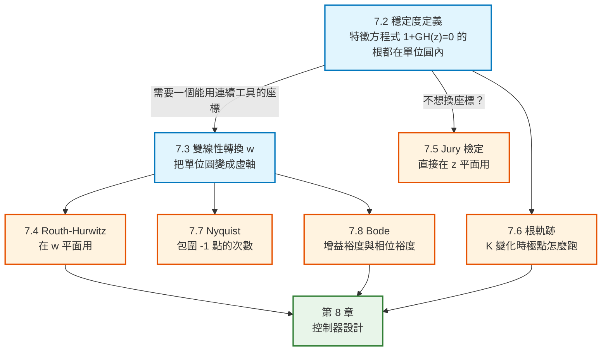

# 數位控制系統第七章：穩定度分析技巧（Stability Analysis Techniques）筆記

本文件彙整教材第 7 章「Stability Analysis Techniques」的完整內容：穩定度的定義與特徵方程式（7.2）、雙線性轉換（7.3）、Routh–Hurwitz 準則（7.4）、Jury 穩定度檢定（7.5）、根軌跡（7.6）、Nyquist 準則（7.7）、Bode 圖（7.8）、頻率響應的物理意義（7.9）與閉迴路頻率響應（7.10）。每個概念與公式均回答「它是什麼／為什麼需要它／怎麼推導／符號代表什麼／物理意義是什麼」，並附上 MATLAB / Octave 對照。

> **本章在全書的位置**：第 6 章建立了「$z$ 平面極點位置 ↔ 時間響應特性」的對應。本章要回答更基本的問題——**極點到底在不在單位圓內？** 而且是在**不解方程式**的前提下判斷，以及**增益 $K$ 可以調到多大**才會不穩定。第 8 章的控制器設計，用的全部是本章的工具。

> **教材導論的重點**：連續系統的穩定度分析技巧（Routh–Hurwitz、根軌跡、頻率響應法）**只要做適當修改，都可以用在離散系統上**。此外還有一個**專為離散系統發展**的技巧——**Jury 穩定度檢定**。

> **符號說明**：原書用 $\varepsilon$ 表示自然指數（即 $e$）、$\omega_w$ 表示 $w$ 平面頻率、$\eta_m$ 表示相位裕度。

---

## 全章架構



---

## 全章符號總表

| 符號 | 型別 | 意義 |
|---|---|---|
| $G(z),H(z)$ | 複變函數 | 前向路徑、回授路徑 |
| $\overline{GH}(z)$ | 複變函數 | $\mathcal{Z}[G(s)H(s)]$（先在 $s$ 域相乘） |
| $K$ | 純量 | 可調的迴路增益 |
| $w$ | 複變數 | **雙線性轉換變數**（$w$ 平面） |
| $\omega_w$ | 純量 | **$w$ 平面頻率** |
| $\omega$ | 純量 | 真實頻率（$s$ 平面） |
| $\omega_s$ | 純量 | 取樣角頻率 $=2\pi/T$ |
| $Q(z)$ | 多項式 | 特徵多項式 |
| $a_i,b_k,c_k$ | 純量 | Jury 陣列的元素 |
| $N$ | 整數 | Nyquist 圖包圍 $-1$ 點的次數 |
| $P$ | 整數 | 開迴路在 Nyquist 路徑外的極點數 |
| $Z$ | 整數 | 閉迴路在單位圓外的極點數，$Z=N+P$ |
| $\eta_m$ | 純量 | **相位裕度**（phase margin） |
| $G_{op}(z)$ | 複變函數 | 在取樣器處斷開所得的開迴路轉移函數 |

---

## 一、導論 (7.1)

本章強調 LTI 離散時間系統的穩定度分析技巧。

> **一般而言，適用於 LTI 連續時間系統的穩定度分析技巧，只要做某些修改，也可以用來分析 LTI 離散時間系統。** 這些技巧包括 **Routh–Hurwitz 準則、根軌跡程序、頻率響應法**。此外還會介紹**專為 LTI 離散系統發展的 Jury 穩定度檢定**。

---

## 二、穩定度 (7.2 Stability)

### 1. 穩定度的定義（式 7-1 ~ 7-3）

對 Fig. 7-1 的取樣資料系統：

$$
C(z)=\frac{G(z)R(z)}{1+\overline{GH}(z)}=\frac{K\prod_{i=1}^{m}(z-z_i)}{\prod_{i=1}^{n}(z-p_i)}R(z)
$$

部分分式展開（極點相異時）：

$$
C(z)=\frac{k_1z}{z-p_1}+\cdots+\frac{k_nz}{z-p_n}+C_R(z)
$$

前 $n$ 項是**自然響應項**。**若這些項的反 z 轉換隨時間增加而趨近於零，系統就是穩定的**，這些項稱為**暫態響應**。

第 $i$ 項的反 z 轉換為：

$$
\mathcal{Z}^{-1}\left[\frac{k_iz}{z-p_i}\right]=k_i(p_i)^k
$$

$$
\boxed{\;\text{若 }|p_i|<1\text{，此項隨 }k\to\infty\text{ 趨近於零}\;}
$$

而因式 $(z-p_i)$ 來自**系統特徵方程式**：

$$
\boxed{\;1+\overline{GH}(z)=0\;}
$$

$$
\boxed{\;\text{系統穩定}\iff\text{特徵方程式的所有根都在 }z\text{ 平面單位圓「內」}\;}
$$

### 2. 兩種等價寫法

特徵方程式也可以寫成：

$$
1+\overline{GH}^*(s)=0
$$

因為 **$z$ 平面單位圓內對應 $s$ 平面左半平面**（第 6.4 節），所以此式的根必須在 $s$ 平面左半平面才穩定。**兩種寫法都可以用來計算特徵方程式。**

### 3. 臨界穩定（marginally stable）

若特徵方程式有一個根的**絕對值恰為 1**（例如 $p_i=1\angle\theta$），則 $k_i(p_i)^k$ 的**大小為常數**——自然響應中有一項既不衰減、也不發散。

$$
\boxed{\;\text{臨界穩定}\iff\text{特徵方程式至少有一個根在單位圓「上」，且沒有根在單位圓「外」}\;}
$$

> **重複極點的情形**：上述推導假設極點相異。**可以證明轉移函數有重複極點時，穩定度條件完全相同**（原書習題 7.2-1）。

### 4. 寫不出轉移函數時怎麼找特徵方程式

第 5 章證明過某些離散系統寫不出轉移函數。教材給出一個**通用做法**：

> **因為線性系統的穩定度與輸入無關，所以令 $R(s)=0$。然後在「某個取樣器的前面」把系統斷開，並在斷開處推導一個轉移函數。**
>
> **為什麼一定要在取樣器處斷開？** 因為**只要輸入訊號在進入系統的連續部分之前先被取樣，我們就一定寫得出轉移函數**（第 5 章的結論）。若在其他任何點斷開，就寫不出轉移函數。

把斷開處的輸入記為 $E_i(s)$、輸出記為 $E_o(s)$，用 Mason 增益公式（定義見第 2 章 §七.3，第 5 章 §三.5 有取樣訊號流圖的版本）求出：

$$
G_{op}(z)=\frac{E_o(z)}{E_i(z)}
$$

**閉迴路時** $E_i(z)=E_o(z)$，因此 $[1-G_{op}(z)]E_o(z)=0$。由於可以設定初始條件使 $E_o(z)\neq0$：

$$
\boxed{\;1-G_{op}(z)=0\quad\text{就是系統特徵方程式}\;}
$$

> **⚠️ 注意是「減號」**：因為 $G_{op}$ 已經把回授路徑的負號吃進去了。這與 $1+\overline{GH}(z)=0$ 是一致的，只是符號約定不同。

---

## 三、雙線性轉換 (7.3 Bilinear Transformation)

### 1. 為什麼需要它

> **許多連續系統的分析與設計技巧（如 Routh–Hurwitz 準則與 Bode 技巧），都建立在「$s$ 平面的穩定邊界是虛軸」這個性質上。**
>
> **因此這些技巧不能直接用在 $z$ 平面，因為 $z$ 平面的穩定邊界是單位圓。**

**解法**：找一個變數變換，把單位圓變成虛軸。

### 2. 轉換式（式 7-7、7-8）

$$
\boxed{\;z=\frac{1+(T/2)w}{1-(T/2)w}\quad\Longleftrightarrow\quad w=\frac{2}{T}\cdot\frac{z-1}{z+1}\;}
$$

### 3. 證明單位圓變成虛軸（式 7-9）

在 $z$ 平面單位圓上，$z=e^{j\omega T}$：

$$
w=\frac{2}{T}\cdot\frac{e^{j\omega T}-1}{e^{j\omega T}+1}
=\frac{2}{T}\cdot\frac{e^{j\omega T/2}-e^{-j\omega T/2}}{e^{j\omega T/2}+e^{-j\omega T/2}}
=j\frac{2}{T}\tan\frac{\omega T}{2}
$$

（第二個等號是分子分母同除 $e^{j\omega T/2}$；第三個等號用尤拉關係，分子是 $2j\sin$、分母是 $2\cos$。）

**結果是純虛數 → $z$ 平面的單位圓確實映射成 $w$ 平面的虛軸。**

| 平面 | 穩定區域 |
|---|---|
| $s$ 平面 | 左半平面 |
| $z$ 平面 | 單位圓**內** |
| $w$ 平面 | **左半平面** |

### 4. $w$ 平面頻率（式 7-10、7-11）

令 $j\omega_w$ 為 $w$ 的虛部，稱 $\omega_w$ 為 **$w$ 平面頻率**：

$$
\boxed{\;\omega_w=\frac{2}{T}\tan\frac{\omega T}{2}\;}
$$

**這條式子給出 $s$ 平面頻率與 $w$ 平面頻率的關係。**

**當 $\omega T$ 很小時**（用 $\tan x\approx x$）：

$$
\omega_w=\frac{2}{T}\tan\frac{\omega T}{2}\approx\frac{2}{T}\cdot\frac{\omega T}{2}=\omega
$$

$$
\boxed{\;\text{低頻時 }w\text{ 平面頻率} \approx s\text{ 平面頻率}\;}
$$

### 5. 近似的有效範圍（式 7-12）

$$
\frac{\omega T}{2}\le\frac{\pi}{10}\quad\Longrightarrow\quad \omega\le\frac{2\pi}{10T}=\frac{\omega_s}{10}
$$

**在此範圍內近似誤差小於 4%。**

> **💡 教材的實務建議**：由於零階保持器引入的相位落後，我們通常**把取樣週期 $T$ 選成讓式 (7-12) 在系統會通過的整個頻帶（系統頻寬）內都成立**。
>
> **在 $\omega=\omega_s/10$ 時，零階保持器引入 $18^\circ$ 的相位落後**（見第 3 章 Fig. 3-13）——這是相當可觀的量，而且**會大幅影響系統穩定度**。

---

## 四、Routh–Hurwitz 準則 (7.4)

### 1. 為什麼要先做雙線性轉換

> **Routh–Hurwitz 準則可以判斷方程式是否有根在 $s$ 平面右半平面。**
>
> **若把這個準則直接套用在寫成 $z$ 的函數的離散系統特徵方程式上，得不到任何有用的穩定度資訊。**
>
> **但若特徵方程式寫成雙線性轉換變數 $w$ 的函數，就可以直接套用 Routh–Hurwitz 準則來判斷穩定度。**

### 2. Routh 陣列的建構（Table 7-1）

給定特徵方程式

$$
F(w)=b_nw^n+b_{n-1}w^{n-1}+\cdots+b_1w+b_0=0
$$

**前兩列**由特徵方程式直接寫出（偶次項一列、奇次項一列），**其餘各列**用下式計算：

$$
c_1=\frac{b_{n-1}b_{n-2}-b_nb_{n-3}}{b_{n-1}},\qquad c_2=\frac{b_{n-1}b_{n-4}-b_nb_{n-5}}{b_{n-1}},\ \dots
$$

$$
d_1=\frac{c_1b_{n-3}-b_{n-1}c_2}{c_1},\qquad d_2=\frac{c_1b_{n-5}-b_{n-1}c_3}{c_1},\ \dots
$$

### 3. 判準

$$
\boxed{\;\text{在右半平面的根數}=\text{陣列「第一行」係數的變號次數}\;}
$$

### 4. 輔助方程式（auxiliary equation）

若某一列全為零，設其上一列（$w^i$ 列）的係數為 $c_1,c_2,\dots$，則**輔助方程式**為

$$
c_1w^i+c_2w^{i-2}+c_3w^{i-4}+\cdots=0
$$

**這個方程式是特徵方程式的一個因式。**

### 範例 7.2：$T=0.1$ s 的系統

受控體 $G_p(s)=\dfrac{1}{s(s+1)}$（第 6.7 節的系統），加上可調增益 $K$。

$$
G(z)=\frac{0.00484z+0.00468}{(z-1)(z-0.905)}
$$

**用 MATLAB 做雙線性轉換**（教材程式）：

```matlab
T=0.1; numz=[0.00484 0.00468]; denz=[1 -1.905 0.905];
Gz=tf(numz,denz,T);
Gw=d2c(Gz,'tustin')   % 雙線性轉換；d2c 回傳 s 的函數，但在本章記號中是 w
```

$$
G(w)=\frac{-0.0000420w^2-0.0491w+1}{w^2+0.997w}
$$

**特徵方程式**（任意 $K$）：

$$
1+KG(w)=(1-0.000042K)w^2+(0.997-0.0491K)w+K=0
$$

**Routh 陣列**：

| | | | 條件 |
|---|---|---|---|
| $w^2$ | $1-0.000042K$ | $K$ | $K<23800$ |
| $w^1$ | $0.997-0.0491K$ | | $K<20.3$ |
| $w^0$ | $K$ | | $K>0$ |

$$
\boxed{\;\text{穩定範圍：}0<K<20.3\;}
$$

### 範例 7.3：同一個系統但 $T=1$ s

$$
G(z)=\frac{0.368z+0.264}{z^2-1.368z+0.368},\qquad
G(w)=\frac{-0.03801w^2-0.386w+0.924}{w^2+0.924w}
$$

$$
1+KG(w)=(1-0.03801K)w^2+(0.924-0.386K)w+0.924K=0
$$

| | | | 條件 |
|---|---|---|---|
| $w^2$ | $1-0.03801K$ | $0.924K$ | $K<26.3$ |
| $w^1$ | $0.924-0.386K$ | | $K<2.39$ |
| $w^0$ | $0.924K$ | | $K>0$ |

$$
\boxed{\;\text{穩定範圍：}0<K<2.39\;}
$$

### 5. 由輔助方程式求振盪頻率

$K=2.39$ 是**臨界穩定**的增益。由 $w^2$ 列寫出輔助方程式：

$$
(1-0.03801K)w^2+0.924K\Big|_{K=2.39}=0.9092w^2+2.2084=0
$$

$$
w=\pm j\sqrt{\frac{2.2084}{0.9092}}=\pm j1.5585\quad\Longrightarrow\quad \omega_w=1.5585
$$

由式 (7-10) 反解（$\omega_w=\frac{2}{T}\tan\frac{\omega T}{2}$）：

$$
\omega=\frac{2}{T}\tan^{-1}\frac{\omega_wT}{2}=\frac{2}{1}\tan^{-1}\frac{(1.5585)(1)}{2}=1.324\ \text{rad/s}
$$

**這就是 $K=2.39$ 時系統的振盪頻率。**

### 6. 💡 取樣週期對穩定度的影響（本節最重要的結論）

| 取樣週期 | 穩定範圍 |
|---|---|
| $T=0.1$ s | $0<K<20.3$ |
| $T=1$ s | $0<K<2.39$ |

$$
\boxed{\;\text{同一個系統，}T\text{ 變大 10 倍，可用增益縮小約 8.5 倍}\;}
$$

> **穩定度隨 $T$ 增大（取樣頻率降低）而劣化，原因是取樣器與資料保持器引入的延遲（相位落後）**——這在第 3 章 Fig. 3-13 的保持器頻率響應中已經看過（ZOH 等效引入 $T/2$ 的延遲）。

---

## 五、Jury 穩定度檢定 (7.5)

### 1. 為什麼需要它

> **Routh–Hurwitz 準則對連續系統的低階系統提供了簡單方便的判別法。但因為 $z$ 平面的穩定邊界與 $s$ 平面不同，若特徵方程式寫成 $z$ 的函數，Routh–Hurwitz 準則不能直接套用。**
>
> **Jury 穩定度檢定是一個類似 Routh–Hurwitz、但可以「直接」用在寫成 $z$ 的函數的特徵方程式上的判別法。**

**也就是說：Jury 檢定讓你不必做雙線性轉換。**

### 2. 陣列的建構（式 7-13、7-14，Table 7-2）

特徵方程式：

$$
Q(z)=a_nz^n+a_{n-1}z^{n-1}+\cdots+a_1z+a_0=0,\qquad a_n>0
$$

**偶數列**是前一列的**元素反序排列**。**奇數列**由下式定義（$2\times2$ 行列式）：

$$
b_k=\begin{vmatrix}a_0&a_{n-k}\cr a_n&a_k\end{vmatrix},\qquad
c_k=\begin{vmatrix}b_0&b_{n-1-k}\cr b_{n-1}&b_k\end{vmatrix},\qquad
d_k=\begin{vmatrix}c_0&c_{n-2-k}\cr c_{n-2}&c_k\end{vmatrix},\ \dots
$$

### 3. 穩定度條件（式 7-15）

$Q(z)$ **沒有任何根在單位圓上或圓外**（且 $a_n>0$）的**充分必要條件**是：

$$
\boxed{
\begin{aligned}
&Q(1)>0\\
&(-1)^nQ(-1)>0\\
&|a_0|<a_n\\
&|b_0|>|b_{n-1}|\\
&|c_0|>|c_{n-2}|\\
&\vdots
\end{aligned}}
$$

> **陣列的大小**：**二階系統的陣列只有一列**；每增加一階就多兩列。$n$ 階系統總共有 **$n+1$ 個條件**。

### 4. 使用步驟（教材建議）

| 步驟 | 內容 |
|---|---|
| **1** | 先檢查 $Q(1)>0$、$(-1)^nQ(-1)>0$、$| a_0|<a_n$ 這三個條件——**它們不需要任何計算**。任一個不滿足就停止。 |
| **2** | 建構陣列，**每算一列就檢查對應條件**。任一個不滿足就停止。 |

### 範例 7.4：用 Jury 檢定重做範例 7.3

特徵方程式：

$$
1+KG(z)=1+\frac{(0.368z+0.264)K}{z^2-1.368z+0.368}=0
$$

$$
z^2+(0.368K-1.368)z+(0.368+0.264K)=0
$$

**二階系統，只有三個條件**（$n+1=3$），而且**都不需要建陣列**：

| 條件 | 展開 | 結果 |
|---|---|---|
| $Q(1)>0$ | $1+(0.368K-1.368)+(0.368+0.264K)=0.632K>0$ | $K>0$ |
| $(-1)^2Q(-1)>0$ | $1-0.368K+1.368+0.368+0.264K>0$ | $K<\dfrac{2.736}{0.104}=26.3$ |
| $| a_0|<a_2$ | $0.368+0.264K<1$ | $K<\dfrac{0.632}{0.264}=2.39$ |

$$
\boxed{\;0<K<2.39\;}\qquad\text{與範例 7.3 的 Routh–Hurwitz 結果完全一致}
$$

### 由臨界增益求振盪頻率

$K=2.39$ 時特徵方程式變成：

$$
z^2-0.488z+1=0
$$

$$
z=0.244\pm j0.970=1\angle(\pm75.9^\circ)=1\angle(\pm1.32\text{ rad})=1\angle(\pm\omega T)
$$

因為 $T=1$ s，**系統振盪頻率為 $1.32$ rad/s**——與範例 7.3 用 Routh–Hurwitz 算出的 $1.324$ 一致。

> **注意 $| z|=1$**：根恰好落在單位圓上，這正是臨界穩定的定義。

### 💡 Jury vs Routh–Hurwitz 怎麼選

| | Routh–Hurwitz | Jury |
|---|---|---|
| 用在哪個平面 | $w$ 平面（**要先做雙線性轉換**） | **$z$ 平面（直接用）** |
| 二階系統 | 要轉換 + 建陣列 | **三個條件，不必建陣列** |
| 高階系統 | 陣列較短 | 陣列較長（每階兩列） |
| 額外好處 | 可由輔助方程式求振盪頻率 | 可由臨界特徵方程式求振盪頻率 |

**低階系統用 Jury 比較快**（省掉轉換），**但要做 Bode 或 Nyquist 分析時無論如何都要轉到 $w$ 平面**。

---

## 六、根軌跡 (7.6 Root Locus)

### 1. 定義

對 Fig. 7-6 的系統：

$$
\frac{C(z)}{R(z)}=\frac{KG(z)}{1+K\overline{GH}(z)},\qquad\text{特徵方程式}\quad 1+K\overline{GH}(z)=0
$$

**根軌跡就是這些根在 $z$ 平面上隨 $K$ 變化的軌跡。**

> **💡 教材的關鍵論點**：**離散系統的根軌跡建構規則與連續系統「完全相同」**——因為任何方程式的根**只取決於方程式的係數**，與變數叫什麼名字無關。

### 2. 建構規則（Table 7-3）

對 $1+K\overline{GH}(z)=0$：

| # | 規則 |
|---|---|
| 1 | 軌跡**起於 $\overline{GH}(z)$ 的極點**，**終於 $\overline{GH}(z)$ 的零點** |
| 2 | 實軸上的根軌跡，位於「其右方極零點總數為**奇數**」的區段 |
| 3 | 根軌跡對**實軸對稱** |
| 4 | 漸近線數目 $=n_p-n_z$（極點數減零點數），角度為 $\dfrac{(2k+1)\pi}{n_p-n_z}$ |
| 5 | 漸近線與實軸交點 $\sigma=\dfrac{\sum\text{極點}-\sum\text{零點}}{n_p-n_z}$ |
| 6 | **分離點**（breakaway points）為 $\dfrac{d[\overline{GH}(z)]}{dz}=0$ 的根 |

規則 6 的等價形式：

$$
\text{den}(z)\frac{d\,\text{num}(z)}{dz}-\text{num}(z)\frac{d\,\text{den}(z)}{dz}=0
$$

### 3. ⚠️ 但「解讀」完全不同

> **雖然 $s$ 平面與 $z$ 平面根軌跡的建構規則相同，但解讀上有重要差異**：
>
> - **$z$ 平面的穩定區是單位圓「內部」**（$s$ 平面是左半平面）
> - **$z$ 平面的根位置，從系統時間響應的角度看，意義與 $s$ 平面不同**（見第 6 章 Fig. 6-11）

### 範例 7.7

$$
K\overline{GH}(z)=\frac{0.368K(z+0.717)}{(z-1)(z-0.368)}
$$

| 項目 | 結果 |
|---|---|
| 軌跡起點 | $z=1$ 與 $z=0.368$（極點） |
| 軌跡終點 | $z=-0.717$（零點）與 $z=\infty$ |
| 漸近線 | 一條，角度 $180^\circ$ |
| 分離點 | $z=0.65$（$K=0.196$）與 $z=-2.08$（$K=15.0$） |

**與單位圓的交點**可以用三種方法求：**圖解法、Jury 檢定、Routh–Hurwitz 準則**。

由範例 7.4 已知臨界增益 $K=2.39$，此時特徵方程式為 $z^2-0.488z+1=0$，根為

$$
z=0.244\pm j0.970=1\angle(\pm75.8^\circ)
$$

**這就是根軌跡穿越單位圓的位置**，振盪頻率 $\omega=1.32$ rad/s。

**也可以用根軌跡的大小條件**（軌跡上任一點 $| K\overline{GH}(z)|=1$）求增益：

$$
\frac{0.368K\cdot Z_1}{P_1\cdot P_2}=1
$$

由 Fig. 7-8 量得 $Z_1=1.364$、$P_1=1.229$、$P_2=0.978$，代入得 $K=2.39$。

**教材的 MATLAB 程式**：

```matlab
T = 1;
num = [0 0.368 0.264];
den = [1 -1.368 0.368];
Gz = tf(num,den,T);
rlocus(Gz)
axis([-3 2 -2 2])
```

> **教材提醒**：**分離點與其對應的增益 $K$，以及軌跡穿越單位圓的位置與增益，都可以直接從 MATLAB 的 `rlocus` 圖上讀出來。**

---

## 七、Nyquist 準則 (7.7)

### 1. 判準

$$
\boxed{\;Z=N+P\;}
$$

| 符號 | 意義 |
|---|---|
| $N$ | Nyquist 圖**順時針包圍 $-1$ 點的次數** |
| $P$ | 開迴路轉移函數在 **Nyquist 路徑外**的極點數 |
| $Z$ | **閉迴路**在單位圓外的極點數 |

$$
\boxed{\;\text{系統穩定}\iff Z=0\;}
$$

### 2. 三種等價的計算方式（Table 7-4）

Nyquist 圖可以由三個轉移函數中的任一個產生，**結果完全相同**：

$$
\overline{GH}^*(s),\qquad \overline{GH}(z),\qquad \overline{GH}(w)
$$

若開迴路函數在變數範圍內有極點（例如 $z=1$ 或 $w=0$），**Nyquist 路徑必須繞道避開該點**。

### 範例 7.10：由 $G(z)$ 畫 Nyquist 圖

**教材程式**：

```matlab
T = 1;
num = [0 0.368 0.264];
den = [1 -1.368 0.368];
Gz = tf(num,den,T);
nyquist(Gz)
axis([-1.2 0.2 -0.7 0.7])
```

> **曲線與實軸的交點（$-0.0381$ 與 $-0.418$）可以直接從 MATLAB 的 Nyquist 圖上讀出來。**

**判別**：$N=0$（圖形不包圍 $-1$ 點），$P=0$（$G(z)$ 在 Nyquist 路徑外沒有極點），因此 $Z=0$——**系統穩定**。

**臨界增益**：把增益增大 $\dfrac{1}{0.418}=2.39$ 倍就會使系統不穩定。

> **💡 教材的重要對照**：**同一個系統若「沒有取樣」，對所有正增益 $K$ 都穩定**（範例 7.9）。**取樣的去穩定化效果，來自取樣器與資料保持器引入的相位落後。**

> **⚠️ 教材的實務警告**：類比系統模型對所有正的受控體增益都穩定，**但這不能推廣到被模型化的實體系統**。二階模型只在有限的訊號準位內準確。**迴路內大幅增加增益會產生大訊號，此時線性二階模型一般就不再準確了。**

### 範例 7.11：由 $G(w)$ 畫 Nyquist 圖

```matlab
num = [-0.0381 -0.368 0.924];
den = [1 0.924 0];
nyquist(num,den)
axis([-1.2 0.2 -0.7 0.7])
```

**在數值精度範圍內，與用 $G(z)$ 畫出的圖完全相同。**

---

## 八、Bode 圖 (7.8)

### 1. ⚠️ 為什麼 Bode 圖「必須」用 $w$ 平面

> **連續系統 Bode 圖之所以方便，來自可以用「直線近似」，而這些直線近似的基礎是「自變數 $j\omega$ 是純虛數」。**
>
> **因此離散系統的 Bode 圖若要用直線近似，「必須使用轉移函數的 $w$ 平面形式」。**

$$
\boxed{\;\text{Bode 圖用 }G(j\omega_w)\text{，不能直接用 }G(e^{j\omega T})\text{ 做直線近似}\;}
$$

### 2. Bode 圖的三種基本項（Table 7-5）

| 項 | 大小 | 相位 |
|---|---|---|
| **常數 $K$** | 整條大小曲線上下平移 $20\log_{10}K$ dB | 0 |
| **$j\omega_w$** | $20\log_{10}\omega_w$，斜率 $+20$ dB/decade | 定值 $+90^\circ$ |
| **$1/(j\omega_w)$** | $-20\log_{10}\omega_w$，斜率 $-20$ dB/decade | 定值 $-90^\circ$ |
| **$(1+j\omega_w\tau)$** | $\omega_w\tau\ll1$ 時為 0 dB；$\omega_w\tau\gg1$ 時為 $20\log_{10}\omega_w\tau$ | $\tan^{-1}\omega_w\tau$ |

**轉折頻率**（corner / break frequency）：$\omega_w=\dfrac{1}{\tau}$。

> **含複數零點或極點的項不適合直線近似**，因此教材的表中省略了。

### 範例 7.12

$$
G(w)=\frac{-0.0381(w-2)(w+12.14)}{w(w+0.924)}
$$

寫成標準的 Bode 形式（每個因式化成 $\left(\frac{j\omega_w}{\omega_c}\pm1\right)$）：

$$
G(j\omega_w)=\frac{-\left(\dfrac{j\omega_w}{2}-1\right)\left(\dfrac{j\omega_w}{12.14}+1\right)}{j\omega_w\left(\dfrac{j\omega_w}{0.924}+1\right)}
$$

| 轉折頻率 | 來自 |
|---|---|
| $\omega_w=0$ | 分母的 $j\omega_w$（積分器） |
| $\omega_w=0.924$ | 分母 |
| $\omega_w=2$ | 分子 |
| $\omega_w=12.14$ | 分子 |

**增益裕度與相位裕度都標示在 Fig. 7-21 上。**

> **這個系統可以靠增加增益變成不穩定**——在 Bode 圖上，**增加增益等於把整條大小曲線垂直往上平移**。**若增益增加的量等於增益裕度，系統就處於臨界穩定。**

**教材的兩個 MATLAB 程式**：

```matlab
% 方法一：由 G(w) 畫
num = [-0.0381 -0.386 0.924];
den = [1 0.924 0];
Gw = tf(num,den);
bode(Gw), grid

% 方法二：由 G(z) 畫，並用 margin 標出裕度
num = [1]; den = [1 1 0]; Gs = tf(num,den); T=1;
Gz = c2d(Gs,T);        % 含零階保持器
margin(Gz)             % margin 會畫出 Bode 圖並標註增益與相位裕度
```

---

## 九、頻率響應的物理意義 (7.9)

### 推導（式 7-35、7-36）

考慮 $C(z)=G(z)E(z)$，輸入是**取樣後的正弦波**：

$$
E(z)=\mathcal{Z}[\sin\omega t]=\frac{z\sin\omega T}{(z-e^{j\omega T})(z-e^{-j\omega T})}
$$

則

$$
C(z)=\frac{G(z)z\sin\omega T}{(z-e^{j\omega T})(z-e^{-j\omega T})}=\frac{k_1z}{z-e^{j\omega T}}+\frac{k_2z}{z-e^{-j\omega T}}+C_g(z)
$$

其中 $C_g(z)$ 是源自 $G(z)$ 極點的成分。**若系統穩定，這些成分隨時間趨於零**，因此**穩態響應**為：

$$
C_{ss}(z)=\frac{k_1z}{z-e^{j\omega T}}+\frac{k_2z}{z-e^{-j\omega T}}
$$

而留數為：

$$
k_1=\frac{G(e^{j\omega T})\sin\omega T}{e^{j\omega T}-e^{-j\omega T}}=\frac{G(e^{j\omega T})}{2j}
$$

$$
\boxed{\;\text{離散系統的頻率響應 }G(e^{j\omega T})\text{，就是「正弦輸入的穩態響應」的大小比與相位差}\;}
$$

**這與連續系統的頻率響應意義完全相同**，只是把 $s=j\omega$ 換成 $z=e^{j\omega T}$。

---

## 十、閉迴路頻率響應 (7.10)

### 1. 目的

> **本章許多閉迴路穩定度分析的技巧，都建立在系統的「開迴路」頻率響應上。但系統的轉移特性其實是由「閉迴路」頻率響應決定的。**
>
> **本節把兩者用圖形連結起來。這張圖在概念上很重要，特別是在控制系統設計時——它有助於說明「增益裕度」與「相位裕度」作為相對穩定度參數的意義。**

> **⚠️ 但教材明講**：**若我們要「計算」閉迴路頻率響應，不會用圖解技巧，而是用電腦軟體。**

### 2. 定義（式 7-40、7-41）

$$
\frac{C(e^{j\omega T})}{R(e^{j\omega T})}=\frac{G(e^{j\omega T})}{1+G(e^{j\omega T})}
$$

在某個頻率 $\omega_1$：

$$
\frac{C(e^{j\omega_1T})}{R(e^{j\omega_1T})}=\frac{\left|G(e^{j\omega_1T})\right|e^{j\phi}}{\left|1+G(e^{j\omega_1T})\right|e^{j\delta}}=Me^{j(\phi-\delta)}=Me^{j\eta}
$$

### 3. 等 $M$ 圓（constant M circles）

$$
\text{令 }G(e^{j\omega T})=X+jY\quad\Longrightarrow\quad M^2=\frac{X^2+Y^2}{(1+X)^2+Y^2}
$$

**$M$ 為常數的軌跡在 $G$ 平面上是「圓」**，稱為**等大小軌跡**或**等 $M$ 圓**。

---

## 十一、本章總結 (7.11)

本章介紹了多種分析離散系統穩定度的技巧。

> **已經證明：許多用於連續系統分析的方法也適用於取樣資料系統。**
>
> **本章包含多個範例，而且在整章中重複使用同一個系統，提供了各種穩定度分析技巧之間比較的共同基準。**
>
> **本章介紹的許多分析技巧，將在第 8 章延伸為設計技巧。**

### 全章公式速查

| 式號 | 公式 | 用途 |
|---|---|---|
| (7-3) | $1+\overline{GH}(z)=0$ | **特徵方程式**，根在單位圓內才穩定 |
| — | $1-G_{op}(z)=0$ | 寫不出轉移函數時，在取樣器處斷開求特徵方程式 |
| (7-7) | $z=\dfrac{1+(T/2)w}{1-(T/2)w}$ | **雙線性轉換** |
| (7-8) | $w=\dfrac{2}{T}\dfrac{z-1}{z+1}$ | 反轉換 |
| (7-9) | $w\big|_{z=e^{j\omega T}}=j\frac{2}{T}\tan\frac{\omega T}{2}$ | 單位圓 → 虛軸 |
| (7-10) | $\omega_w=\dfrac{2}{T}\tan\dfrac{\omega T}{2}$ | **$w$ 平面頻率 ↔ 真實頻率** |
| (7-12) | $\omega\le\dfrac{\omega_s}{10}$ | $\omega_w\approx\omega$ 的有效範圍（誤差 < 4%） |
| Table 7-1 | Routh 陣列 | **在 $w$ 平面**判斷穩定度 |
| (7-15) | Jury 條件 | **直接在 $z$ 平面**判斷穩定度 |
| Table 7-3 | 根軌跡規則 | 與連續系統**完全相同** |
| — | $Z=N+P$ | **Nyquist 準則** |

### 五種方法的比較

| 方法 | 在哪個平面 | 給你什麼 | 適用時機 |
|---|---|---|---|
| **Jury** | $z$ | 穩定範圍（不必轉換） | 低階、只要知道穩不穩 |
| **Routh–Hurwitz** | $w$ | 穩定範圍 + 振盪頻率 | 已經轉到 $w$ 平面時 |
| **根軌跡** | $z$ | **$K$ 變化時極點怎麼跑** | 想看設計取捨 |
| **Nyquist** | $z$ 或 $w$ | 包圍次數 + 臨界增益 | 開迴路不穩定時特別有用 |
| **Bode** | **只能 $w$** | **增益裕度、相位裕度** | **第 8 章設計的主力工具** |

---

## 十二、MATLAB / Octave 實作驗證

> **需要 Control System Toolbox**（Octave 使用者請先 `pkg load control`）。

完整可執行版見 [`chp7.m`](chp7.m)，逐格教學版見 [`chp7.ipynb`](chp7.ipynb)。

### 實驗一覽

| # | 對應章節 | 驗證什麼 |
|---|---|---|
| 1 | 7.3、7.4（例 7.2、7.3） | 雙線性轉換 `d2c(Gz,'tustin')` 與 Routh 穩定範圍 |
| 2 | 7.4 | 取樣週期對穩定範圍的影響（$T=0.1$ vs $T=1$） |
| 3 | 7.5（例 7.4） | **Jury 檢定**三個條件與臨界增益 |
| 4 | 7.4、7.5 | 由輔助方程式與臨界特徵方程式求**振盪頻率** |
| 5 | 7.6（例 7.7） | **根軌跡**、分離點、穿越單位圓的位置 |
| 6 | 7.7（例 7.10） | **Nyquist** 圖與實軸交點 |
| 7 | 7.8（例 7.12） | **Bode 圖與增益／相位裕度**，$G(z)$ 與 $G(w)$ 兩條路 |

### 數學 ↔ MATLAB 對照

| 數學 | MATLAB / Octave | 說明 |
|---|---|---|
| $G(w)=G(z)\big|_{z=\frac{1+(T/2)w}{1-(T/2)w}}$ | `d2c(Gz, 'tustin')` | **`'tustin'` 就是雙線性轉換** |
| 根軌跡 | `rlocus(Gz)` | |
| Nyquist 圖 | `nyquist(Gz)` | |
| Bode 圖 | `bode(Gw)` | **要用 $w$ 平面版本才能直線近似** |
| 增益／相位裕度 | `[gm,pm,wg,wp] = margin(sys)` | `gm` 是**倍率**不是 dB，要 `20*log10(gm)` |
| 頻率響應 | `freqresp(sys, w)` | **回傳複數**，`abs` 取大小、`angle` 取相位 |
| 多項式的根 | `roots(p)` | 求極點、零點 |

> **⚠️ 三個 Octave 陷阱（實測發現，MATLAB 未必相同）**
>
> **1. `bode` 對「含 $z=1$ 極點」的離散系統，回傳的相位是錯的。**
>
> 實測第 8 章的受控體（$T=0.05$，含積分器）：
>
> | $\omega$ | `bode` 相位 | `freqresp` 相位 | 教材 Table 8-1 |
> |---|---|---|---|
> | 0.10 | $+81.28^\circ$ | $-98.72^\circ$ | $-98.7^\circ$ |
> | 0.36 | $+59.48^\circ$ | $-120.52^\circ$ | $-120.5^\circ$ |
> | 1.00 | $+17.00^\circ$ | $-163.00^\circ$ | $-163.0^\circ$ |
>
> **沒有 $z=1$ 極點的系統則完全正確。** 因此**取相位一律用 `freqresp`**：
>
> ```matlab
> H = freqresp(Gz, w);
> mag = abs(H);  phase_deg = angle(H)*180/pi;
> ```
>
> **2. `margin` 有時找不到增益交越頻率**，回傳 `pm = 180` 與 `wp = NaN`。**遇到就自己掃頻計算**（見 `chp7.m` 的輔助段落）。
>
> **3. `exist('d2c')` 回傳 0，但 `d2c` 可以正常呼叫**——因為它是 LTI 類別的**方法**而非一般函數（`c2d`、`margin`、`nyquist` 也一樣）。**不要用 `exist` 判斷這些函數在不在。**
