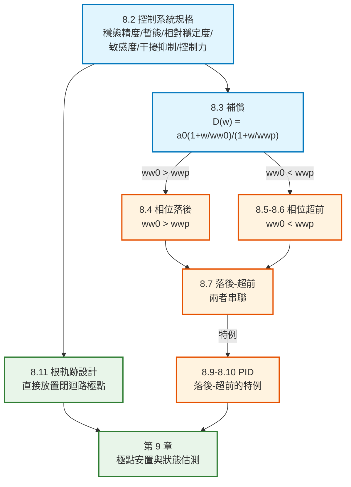

# 數位控制系統第八章：數位控制器設計（Digital Controller Design）筆記

本文件彙整教材第 8 章「Digital Controller Design」的完整內容：控制系統規格（8.2）、補償的概念（8.3）、相位落後補償（8.4）、相位超前補償（8.5、8.6）、落後–超前補償（8.7）、積分與微分濾波器（8.8）、PID 控制器（8.9、8.10）以及根軌跡設計（8.11）。每個概念與公式均回答「它是什麼／為什麼需要它／怎麼推導／符號代表什麼／物理意義是什麼」，並附上 MATLAB / Octave 對照。

> **本章在全書的位置**：前面各章都在**分析**——給定系統，判斷穩定度、算裕度、看時間響應。**本章是全書第一次做「完整的設計」**：如何設計一個數位控制器轉移函數 $D(z)$（或差分方程式），使給定的控制系統滿足設計規格。

> **教材導論的重要提醒**：
>
> **所有數值設計程序都建立在物理系統的「不精確模型」上。因此數值設計只是讓我們走到「可以拿實體系統做實驗」的那一步。**
>
> 若用包含非線性、時變元件的精確模擬模型（在最佳濾波設計中有時稱為 **truth model**）來做設計，一般會太複雜。
>
> **因此某種意義上，任何數值設計程序都是試誤法**——控制器的最終形式與係數，要靠「數值設計 → 實體或精確模擬實驗」反覆迭代好幾次才能確定。

> **符號說明**：原書用 $\varepsilon$ 表示自然指數、$\omega_w$ 表示 $w$ 平面頻率、$\eta_m$ 表示相位裕度、$\varphi$ 表示補償器在設計頻率的相角。

---

## 全章架構



---

## 全章符號總表

| 符號 | 型別 | 意義 |
|---|---|---|
| $D(z),D(w)$ | 複變函數 | **數位控制器（補償器）** |
| $G(z),G(w)$ | 複變函數 | 受控體（**含零階保持器**） |
| $a_0$ | 純量 | **補償器的直流增益** |
| $\omega_{w0}$ | 純量 | 補償器**零點**的 $w$ 平面位置 |
| $\omega_{wp}$ | 純量 | 補償器**極點**的 $w$ 平面位置 |
| $\omega_{w1}$ | 純量 | **設計頻率**（相位裕度頻率） |
| $\eta_m$ | 純量 | **期望的相位裕度** |
| $\varphi$ | 純量 | 補償器在 $\omega_{w1}$ 的相角 |
| $K_d,z_0,z_p$ | 純量 | $D(z)$ 的增益、零點、極點 |
| $K_P,K_I,K_D$ | 純量 | **PID 的比例、積分、微分增益** |
| $t_r,M_p,t_p,t_s$ | 純量 | 上升時間、峰值超越量、峰值時間、安定時間 |
| $\omega_b$ | 純量 | 系統**頻寬**（bandwidth） |
| $M_r$ | 純量 | 共振峰值 |

---

## 一、導論 (8.1)

> **本章考慮完整的設計問題**：如何設計一個數位控制器轉移函數（或差分方程式），使給定的控制系統滿足設計規格？
>
> 我們會研究**頻率響應**與**根軌跡**這兩種古典設計技巧：
> 1. 先考慮**相位落後**與**相位超前**控制器
> 2. 然後發展一種特殊的落後–超前控制器，稱為 **PID 控制器**
> 3. 最後介紹**根軌跡設計**
>
> **基於受控體狀態變數模型的設計技巧，則在第 9、11 章發展**（也就是 [`course/ackermann`](../ackermann/full-Ackermann-formula-example.md) 示範的極點安置法）。

---

## 二、控制系統規格 (8.2)

> **控制系統的設計，就是「改變系統參數」和／或「加入子系統（稱為補償器）」，以達成某些期望的系統特性。**

教材列出**六大類規格**：

### 1. 穩態精確度（Steady-State Accuracy）

第 6.5 節詳述過：**在開迴路函數增加 $z=1$ 的極點、和／或提高開迴路增益，都會提高穩態精確度。**

> **⚠️ 但兩者都有代價**：
> - 增加 $z=1$ 的極點 → **引入相位落後** → 穩定裕度下降
> - 提高開迴路增益 → 第 7 章證明過會造成穩定度問題
>
> **因此控制系統設計通常是「穩態精確度」與「可接受的相對穩定度」之間的取捨。**

### 2. 暫態響應（Transient Response）

**定義**：具有**兩個主極點**的物理系統，是指可以用二階轉移函數合理精確地模型化的系統。

典型的性能指標（Fig. 8-1a）：

| 指標 | 符號 | 定義 |
|---|---|---|
| **上升時間** | $t_r$ | 響應從終值的 **10% 上升到 90%** 所需時間 |
| **峰值超越量** | $M_p$ | 響應的最大值超過終值的量 |
| **峰值時間** | $t_p$ | 到達峰值的時間 |
| **安定時間** | $t_s$ | 響應進入終值 $\pm2\%$（或 $\pm5\%$）帶內不再離開的時間 |

**頻域對應**（Fig. 8-1b）：**頻寬 $\omega_b$**（增益降到 $-3$ dB 的頻率）與**共振峰值 $M_r$**。

### 3. 相對穩定度（Relative Stability）

用**增益裕度**與**相位裕度**衡量（第 7 章）。

### 4. 敏感度（Sensitivity）

受控體參數（摩擦、質量等）因老化或環境改變時，系統性能不應劇烈惡化。

### 5. 干擾抑制（Disturbance Rejection）

系統輸出應盡量不受風力、雜訊等外部擾動影響。

### 6. 控制力（Control Effort）

> **教材的實務說明**：例如雷達追蹤系統用電動馬達轉動天線——**馬達能輸出的最大轉矩是有限的**。
>
> 另一個例子是**可用的最大能量**：某些衛星姿態控制器的能量供應有限。

**這正是 [`course/ackermann`](../ackermann/full-Ackermann-formula-example.md) 中「$u(1)=120$ N·m 會讓推力器飽和」那個警告的一般化。**

---

## 三、補償 (8.3 Compensation)

### 1. 為什麼在 $w$ 平面設計

> **這三節（8.4～8.6）的補償器設計都在頻域用 Bode 技巧進行，因此我們會在 $w$ 平面工作。**

這是第 7.8 節的結論：**Bode 圖的直線近似需要純虛數的自變數，所以必須用 $w$ 平面**。

$$
D(w)=D(z)\Big|_{z=[1+(T/2)w]/[1-(T/2)w]}
$$

### 2. 一階補償器的標準形式（式 8-13）

$$
\boxed{\;D(w)=a_0\left[\frac{1+w/\omega_{w0}}{1+w/\omega_{wp}}\right]\;}
$$

| 符號 | 意義 |
|---|---|
| $\omega_{w0}$ | **零點**位置（$w$ 平面） |
| $\omega_{wp}$ | **極點**位置（$w$ 平面） |
| $a_0$ | **直流增益**（令 $w=0$ 即得） |

### 3. 分類（本章的核心分野）

$$
\boxed{
\begin{aligned}
\omega_{w0}<\omega_{wp}&\ \Longrightarrow\ \textbf{相位超前}\text{（phase lead）}\\
\omega_{w0}>\omega_{wp}&\ \Longrightarrow\ \textbf{相位落後}\text{（phase lag）}
\end{aligned}}
$$

**記法**：**零點在前（頻率較低）= 超前；極點在前 = 落後。**

### 4. 轉回 $z$ 平面（式 8-14、8-15）

設計完 $D(w)$ 之後，要實作就必須轉回 $z$。把 $w=\dfrac{2}{T}\dfrac{z-1}{z+1}$ 代入式 (8-13)：

$$
D(z)=a_0\frac{\omega_{wp}(\omega_{w0}+2/T)}{\omega_{w0}(\omega_{wp}+2/T)}\cdot\frac{z-\dfrac{2/T-\omega_{w0}}{2/T+\omega_{w0}}}{z-\dfrac{2/T-\omega_{wp}}{2/T+\omega_{wp}}}
$$

寫成 $D(z)=K_d\dfrac{z-z_0}{z-z_p}$ 的形式：

$$
\boxed{\;K_d=a_0\frac{\omega_{wp}(\omega_{w0}+2/T)}{\omega_{w0}(\omega_{wp}+2/T)},\qquad
z_0=\frac{2/T-\omega_{w0}}{2/T+\omega_{w0}},\qquad
z_p=\frac{2/T-\omega_{wp}}{2/T+\omega_{wp}}\;}
$$

> **💡 這三條式子是本章所有設計的「最後一步」**——不論用哪種方法在 $w$ 平面設計出 $\omega_{w0}$、$\omega_{wp}$、$a_0$，都用它們轉成可以寫進程式的 $D(z)$。

---

## 四、相位落後補償 (8.4 Phase-Lag Compensation)

### 1. 特性（Fig. 8-5）

$\omega_{w0}>\omega_{wp}$ 時 $D(w)$ 的頻率響應呈**負相角**（相位落後）：

| 頻段 | 增益 |
|---|---|
| 低頻（$\omega_w\ll\omega_{wp}$） | $a_0$（直流增益） |
| 高頻（$\omega_w\gg\omega_{w0}$） | $\dfrac{a_0\omega_{wp}}{\omega_{w0}}$ |

$$
\text{高頻增益(dB)}=20\log\frac{a_0\omega_{wp}}{\omega_{w0}}
$$

**最大相位偏移 $\varphi_M$ 介於 $0$ 到 $-90^\circ$ 之間**，取決於 $\omega_{w0}/\omega_{wp}$ 的比值。

### 2. ⚠️ 設計的核心矛盾與解法

> **因為相位落後一般會「去穩定化」系統**（把 Nyquist 圖往 $-1$ 點轉），**轉折頻率 $\omega_{wp}$ 與 $\omega_{w0}$ 必須選在「遠離受控體 $180^\circ$ 穿越頻率」的地方。**
>
> **但為了穩定度，濾波器又必須在 $180^\circ$ 穿越點附近提供「降低的增益」。**
>
> **因此 $\omega_{wp}$ 與 $\omega_{w0}$ 兩者都必須遠小於 $180^\circ$ 穿越頻率。**

**這就是相位落後補償的全部精神**：**在低頻把增益「墊高」（或說在高頻把增益「壓低」），但把相位落後留在低頻，不去污染關鍵的穿越區。**

### 3. 效果（Fig. 8-7）

| 項目 | 變化 |
|---|---|
| 增益裕度 | **增加** ✓ |
| 相位裕度 | **增加** ✓ |
| 低頻增益 | **不變**（所以穩態誤差與低頻敏感度沒有變差）✓ |
| 頻寬 | **減少** → 系統時間響應變慢 ✗ |

### 4. ⚠️ 條件穩定的風險（教材的重要警告）

> 若保持 $\omega_{w0}$ 與乘積 $a_0\omega_{wp}$ 不變，同時**增大 $a_0$、減小 $\omega_{wp}$**：
> - 補償器高頻增益不變
> - 但開迴路低頻增益增加 → 閉迴路低頻增益趨近 1 → **穩態響應改善**
>
> **但是**：增加的相位落後可能把相位曲線壓到 $-180^\circ$ 線以下。此時系統成為**條件穩定**（conditionally stable）——**可以靠「減少」增益而變成不穩定**。
>
> **若系統含有飽和非線性，大訊號會降低其等效增益**。因此**相位落後補償的系統在大訊號（非線性操作）下可能出現不穩定**。

### 5. 設計程序（三步驟）

**前提**：補償器直流增益 $a_0$ 由系統規格決定，期望相位裕度為 $\eta_m$。

| 步驟 | 內容 | 公式 |
|---|---|---|
| **1** | 找出 $\angle G(j\omega_w)\approx(-180^\circ+\eta_m+5^\circ)$ 的頻率 $\omega_{w1}$ | — |
| **2** | 取 $\omega_{w0}=0.1\omega_{w1}$（確保在 $\omega_{w1}$ 只引入很少相位落後） | (8-20) |
| **3** | 要求 $| D(j\omega_{w1})G(j\omega_{w1})|=1$，解出 $\omega_{wp}$ | (8-21) |

$$
\boxed{\;\omega_{w0}=0.1\omega_{w1},\qquad \omega_{wp}=\frac{0.1\omega_{w1}}{a_0| G(j\omega_{w1})|}\;}
$$

> **步驟 1 為什麼要多加 $5^\circ$**：因為補償器本身會在 $\omega_{w1}$ 引入**約 $5^\circ$** 的相位落後（步驟 2 的 $0.1$ 倍就是為了讓它只有這麼小），這 $5^\circ$ 在步驟 1 已經預先扣掉了。

> **若感測器轉移函數 $H(s)$ 不是 1**：把步驟 1 與式 (8-21) 中的 $G(j\omega_{w1})$ 換成 $GH(j\omega_{w1})$。

### 範例 8.1：雷達天線伺服系統的相位落後設計

**物理背景**（教材說明）：**伺服馬達系統控制雷達天線的水平（方位）角**。$c(t)$ 是天線方位角、$r(t)$ 是指令方位角。第 1.5 節推導的受控體是二階，但**這裡假設電樞電感不可忽略，因此是三階**：

$$
G_p(s)=\frac{1}{s(s+1)(0.5s+1)}=\frac{2}{s^3+3s^2+2s}
$$

**取樣週期的選法**（教材的實用法則）：

> **最快的時間常數是 $0.5$ 秒，我們選 $T$ 為其十分之一**（常用的經驗法則），即 $T=0.05$ 秒。

**設計**（$a_0=1$，$\eta_m=55^\circ$）：

| 步驟 | 計算 | 結果 |
|---|---|---|
| 1 | 找 $\angle G=-180+55+5=-120^\circ$ 的頻率 | $\omega_{w1}\approx0.36$，此時 $| G|\approx2.57$ |
| 2 | $\omega_{w0}=0.1\times0.36$ | $0.036$ |
| 3 | $\omega_{wp}=\dfrac{0.036}{(1)(2.57)}$ | $0.0140$ |

$$
D(w)=\frac{1+w/0.036}{1+w/0.0140}\quad\xrightarrow{\ \text{式 (8-14)}\ }\quad
\boxed{\;D(z)=\frac{0.3890(z-0.9982)}{z-0.9993}\;}
$$

**結果**：增益裕度 $16.8$ dB，相位裕度 $55.9^\circ$。

### ⚠️ 係數量化問題（教材特別提醒）

> **相位落後濾波器在實作時可能出現數值問題。** 範例 8.1 需要一個分母係數 $0.999300$，但若用有限字長的定點運算，可能只能表示成 $0.99609375$——**這個誤差足以大幅改變濾波器的特性**。
>
> **原因**：相位落後濾波器的**極點與零點幾乎重合**（$0.9982$ vs $0.9993$），**位置非常關鍵**。
>
> **對照**：相位超前濾波器的極點與零點**分得很開**（$0.9711$ vs $0.8111$），**任一個小幅偏移對頻率響應影響很小**——所以相位超前濾波器**通常沒有這個問題**。

---

## 五、相位超前補償與設計程序 (8.5、8.6)

### 1. 設計目標（式 8-28）

> 本節的設計程序會產生指定的相位裕度，**前提是設計出的系統是穩定的**。
>
> **也就是說**：程序會把開迴路函數在**某個給定頻率**的**增益與相位設成指定值**——增益設為 0 dB、相位設為 $(-180^\circ+\eta_m)$。
>
> **⚠️ 因此程序「不決定」增益裕度，甚至可能產生不穩定的系統。設計完之後「必須」檢查增益裕度是否足夠。**

$$
D(j\omega_{w1})G(j\omega_{w1})=1\angle(-180^\circ+\eta_m)
$$

### 2. 設計方程式（式 8-29 ~ 8-33）

把 $D(w)$ 寫成另一種形式（比落後補償的記號方便）：

$$
D(w)=\frac{a_1w+a_0}{b_1w+1},\qquad \omega_{w0}=\frac{a_0}{a_1},\quad \omega_{wp}=\frac{1}{b_1}
$$

由設計要求得到兩個約束：

$$
| D(j\omega_{w1})|=\frac{1}{| G(j\omega_{w1})|},\qquad
\boxed{\;\varphi=\angle D(j\omega_{w1})=180^\circ+\eta_m-\angle G(j\omega_{w1})\;}
$$

**三個未知數（$a_0,a_1,b_1$）、兩個方程式** → 把 $a_0$ 當已知（由穩態規格決定），解出：

$$
\boxed{\;a_1=\frac{1-a_0| G(j\omega_{w1})|\cos\varphi}{\omega_{w1}| G(j\omega_{w1})|\sin\varphi}\;}
$$

$$
\boxed{\;b_1=\frac{\cos\varphi-a_0| G(j\omega_{w1})|}{\omega_{w1}\sin\varphi}\;}
$$

### 3. 怎麼選 $\omega_{w1}$（三個約束）

因為是**相位超前**，式 (8-32) 的 $\varphi$ 必須為**正**。由此推出三個約束：

| # | 約束 | 來源 |
|---|---|---|
| **1** | $\angle G(j\omega_{w1})<180^\circ+\eta_m$ | $\varphi>0$ |
| **2** | $| G(j\omega_{w1})|<\dfrac{1}{a_0}$ | $| D|>a_0$ |
| **3** | $\cos\varphi>a_0| G(j\omega_{w1})|$ | $b_1>0$（確保控制器穩定） |

> **教材附註**：式 (8-33) **也可以用在相位落後濾波器設計**，因為推導過程並沒有假設濾波器是超前的。相位落後設計可以推出三個等價的約束（習題 8.6-3）。

### 4. ⚠️ 設計後必須檢查

> **若補償器係數滿足上述方程式，Nyquist 圖會通過 $1\angle(-180^\circ+\eta_m)$ 這個點。若設計出的系統穩定，就有所要求的相位裕度。**
>
> **但設計程序中沒有任何東西保證穩定。因此係數算出後，「必須」計算 Bode 圖（或 Nyquist 圖）以判斷閉迴路系統是否穩定。**

### 範例 8.2：同一個系統的相位超前設計

$a_0=1$，$\eta_m=55^\circ$。由約束 1 需 $\angle G<-125^\circ$、約束 2 需 $| G|<1$。

**教材相當隨意地選 $\omega_{w1}=1.200$**，由 Table 8-1 得 $G(j\omega_{w1})=0.4574\angle(-172.9^\circ)$。

$$
\varphi=180^\circ+55^\circ-(-172.9^\circ)=407.9^\circ\equiv47.9^\circ
$$

**檢查約束 3**：$\cos47.9^\circ=0.670>0.4576$ ✓ 全部滿足。

$$
a_1=\frac{1-(1)(0.4574)\cos47.9^\circ}{(1.2)(0.4574)\sin47.9^\circ}=1.703,\qquad
b_1=\frac{\cos47.9^\circ-(1)(0.4576)}{(1.2)\sin47.9^\circ}=0.2397
$$

$$
D(w)=\frac{1+1.7028w}{1+0.2397w}=\frac{1+w/0.5873}{1+w/4.1719}
\quad\Longrightarrow\quad
\boxed{\;D(z)=\frac{6.5278(z-0.9711)}{z-0.8111}\;}
$$

**結果**：相位裕度 $55^\circ$，增益裕度 $12.4$ dB。

### 💡 $\omega_{w1}$ 的選擇對結果的影響（教材的設計直覺）

> **若選不同的 $\omega_{w1}$，相位裕度仍維持 $55^\circ$，但增益裕度會不同。**
>
> - **$\omega_{w1}$ 選大** → $\varphi$（$D$ 的相角）較大 → $\omega_{wp}/\omega_{w0}$ 比值較大 → **高頻增益增加 → 系統頻寬增加**
> - **$\omega_{w1}$ 選小** → **系統頻寬減少**

**這給了設計者一個直接的旋鈕：用 $\omega_{w1}$ 調頻寬（也就是調反應速度）。**

---

## 六、落後–超前補償 (8.7)

**把相位落後與相位超前串聯**，同時獲得兩者的好處：

- **落後段**：改善低頻增益（穩態誤差）
- **超前段**：改善相位裕度與頻寬（暫態響應）

**範例 8.3** 的結果（Table 8-3）：

$$
D(z)=\frac{5.227(z-0.9982)(z-0.9792)}{(z-0.9993)(z-0.8604)}
$$

增益裕度 $11.2$ dB，相位裕度 $55.0^\circ$，上升時間 $1.05$ s，安定時間 $5.3$ s，超越量 $10.7\%$，**斜坡誤差 $0.50$**（比純落後或純超前的 $1.00$ 好一倍）。

---

## 七、PID 控制器 (8.9、8.10)

### 1. PID 是落後–超前的特例

> **PID 控制器（proportional-plus-integral-plus-derivative）是一種特殊的落後–超前控制器。**

$$
\boxed{\;D(w)=K_P+\frac{K_I}{w}+K_Dw\;}
$$

| 增益 | 路徑 | 作用 |
|---|---|---|
| $K_P$ | **比例** | 基本增益 |
| $K_I$ | **積分** | 降低穩態誤差 |
| $K_D$ | **微分** | 增加頻寬（加快反應） |

### 2. PI 控制器 = 極點在原點的相位落後（式 8-46）

$$
D(w)=K_P+\frac{K_I}{w}=\frac{K_Pw+K_I}{w}=K_I\frac{1+w/\omega_{w0}}{w},\qquad \omega_{w0}=\frac{K_I}{K_P}
$$

> **這正是式 (8-13) 型的相位落後濾波器，只是「極點放在 $\omega_{wp}=0$」。**
>
> **PI 控制器的低頻增益被提高（$\omega_w=0$ 時為無限大），因此穩態誤差被降低。目的與相位落後控制器相同：增加穩定裕度和／或降低穩態誤差。**

### 3. PD 控制器（式 8-47）

$$
D(w)=K_P+K_Dw=K_P\left(1+\frac{w}{\omega_{w0}}\right)
$$

### 4. PID 設計方程式（式 8-53 ~ 8-58）

**設計流程與第 8.6 節的相位超前完全平行。**

$$
D(j\omega_w)=K_P+j\left(K_D\omega_w-\frac{K_I}{\omega_w}\right)=| D(j\omega_w)| e^{j\varphi}
$$

要求在選定的 $\omega_{w1}$ 滿足 $D(j\omega_{w1})G(j\omega_{w1})=1\angle(-180^\circ+\eta_m)$，因此：

$$
\boxed{\;\varphi=-180^\circ+\eta_m-\angle G(j\omega_{w1})\;}
$$

$$
\boxed{\;K_P=\frac{\cos\varphi}{| G(j\omega_{w1})|}\;}
$$

$$
\boxed{\;K_D\omega_{w1}-\frac{K_I}{\omega_{w1}}=\frac{\sin\varphi}{| G(j\omega_{w1})|}\;}
$$

### 5. ⚠️ 一個關鍵的設計自由度

> **對給定的受控體，選定 $\omega_{w1}$ 與 $\eta_m$ 就「唯一決定」了 $K_P$。**
>
> **但 $K_D$ 與 $K_I$ 「不是」唯一決定的**——因為式 (8-55) 只給出兩個方程式，卻有三個未知數。
>
> **在滿足式 (8-58) 的前提下**：
> - **增大 $K_D$** → 增加**頻寬**
> - **增大 $K_I$** → 降低**穩態誤差**
>
> （前提是系統保有可接受的增益裕度。）
>
> **若式 (8-57) 與 (8-58) 都滿足，改變 $K_D$ 與 $K_I$ 只會改變「增益裕度」，「相位裕度維持不變」。**

> **PI 與 PD 設計**：把對應的增益（$K_D$ 或 $K_I$）設為零，此時**所有增益都唯一決定**。

### 6. 離散化（式 8-52）

$$
\boxed{\;D(z)=K_P+\frac{K_IT}{2}\cdot\frac{z+1}{z-1}+\frac{K_D}{T}\cdot\frac{z-1}{z}\;}
$$

| 項 | 用什麼數值方法 |
|---|---|
| 積分 $\dfrac{K_I}{w}$ | **梯形法（Tustin）**：$\dfrac{T}{2}\dfrac{z+1}{z-1}$ |
| 微分 $K_Dw$ | **後向差分**：$\dfrac{1}{T}\dfrac{z-1}{z}$ |

> **教材另外說明**：**微分項一般需要一個極點**（純微分會放大高頻雜訊），常用的形式在式 (8-50) 給出。

### 範例 8.4：PI 控制器設計

**要求**：相位裕度 $55^\circ$，單位斜坡輸入的穩態誤差 $\le0.5$。

> **關鍵觀察**：$D(z)$ 在 $z=1$ 加了一個極點，而 $G(z)$ 本來就有一個，因此 **$D(z)G(z)$ 有兩個 $z=1$ 的極點**。由第 6.5 節，**斜坡輸入的穩態誤差為零**——規格自動滿足。

由 Table 8-1 選 $\omega_{w1}=0.400$，得 $G(j0.4)=2.2761\angle(-123.68^\circ)$：

$$
\varphi=-180^\circ+55^\circ-(-123.68^\circ)=-1.32^\circ
$$

> **教材的觀察**：**濾波器在相位裕度頻率的相角非常小，正是我們想要的**（PI 的相位落後不該污染穿越區）。

$$
K_P=\frac{\cos(-1.32^\circ)}{2.2768}=0.4392,\qquad
K_I=\left[\frac{-\sin(-1.32^\circ)}{2.278}\right]0.4=0.0040
$$

$$
\boxed{\;D(z)=\frac{0.4393z-0.4391}{z-1}\;},\qquad \omega_{w0}=\frac{K_I}{K_P}=0.0092
$$

> **教材的評語**：$\omega_{w0}=0.0092$ **相當低，因此系統頻寬被大幅降低**。**雖然穩態誤差響應很好，但要達到它需要相當長的時間。**

**結果**：增益裕度 $16.0$ dB，相位裕度 $55^\circ$，上升時間 $2.95$ s，超越量 $13.8\%$，安定時間 $19.4$ s。

**若改選 $\omega_{w1}=0.3$**：

$$
K_P=0.3125,\quad K_I=0.0154,\quad D(z)=\frac{0.3129z-0.3121}{z-1},\quad \omega_{w0}=0.0493
$$

**系統頻寬增加**，增益裕度提高到 $18.4$ dB，但上升時間延長到 $3.65$ s、超越量增加到 $18.6\%$、安定時間延長到 $43.0$ s。

### 範例 8.5：PID 控制器

沿用範例 8.4 的 $K_I=0.004$，加上微分項後 $K_D=1.3541$（忽略微分極點）或 $1.3553$（含極點）：

$$
D(z)=\frac{28.52(z-0.99986)(z-0.9504)}{z(z-1)}
$$

**結果**：增益裕度 $23.3$ dB，相位裕度 $55.0^\circ$，上升時間 $1.05$ s，安定時間 $3.6$ s，超越量 $13.0\%$，**斜坡誤差 $0$**。

---

## 八、設計方法的完整比較（教材 Table 8-3）

**所有設計都用同一個受控體** $G_p(s)=\dfrac{1}{s(s+1)(0.5s+1)}$、$T=0.05$ s、目標相位裕度 $55^\circ$：

| 範例 | 設計型式 | $D(z)$ | 增益裕度 (dB) | 相位裕度 (deg) | 上升時間 (s) | 安定時間 (s) | 超越量 (%) | 斜坡誤差 |
|---|---|---|---|---|---|---|---|---|
| 8.1 | **落後** | $\dfrac{0.389(z-0.9982)}{z-0.9993}$ | 16.8 | 55.9 | 3.15 | 32.4 | 14.1 | 1.00 |
| 8.2 | **超前** | $\dfrac{6.528(z-0.9711)}{z-0.8111}$ | 12.4 | 55.0 | **1.05** | 5.2 | 11.4 | 1.00 |
| 8.3 | **落後–超前** | $\dfrac{5.227(z-0.9982)(z-0.9792)}{(z-0.9993)(z-0.8604)}$ | 11.2 | 55.0 | **1.05** | 5.3 | **10.7** | 0.50 |
| 8.4 | **PI** | $\dfrac{0.4393(z-0.99954)}{z-1}$ | 16.0 | 55.0 | 2.95 | 19.4 | 13.8 | **0** |
| 8.5 | **PID** | $\dfrac{28.52(z-0.99986)(z-0.9504)}{z(z-1)}$ | **23.3** | 55.0 | **1.05** | **3.6** | 13.0 | **0** |
| 8.6 | **pidtool** | $\dfrac{14.37(z-0.9995)(z-0.9569)}{(z-1)(z-0.5221)}$ | 17.8 | 55.0 | **1.0** | 3.45 | 12.9 | **0** |
| 8.9 | **sisotool** | $\dfrac{6.64(z-0.9512)}{z-0.7}$ | 16.7 | 55.1 | 1.25 | 4.25 | 12.6 | 0.98 |

### 💡 這張表怎麼讀（本章最重要的一頁）

| 觀察 | 說明 |
|---|---|
| **所有設計的相位裕度都是 $55^\circ$** | 設計程序保證的就是這一項 |
| **落後：安定時間 32.4 s（最慢）** | 落後補償降低頻寬，代價就是慢 |
| **超前：上升時間 1.05 s（最快組）** | 超前補償增加頻寬 |
| **落後–超前：兩者兼得** | 上升 1.05 且斜坡誤差降到 0.5 |
| **PI：斜坡誤差 0，但慢** | 積分器消除誤差，但頻寬低 |
| **PID：全面最佳** | 上升 1.05、安定 3.6、斜坡誤差 0、增益裕度 23.3 dB（最高） |

$$
\boxed{\;\text{PID = 落後（積分項）+ 超前（微分項），所以能同時拿到兩邊的好處}\;}
$$

---

## 九、根軌跡設計 (8.11)

第 7.6 節的根軌跡是**分析**工具（看 $K$ 變化時極點怎麼跑）；本節把它變成**設計**工具——**加入補償器的零極點，把根軌跡「拉」到想要的地方**，讓閉迴路極點落在指定位置。

**範例 8.9** 用 MATLAB 的 `sisotool` 設計出：

$$
D(z)=\frac{6.64(z-0.9512)}{z-0.7}
$$

增益裕度 $16.7$ dB，相位裕度 $55.1^\circ$。

> **教材在總結中提到**：本章最後介紹了 MATLAB 的 **`pidtool`**（範例 8.6）與 **`sisotool`**（範例 8.9）這兩個互動式設計工具。
>
> **⚠️ 這兩個工具在 Octave 中都不存在**，因此第十一節的實作以**手動實作設計方程式**為主（這反而更能看清楚設計程序在做什麼）。

---

## 十、本章總結 (8.12)

> 本章介紹了控制系統規格中使用的各種準則。接著發展了使用**相位超前**與**相位落後**補償的數位控制器設計技巧。
>
> **這些基於頻率響應的技巧，本質上大多是試誤法，但卻是補償器設計中較常用的技巧。**
>
> 然後發展了**三項控制器（PID）**，並看出它是**落後–超前設計的一種特例**。接著示範了 MATLAB 的 `pidtool`。最後發展了**根軌跡設計**技巧，並介紹了 `sisotool`。

### 全章公式速查

| 式號 | 公式 | 用途 |
|---|---|---|
| (8-13) | $D(w)=a_0\dfrac{1+w/\omega_{w0}}{1+w/\omega_{wp}}$ | **一階補償器標準形式** |
| — | $\omega_{w0}<\omega_{wp}$ → 超前；$\omega_{w0}>\omega_{wp}$ → 落後 | **分類** |
| (8-14)(8-15) | $K_d,z_0,z_p$ 的公式 | **$D(w)\to D(z)$（所有設計的最後一步）** |
| (8-20) | $\omega_{w0}=0.1\omega_{w1}$ | 落後設計步驟 2 |
| (8-21) | $\omega_{wp}=\dfrac{0.1\omega_{w1}}{a_0| G|}$ | 落後設計步驟 3 |
| (8-32) | $\varphi=180^\circ+\eta_m-\angle G$ | **超前設計的相角** |
| (8-33) | $a_1,b_1$ 的公式 | **超前設計的係數** |
| (8-45) | $D(w)=K_P+\dfrac{K_I}{w}+K_Dw$ | **PID** |
| (8-46) | $\omega_{w0}=K_I/K_P$ | PI 的零點 |
| (8-52) | $D(z)=K_P+\dfrac{K_IT}{2}\dfrac{z+1}{z-1}+\dfrac{K_D}{T}\dfrac{z-1}{z}$ | **PID 離散化** |
| (8-56) | $\varphi=-180^\circ+\eta_m-\angle G$ | PID 設計的相角 |
| (8-57) | $K_P=\dfrac{\cos\varphi}{| G|}$ | **PID 的 $K_P$（唯一決定）** |
| (8-58) | $K_D\omega_{w1}-\dfrac{K_I}{\omega_{w1}}=\dfrac{\sin\varphi}{| G|}$ | $K_D$ 與 $K_I$ 的關係（一個自由度） |

---

## 十一、MATLAB / Octave 實作驗證

> **需要 Control System Toolbox**（Octave 使用者請先 `pkg load control`）。

完整可執行版見 [`chp8.m`](chp8.m)，逐格教學版見 [`chp8.ipynb`](chp8.ipynb)。

### 實驗一覽

| # | 對應章節 | 驗證什麼 |
|---|---|---|
| 1 | 8.2、8.4 | 受控體的頻率響應（重現教材 Table 8-1） |
| 2 | 8.4（例 8.1） | **相位落後設計**：$D(z)=0.3890\dfrac{z-0.9982}{z-0.9993}$ |
| 3 | 8.6（例 8.2） | **相位超前設計**：$D(z)=6.5278\dfrac{z-0.9711}{z-0.8111}$ |
| 4 | 8.10（例 8.4） | **PI 設計**：$D(z)=\dfrac{0.4393z-0.4391}{z-1}$，兩個 $\omega_{w1}$ |
| 5 | 8.4 | **係數量化問題**：落後濾波器的極零點幾乎重合 |
| 6 | Table 8-3 | **四種設計的完整比較**（裕度 + 時域指標 + 階躍響應圖） |

### ⚠️ 本章最重要的實作注意事項

> **教材的所有設計程式都用 `[mag,phase]=bode(Gz,ww1)` 取受控體的頻率響應。**
>
> **但第 7 章實驗證明：Octave 的 `bode` 對「含 $z=1$ 極點」的離散系統，回傳的相位是錯的。** 本章的受控體 $G_p(s)=\dfrac{2}{s^3+3s^2+2s}$ **正好含有一個純積分器**，離散化後就有 $z=1$ 的極點。
>
> **實測對照**（$\omega_{w1}=1.2$，例 8.2 的設計點）：
>
> | 取相位的方法 | $\angle G$ | $\varphi=180+55-\angle G$ | 約束 3：$\cos\varphi>a_0| G|$ |
> |---|---|---|---|
> | **`freqresp`（正確）** | $-172.88^\circ$ | $47.9^\circ$ | $0.671>0.457$ ✓ **通過** |
> | `bode`（錯誤） | $+7.12^\circ$ | $227.9^\circ$ | $-0.671>0.457$ ✗ **失敗** |
>
> $$\boxed{\;\text{在 Octave 上，本章所有設計都必須把 }\texttt{bode}\text{ 換成 }\texttt{freqresp}\;}$$
>
> ```matlab
> H = freqresp(Gz, ww1);
> magG = abs(H);  phaseG = angle(H)*180/pi;
> ```

> **第二個注意事項**：`margin` 對補償後的系統**常常找不到增益交越頻率**（回傳 `pm=180`、`wp=NaN`）。本章的 `.m` 檔提供了一個自己掃頻的替代函數。

### 數學 ↔ MATLAB 對照

| 數學 | MATLAB / Octave |
|---|---|
| $| G(j\omega_{w1})|$、$\angle G$ | `H=freqresp(Gz,ww1); abs(H); angle(H)*180/pi` |
| 式 (8-15) 的 $K_d$ | `Kd = a0*(wwp*(ww0+2/T))/(ww0*(wwp+2/T))` |
| 式 (8-15) 的 $z_0,z_p$ | `z0=(2/T-ww0)/(2/T+ww0); zp=(2/T-wwp)/(2/T+wwp)` |
| $D(z)=K_d\dfrac{z-z_0}{z-z_p}$ | `Dz = Kd*tf([1 -z0],[1 -zp],T)` |
| 式 (8-52) 的 PID | `Dz = KP + (KI*T/2)*tf([1 1],[1 -1],T) + (KD/T)*tf([1 -1],[1 0],T)` |
| 閉迴路 | `Tcl = feedback(Dz*Gz, 1)` |
| 上升時間／超越量／安定時間 | 手動由 `step` 的輸出計算（見 `chp8.m`） |

> **`stepinfo` 在 Octave 的 control 4.2.1 中不存在**，教材例 8.4 的程式用到它。本章的 `.m` 檔改用手動計算，並在註解中標明。
