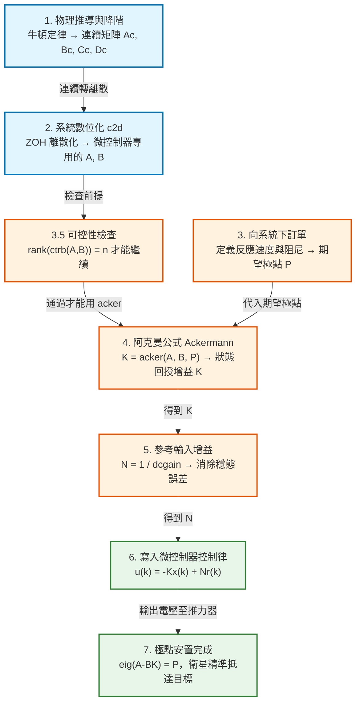

# 阿克曼公式（Ackermann's Formula）極點安置完整解說

**範例系統：剛體衛星的航向軸姿態控制（Rigid Satellite Yaw-Axis Attitude Control）**

本文件對照可執行程式 [`full-Ackermann-formula-example.m`](full-Ackermann-formula-example.m) 與教學版 [`full-Ackermann-formula-example.ipynb`](full-Ackermann-formula-example.ipynb)，把程式的**每一個步驟**拆成「**用了哪個公式 → 公式在說什麼 → 每個變數是什麼 → 對應到哪一行程式**」四層來說明。文中所有數值都經過 Octave 實際執行驗證，手算結果與程式輸出完全一致。

> **本篇的前置知識**：本例的受控體就是 [CHP1 第四節「衛星系統建模」](../CHP1/chp1.md) 推導出的模型（$G_p(s)=1/(Js^2)$，狀態空間 $A_c=\begin{bmatrix}0&1\\0&0\end{bmatrix}$）。CHP1 只到「把物理系統寫成數學模型」為止；本篇接續下去，做**控制器設計**——也就是 CHP1 第三節六大步驟中的第 4 步。

---

## 先看這三行：本篇從頭到尾都在繞它們轉

**狀態方程式**（物理世界怎麼走，衛星自己會做的事）：

$$
\mathbf x(k+1) = A\,\mathbf x(k) + B\,u(k)
$$

**輸出方程式**（感測器看得到什麼）：

$$
y(k) = C\,\mathbf x(k) + D\,u(k)
$$

**控制律**（你要寫進微控制器的那一行）：

$$
u(k) = -K\,\mathbf x(k) + N\,r(k)
$$

整份文件的工作就是把這三行的每個字母填滿：

| 步驟 | 在做什麼 | 填滿了誰 |
|---|---|---|
| 1–2 | 物理建模 + 離散化 | $A,\ B,\ C,\ D$ |
| 3–4 | 下訂單 + 阿克曼公式 | $K$ |
| 5 | 消除穩態誤差 | $N$ |
| 6 | 寫成程式跑起來 | 三行一起動 |

---

### ⚠️ 最容易混淆的一點：大寫 $K$ 和小寫 $k$ 完全不同

$$
u(\underbrace{k}_{\text{小寫：第幾步}}) = -\underbrace{K}_{\text{大寫：增益矩陣}}\,\mathbf x(k) + N\,r(k)
$$

| 符號 | 是什麼 | 形狀 | 會不會變 | 本例 |
|---|---|---|---|---|
| **小寫 $k$** | **取樣序號**（第幾步），寫在括號裡 | 一個整數 | **每一步都變** | $1,2,3,\dots,50$ |
| **大寫 $K$** | **狀態回授增益矩陣**（權重） | $1\times2$ | **從頭到尾不變** | $[4\ \ 5.8]$ |

在程式裡它們是**兩個同時存在的變數**（Octave 大小寫敏感）：

```text
k    t = k*T    x(k) = [角度; 角速度]      u(k)      K (從頭到尾不變)
1    0.0        [ 0.0000;  0.0000]     120.0000    [4 5.8]
2    0.1        [ 0.3000;  6.0000]      84.0000    [4 5.8]
3    0.2        [ 1.1100; 10.2000]      56.4000    [4 5.8]
4    0.3        [ 2.2710; 13.0200]      35.4000    [4 5.8]
5    0.4        [ 3.6615; 14.7900]      19.5720    [4 5.8]
```

左邊的 `k` 一直在跳，右邊的 `K` 一動也不動——**$K$ 是設計階段就算好、燒進韌體的常數；$k$ 是執行時的迴圈計數器。**

### 小寫 $k$ 到底是什麼？

- $k$ 是**取樣序號**：整數 $0,1,2,3,\dots$，代表「第幾次醒來」。
- $\mathbf x(k)$ 唸作「**第 $k$ 步的 $\mathbf x$**」。**那個括號是「編號」，不是乘法，也不是函數呼叫。**
- $\mathbf x(k+1)$ 是「**下一步的狀態**」，不是「$\mathbf x$ 加 1」。
- **實際時間** $t = k\times T$。本例 $T=0.1$ 秒，所以 $k=50$ 對應 $5$ 秒。
- 它就是程式裡 `for k = 1:steps` 的那個迴圈變數。

**為什麼用 $k$ 不用 $t$？** 連續時間寫 $\theta(t)$，$t$ 是實數，任何時刻都有定義。但數位系統只在 $t=0,\ T,\ 2T,\ 3T,\dots$ 這些孤立時刻存在，中間是空白的——用整數編號比較自然。嚴格說 $\mathbf x(k)$ 是 $\mathbf x(kT)$ 的簡寫，教科書為了少寫一個 $T$ 就簡化成 $\mathbf x(k)$。

### 那 $u(k)$ 的括號呢？

一模一樣的意思：**第 $k$ 步的輸入**。$u(3)$ 是「第 3 步推力器該出多少轉矩」，不是「$u$ 乘以 3」。

$y(k)$、$r(k)$ 也都是同一個規則。這三行式子裡**所有的 $(k)$ 都是「第幾步」的標籤**。

---

### 一步一步攤開來看：誰不變、誰在變

**常數**——設計階段決定，燒進韌體，每一步都一樣（**注意它們都沒有括號**）：

```text
A = [1  0.1]     B = [0.0025]     C = [1  0]     D = 0
    [0    1]         [0.0500]

K = [4  5.8]     N = 4      T = 0.1 s      r = 30 度
```

**變數**——帶 $(k)$ 的都在這裡，每一步重算：

```text
k   t=k*T   x(k)=[角度;角速度]     u(k)        A*x(k)              B*u(k)              x(k+1)=A*x+B*u
1   0.0     [ 0.0000;  0.0000]   120.0000   [ 0.0000;  0.0000]  [ 0.3000;  6.0000]  [ 0.3000;  6.0000]
2   0.1     [ 0.3000;  6.0000]    84.0000   [ 0.9000;  6.0000]  [ 0.2100;  4.2000]  [ 1.1100; 10.2000]
3   0.2     [ 1.1100; 10.2000]    56.4000   [ 2.1300; 10.2000]  [ 0.1410;  2.8200]  [ 2.2710; 13.0200]
4   0.3     [ 2.2710; 13.0200]    35.4000   [ 3.5730; 13.0200]  [ 0.0885;  1.7700]  [ 3.6615; 14.7900]
5   0.4     [ 3.6615; 14.7900]    19.5720   [ 5.1405; 14.7900]  [ 0.0489;  0.9786]  [ 5.1894; 15.7686]
```

這張表就是狀態方程式 $\mathbf x(k+1)=A\mathbf x(k)+Bu(k)$ 逐格算出來的樣子：**最右邊那欄 = 前兩欄相加**，而它會變成下一列的 $\mathbf x(k)$。

**$u(k)$ 每一步都不同**（120 → 84 → 56.4 → …），因為 $u=-K\mathbf x+Nr$ 裡的 $K,N,r$ 雖然固定，$\mathbf x(k)$ 卻一直在變。**這就是回授的定義：每一步根據當下的狀態重新計算。** 若 $u$ 固定不變（開迴路），這顆衛星 5 秒後會轉到 720 度——整整兩圈還在加速，正是 CHP1 裡那條拋物線發散的曲線。

### 為什麼 $B$ 是矩陣，卻能乘上純量 $u(k)$？

**因為 $u$ 是 $1\times1$ 矩陣，這是合法的矩陣乘法，不是特例。**

$$
\underbrace{B}_{2\times1}\ \underbrace{u}_{1\times1}\;\longrightarrow\;\underbrace{Bu}_{2\times1}
$$

矩陣乘法的規則是「**內側維度必須相符**」：$B$ 的行數（1）與 $u$ 的列數（1）相同，所以乘得起來；結果的形狀由外側決定，是 $2\times1$——**剛好和 $\mathbf x$ 一樣，才能跟 $A\mathbf x$ 相加**。

#### 幾何意義：$B$ 是方向，$u$ 是倍率

$$
B=\begin{bmatrix}0.0025\cr 0.0500\end{bmatrix}
$$

這是「**輸入 1 N·m、持續 0.1 秒**」會造成的狀態變化：角度 $+0.0025$ 度、角速度 $+0.05$ 度/秒（就是步驟 2 手算的 $T^2/2J$ 和 $T/J$）。

$B$ 指出**狀態空間中的一個固定方向**——推力器只能沿著這個方向推動系統。$u$ 則決定**這一步要沿著它走多遠**：

```text
B         = [0.0025; 0.0500]    <- u = 1 的效果
B * 120   = [0.3000; 6.0000]    <- u = 120 就是同方向拉長 120 倍
```

對照上表第 1 列：$\mathbf x(1)=[0,0]^T$ 所以 $A\mathbf x(1)=\mathbf 0$，於是 $\mathbf x(2)=B\cdot120=[0.3,\ 6.0]^T$——**跟表格第 2 列的 $\mathbf x(k)$ 完全吻合**。

> **💡 單輸入只是退化情形**：當 $m=1$ 時 $Bu$ 看起來像「向量乘以一個數」，所以會有「矩陣怎麼乘純量」的疑惑。但一般的多輸入系統中 $\mathbf u$ 是 $m\times1$ 向量、$B$ 是 $n\times m$ 矩陣，$B\mathbf u$ 就是道地的矩陣乘矩陣，此時 $B$ 的**每一行代表一個致動器各自的推動方向**，$B\mathbf u$ 是它們的加權合成。單輸入只是「只有一個方向可推」的特例。

---

## 全流程總覽



---

## 全篇符號總表（先看這張，之後遇到就不用回頭猜）

| 符號 | 程式變數 | **型別（形狀）** | 意義 | 單位 | 本例數值 |
|---|---|---|---|---|---|
| $J$ | `J` | **純量** $1\times1$ | 衛星繞航向軸的轉動慣量（抵抗旋轉的能力） | kg·m² | 2 |
| $T$ | `T` | **純量** $1\times1$ | **取樣週期**，數位電腦每隔多久算一次 | s | 0.1 |
| $k$ | `k` | **純量**（整數） | 取樣序號（第幾步），實際時間 $t=kT$ | — | 1…50 |
| $\theta(t)$ | — | **純量** $1\times1$ | 衛星航向角 | rad（本例當作「度」看待） | — |
| $v(t)$、$u(k)$ | `u` | **純量** $1\times1$ ⚠️ | 推力器轉矩，系統的**輸入**（一般為 $m\times1$ 向量，本例只有一個推力器故退化成純量） | N·m | 120 → −0.7 |
| $\mathbf x(k)$ | `x` | **行向量** $2\times1$ | **狀態向量**（角度與角速度打包在一起） | — | $\begin{bmatrix}0.3\cr6.0\end{bmatrix}$ |
| $x_1,\ x_2$ | `x(1), x(2)` | **純量** $1\times1$（各） | 狀態變數：$x_1=\theta$（角度）、$x_2=\dot\theta$（角速度） | 度、度/s | — |
| $y(k)$ | `y` | **純量** $1\times1$ | 感測器讀值（一般為 $p\times1$ 向量，本例只有一個角度計） | 度 | — |
| $r$ | `r` | **純量** $1\times1$ | 參考輸入（目標角度指令） | 度 | 30 |
| $A_c$ | `Ac` | **矩陣** $2\times2$ | 連續時間**系統矩陣**（系統自己的內部動態） | — | $\begin{bmatrix}0&1\cr0&0\end{bmatrix}$ |
| $B_c$ | `Bc` | **行向量** $2\times1$ | 連續時間**輸入矩陣**（輸入如何影響狀態） | — | $\begin{bmatrix}0\cr0.5\end{bmatrix}$ |
| $C_c$ | `Cc` | **列向量** $1\times2$ | **輸出矩陣**（感測器量得到哪些狀態） | — | $\begin{bmatrix}1&0\end{bmatrix}$ |
| $D_c$ | `Dc` | **純量** $1\times1$ | **直接傳遞矩陣**（輸入是否直接穿透到輸出） | — | 0 |
| $A$ | `A` | **矩陣** $2\times2$ | 離散時間系統矩陣 | — | $\begin{bmatrix}1&0.1\cr0&1\end{bmatrix}$ |
| $B$ | `B` | **行向量** $2\times1$ | 離散時間輸入矩陣 | — | $\begin{bmatrix}0.0025\cr0.05\end{bmatrix}$ |
| $P$ | `P` | **列向量** $1\times2$ | **期望極點**（設計者下的訂單） | — | $[0.8\ \ 0.9]$ |
| $\alpha_d(z)$ | `poly(P)` | **多項式**（係數 $1\times3$） | 期望特徵多項式 | — | $z^2-1.7z+0.72$ |
| $\mathcal{C}$ | `ctrb(A,B)` | **矩陣** $2\times2$ | **可控性矩陣**（注意：與輸出矩陣 $C$ 不同東西） | — | $\begin{bmatrix}0.0025&0.0075\cr0.05&0.05\end{bmatrix}$ |
| $K$ | `K` | **列向量** $1\times2$ ⚠️ | **狀態回授增益矩陣**（要求出來的答案；一般為 $m\times n$） | — | $[4\ \ 5.8]$ |
| $N$ | `N` | **純量** $1\times1$ | **參考輸入增益**（消除穩態誤差的比例補償） | — | 4 |

**形狀的通則**（$n$ = 狀態數、$m$ = 輸入數、$p$ = 輸出數；本例 $n=2,\ m=1,\ p=1$）：

| 符號 | 一般形狀 | 本例 | 誰決定它的形狀 |
|---|---|---|---|
| $\mathbf x$ | $n\times1$ | $2\times1$ | 狀態數 |
| $\mathbf u$ | $m\times1$ | $1\times1$（純量） | **致動器數量** |
| $\mathbf y$ | $p\times1$ | $1\times1$（純量） | **感測器數量** |
| $A$ | $n\times n$ | $2\times2$ | 狀態數 |
| $B$ | $n\times m$ | $2\times1$ | 狀態數 × 致動器數 |
| $C$ | $p\times n$ | $1\times2$ | 感測器數 × 狀態數 |
| $D$ | $p\times m$ | $1\times1$ | 感測器數 × 致動器數 |
| $K$ | $m\times n$ | $1\times2$ | **致動器數 × 狀態數** |

> **⚠️ 兩個最容易搞混的地方**
> - **大寫 $K$（增益矩陣，$1\times2$，恆定）vs 小寫 $k$（取樣序號，整數，每步遞增）**——Octave 大小寫敏感，程式裡是兩個變數。
> - **$K$ 有兩個元素，但 $u$ 只有一個數字**：$K\mathbf x$ 是 $(1\times2)(2\times1)=1\times1$，兩個權重**相加**成一個指令。$K$ 的元素個數由**狀態數**決定，$u$ 的元素個數由**致動器數**決定，兩者無關。

---

## 零、先建立三個直覺（新手必讀）

在碰任何公式之前，先把三件事講白。這三件事想通了，後面的數學只是把它們寫成矩陣而已。

### 直覺 1：「極點」為什麼決定了系統的個性？

任何線性系統的行為，都由它**轉移函數分母的根**（也就是**極點**，pole）決定。極點就像系統的「DNA」——決定它是快是慢、震不震盪、會不會發散。

- 在**連續時間**（$s$ 平面）：極點 $s=-2$ 代表響應含有 $e^{-2t}$ 這一項，會衰減；極點 $s=+2$ 代表含 $e^{+2t}$，會爆炸。**實部小於 0 才穩定。**
- 在**離散時間**（$z$ 平面）：極點 $z=0.8$ 代表響應含有 $0.8^k$ 這一項（每一步乘 0.8，越來越小）；極點 $z=1.2$ 代表 $1.2^k$，越來越大。**絕對值小於 1 才穩定。**

CHP1 的衛星系統 $G_p(s)=1/(Js^2)$ 有兩個極點都在 $s=0$，落在穩定邊界上——所以那一章的模擬中，衛星的階躍響應是**拋物線發散**，推一下就永遠停不下來。

**本篇要做的事，一句話講完：把這兩個爛極點，用回授硬生生搬到我們想要的位置。** 這就叫**極點安置**（pole placement）。

### 直覺 2：為什麼要「離散化」？

物理世界是連續的（衛星每一瞬間都在轉），但微控制器不是——它每隔 $T=0.1$ 秒才醒來一次，讀感測器、算一次乘法、輸出電壓，然後睡覺。

所以我們設計控制器時，**不能用連續模型 $A_c, B_c$，必須用「站在微控制器的角度看到的模型」$A, B$**：「這一步的狀態是 $x(k)$，如果我輸出 $u(k)$ 並維持 0.1 秒，下一步 $x(k+1)$ 會變成多少？」把這個問題的答案寫成矩陣，就是離散化。

### 直覺 3：$K$ 到底是什麼？

$K$ 是**一組權重**。控制律 $u=-Kx$ 展開就是：

$$
u = -\big(K_1\cdot\underbrace{\text{角度誤差}}_{x_1} + K_2\cdot\underbrace{\text{角速度}}_{x_2}\big)
$$

- $K_1$ 是「**看到偏差就推回去**」的力道 → 像**彈簧**，決定反應快慢。
- $K_2$ 是「**看到在動就踩煞車**」的力道 → 像**阻尼**，決定震不震盪。

阿克曼公式做的事，就是幫你把「我想要極點在 0.8 和 0.9」這個願望，**直接反解成 $K_1$ 和 $K_2$ 該是多少**。不用試誤，一次算到位。

---

## 一、步驟 1：連續時間狀態空間模型

### 用了哪個公式

**牛頓第二運動定律（旋轉形式）**：

$$
J\,\ddot{\theta}(t) = v(t)
$$

**狀態空間標準式**（連續時間）：

$$
\dot{\mathbf{x}}(t) = A_c\,\mathbf{x}(t) + B_c\,v(t), \qquad y(t) = C_c\,\mathbf{x}(t) + D_c\,v(t)
$$

### 公式在說什麼

第一式就是「轉矩 = 轉動慣量 × 角加速度」。太空中沒有空氣阻力，所以**沒有任何摩擦項**——這是整個問題困難的根源：系統自己不會停。

第二式是把「一個二階微分方程」改寫成「兩個一階微分方程」的標準做法，稱為**降維**（更精確說是**降階**）。為什麼要這樣做？因為電腦只會做矩陣乘法，不會解微分方程；寫成一階向量形式後，未來的所有操作（離散化、極點安置、模擬）都只是矩陣運算。

### 怎麼推導

定義兩個狀態變數：

$$
x_1(t) = \theta(t)\ (\text{角度}), \qquad x_2(t) = \dot{\theta}(t)\ (\text{角速度})
$$

則：

$$
\dot{x}_1 = \dot\theta = x_2 \qquad\text{（角度的變化率就是角速度，這是定義，不是物理）}
$$

$$
\dot{x}_2 = \ddot\theta = \frac{1}{J}v(t) \qquad\text{（這一條才是牛頓定律）}
$$

寫成矩陣：

$$
\begin{bmatrix}\dot{x}_1\\ \dot{x}_2\end{bmatrix}
=\underbrace{\begin{bmatrix}0&1\\0&0\end{bmatrix}}_{A_c}\begin{bmatrix}x_1\\x_2\end{bmatrix}
+\underbrace{\begin{bmatrix}0\\ \tfrac1J\end{bmatrix}}_{B_c}v(t),
\qquad
y=\underbrace{\begin{bmatrix}1&0\end{bmatrix}}_{C_c}\begin{bmatrix}x_1\\x_2\end{bmatrix}
$$

### 每個元素的意義（逐格解讀）

| 位置 | 值 | 意義 |
|---|---|---|
| $A_c(1,1)=0$ | 0 | 角度不會自己影響自己（沒有回正彈簧） |
| $A_c(1,2)=1$ | 1 | **角速度會累積成角度**——這是純運動學關係，恆為 1 |
| $A_c(2,1)=0$ | 0 | 角度不會產生轉矩（太空中沒有回正力） |
| $A_c(2,2)=0$ | 0 | **關鍵**：角速度不會自己衰減 → **沒有阻尼、沒有空氣阻力**。若是地面上的馬達，這格會是負值（見 CHP1 第五節） |
| $B_c(1)=0$ | 0 | 轉矩無法「瞬間」改變角度（要先變成角速度） |
| $B_c(2)=1/J$ | 0.5 | 轉矩產生角加速度，慣量 $J$ 越大加速越慢（$a=v/J$） |
| $C_c=[1\ 0]$ | — | **感測器只裝了角度計，量不到角速度** |
| $D_c=0$ | 0 | 推力器不會「直接」改變角度讀值（沒有直通路徑）；絕大多數物理系統 $D=0$ |

### 對應程式碼

```matlab
J  = 2;             % 轉動慣量 (kg-m^2)
Ac = [0 1; 0 0];    % 連續系統矩陣
Bc = [0; 1/J];      % 連續輸入矩陣
Cc = [1 0];         % 連續輸出矩陣（只量角度）
Dc = 0;             % 直接傳遞矩陣
sys_c = ss(Ac, Bc, Cc, Dc);   % 打包成狀態空間物件
```

**數學 ↔ 程式對照**：

| 數學 | 程式 | 說明 |
|---|---|---|
| $\begin{bmatrix}0&1\cr0&0\end{bmatrix}$ | `[0 1; 0 0]` | `;` 在中括號內代表**換到下一列** |
| $\begin{bmatrix}0\cr1/J\end{bmatrix}$ | `[0; 1/J]` | 只有一個 `;`，所以是 2×1 的**行向量** |
| $\dot x=A_cx+B_cu,\ y=C_cx+D_cu$ | `ss(Ac,Bc,Cc,Dc)` | 四個引數的順序**永遠**是 A, B, C, D |

> **💡 常見混淆**：$C_c=[1\ 0]$ 是「**感測器**能量到什麼」，跟後面 $K=[4\ 5.8]$ 是「**控制器**怎麼加權」完全是兩件事，只是形狀剛好都是 1×2。看到 `C` 想「量測」，看到 `K` 想「控制」。

### 📦 深入理解 `ss()`：為什麼只有四個矩陣？

這一小節回答四個新手一定會卡住的問題。

#### 問題 1：不是兩條方程式嗎？為什麼只呼叫一次 `ss()`？

因為**那四個引數，就是那兩條方程式**。一條方程式各出兩個矩陣，剛好四個：

$$
\underbrace{\dot{\mathbf x} = \boxed{A_c}\,\mathbf x + \boxed{B_c}\,u}_{\text{第 1 條：狀態方程}}
\qquad
\underbrace{y = \boxed{C_c}\,\mathbf x + \boxed{D_c}\,u}_{\text{第 2 條：輸出方程}}
$$

```text
ss( Ac , Bc , Cc , Dc )
     └───┬───┘  └───┬───┘
      第 1 條方程   第 2 條方程
```

`ss()` 不是「一條方程式的函數」，它是一個**容器**——把描述系統所需的全部資訊打包成一個物件。

**為什麼是兩條而不是一條？** 因為它們回答兩個不同的問題：

| 方程式 | 回答的問題 | 誰在乎 |
|---|---|---|
| $\dot{\mathbf x}=A_c\mathbf x+B_cu$ | **系統內部**怎麼演變 | 物理世界（衛星自己） |
| $y=C_c\mathbf x+D_cu$ | 我**能看到**其中哪些 | 感測器（角度計） |

衛星內部同時存在角度與角速度，但感測器只讀得到角度。**內部有什麼，跟你量得到什麼，是兩回事**——這就是為什麼需要第二條方程式，也是後面需要**觀測器**的原因（$x_2$ 出現在第一條裡，卻不出現在第二條裡）。

#### 問題 2：為什麼「剛好」是四個矩陣？我的系統怎麼那麼巧？

**順序是反過來的。** 不是「我推導出四個矩陣，剛好能用 `ss()`」，而是：

```text
狀態空間模型在數學上被「定義」成這個固定樣板
        ↓
我把衛星「套」進這個模板（令 x1 = θ, x2 = θ̇）
        ↓
套完必定產生四個矩陣
```

$$
\dot{\mathbf x} = A\mathbf x + B\mathbf u, \qquad \mathbf y = C\mathbf x + D\mathbf u
$$

這兩行是**定義**，不是任何特定系統的推導結果。`ss()` 只有四個欄位，純粹因為這個定義只有四個矩陣符號。

而定義為什麼只有四項？因為 $4 = 2\text{ 條方程式}\times 2\text{ 項}$，而**每條方程式只能有兩項**——系統裡總共只有兩種東西（狀態 $\mathbf x$ 和輸入 $\mathbf u$），線性系統的定義就是「結果 = 各項貢獻的加權相加」。不可能有第三項：第三項要乘什麼？$x^2$？$x\cdot u$？**那就不是線性系統了**，狀態空間根本裝不下（CHP1 的 SMIB 含 $\sin\phi$，所以必須先線性化才能寫成矩陣）。

**維度也不是規定，是被矩陣運算逼出來的**（$n$ = 狀態數、$m$ = 輸入數、$p$ = 輸出數）：

| 要求 | 推得 |
|---|---|
| $A\mathbf x$ 必須和 $\dot{\mathbf x}$ 同為 $n\times1$，而 $\mathbf x$ 是 $n\times1$ | $A$ 只能是 $n\times n$ |
| $B\mathbf u$ 必須是 $n\times1$，而 $\mathbf u$ 是 $m\times1$ | $B$ 只能是 $n\times m$ |
| $C\mathbf x$ 必須和 $\mathbf y$ 同為 $p\times1$，而 $\mathbf x$ 是 $n\times1$ | $C$ 只能是 $p\times n$ |
| $D\mathbf u$ 必須是 $p\times1$，而 $\mathbf u$ 是 $m\times1$ | $D$ 只能是 $p\times m$ |

本例 $n=2$（角度、角速度）、$m=1$（一個推力器）、$p=1$（一個角度計），所以 $A$ 是 2×2、$B$ 是 2×1、$C$ 是 1×2、$D$ 是 1×1。這也解釋了錯誤訊息 `a(2x2) and b(3x1) are incompatible`：不是 `ss` 有特別規矩，而是**矩陣加法要求兩邊形狀一樣**，$B$ 給錯形狀，$A\mathbf x+B\mathbf u$ 這個加法就做不成。

**最反直覺、也最重要的一點：系統變複雜，矩陣「變大」不「變多」。** 實測一個 10 階、3 輸入、2 輸出的系統：

```text
A 是 10x10   B 是 10x3   C 是 2x10   D 是 2x3
矩陣個數仍然是 4 個 —— 只有尺寸變大
```

| 系統變化 | 誰變了 |
|---|---|
| 階數變高（狀態變多） | $A$ 從 2×2 → 10×10 |
| 多裝幾個推力器（輸入變多） | $B$ 多幾**行** |
| 多裝幾個感測器（輸出變多） | $C$ 多幾**列** |
| **矩陣的個數** | **永遠是 4** |

這正是狀態空間的價值：**不管系統多複雜，交給 Octave 的介面永遠長一樣**，所以 `acker`、`c2d`、`step` 才能寫成通用程式碼。

> **三個例外（誠實補充）**：電路含代數約束時會出現廣義系統 $E\dot{\mathbf x}=A\mathbf x+B\mathbf u$，多一個 $E$（`ss` 有 `'e'` 選項）；時變系統 $A(t)$ 裝不進去（不是 LTI）；非線性系統完全裝不進去，只能先線性化。

#### 問題 3：可以寫成 `ss(C, D, A, B)` 嗎？位置能不能換？

**不能。`ss()` 靠「位置」認人，它根本不知道你傳進來的矩陣是什麼。**

| 寫法 | 結果 |
|---|---|
| `ss(Cc, Dc, Ac, Bc)` | ❌ `a(1x2) is not square` |
| `ss('c',Cc,'d',Dc,'a',Ac,'b',Bc)` | ❌ `a(0x0) and c(1x2) are incompatible` |
| `ss('a',Ac,'b',Bc,'c',Cc,'d',Dc)` | ❌ 連照順序用名字也失敗 |
| **`ss(Ac, Cc', Bc', Dc)`（B 與 C 對調）** | ⚠️ **完全不報錯**，但建出一個完全不同的系統 |

最後一列最值得警惕：Octave 開開心心建好了，因為維度剛好都對得上。**它把第 2 個位置的東西叫做 $B$，因為「第 2 個位置的東西就叫 $B$」這是規定，不是它看出來的**——就像 `rgb(255,0,0)`，函數不會「看出」你想要紅色，是約定好第一個位置是紅色。

在 Octave `control-4.2.1` 中，**A、B、C、D 只能靠位置傳**（名稱/值寫法對這四個一律失敗，因為它邊讀邊檢查維度）。能用名字傳的是附註資訊：

```matlab
sys = ss(Ac, Bc, Cc, Dc, 'stname',{'angle','rate'}, ...
                         'inname',{'torque'}, 'outname',{'meas'});
```

取樣時間也必須用**第 5 個位置**（`'tsam',0.1` 這個 key 會報錯）。

**維度檢查抓得到「打錯字」，抓不到「觀念錯誤」**——這是你唯一的自動防護網，但它防不住 B/C 對調這種錯。

**為什麼 C、D 可以省略，A、B 不行？** `ss(Ac, Bc)` 會自動把 $C$ 補成單位矩陣、$D$ 補成零矩陣，因為這兩個有合理預設（$C=I$ 代表「所有狀態都量得到」、$D=0$ 代表「沒有直通路徑」）。而 $A$、$B$ **就是系統本身**，沒有預設值可言。

#### 問題 4：到底什麼時候該呼叫 `ss()`？

> **只有當你下一個要呼叫的函數「收系統物件」而不收散裝矩陣時，才需要打包。**

| 不需要 `ss()`，直接吃矩陣 | 一定要 `ss()` 物件 |
|---|---|
| `acker(A,B,P)` ✅ | `c2d(sys,T)` ❌ |
| `place(A,B,P)` ✅ | `dcgain(sys)` ❌ |
| `ctrb(A,B)` ✅ | `step(sys)` ❌ |
| `eig(A-B*K)` ✅ | `feedback`、`pole`、`bode` ❌ |

散裝矩陣呼叫 `c2d` 的錯誤訊息直接講明了原因：`'c2d' is a method of class 'lti'`——它不是一般函數，是 LTI 物件的**方法**，沒有物件就沒東西可以呼叫它。

**為什麼會分成兩堆？** 因為 A、B、C、D 四個矩陣其實**不足以**描述一個系統，還少了一項：**這是連續時間還是離散時間？**

```matlab
A = [1 0.1; 0 1]     % 光看數字，你分不出這是連續還是離散
```

- `acker` **不在乎**——它做純線性代數，把 $A$ 當一堆數字算 $\mathcal{C}^{-1}\alpha_d(A)$。
- `c2d` **非常在乎**——它的工作就是「連續轉離散」。
- `dcgain` **非常在乎**——連續代 $s=0$、離散代 $z=1$，代錯就算錯。

**`ss()` 補上的正是這個「散裝矩陣裡沒有的資訊」**：

| 寫法 | `tsam` | 判定 |
|---|---|---|
| `ss(A,B,C,D)` | 0 | **連續**系統 |
| `ss(A,B,C,D,0)` | 0 | **連續**系統（明寫 0 等同不寫） |
| `ss(A,B,C,D,0.1)` | 0.1 | **離散**系統，每 0.1 秒一步 |
| `ss(A,B,C,D,-1)` | −1 | **離散**系統，但取樣時間未指定 |

這就是為什麼步驟 5 的 `ss(A-B*K, B, C, D, T)` 那個 `T` 不能漏——漏了 `tsam` 就變 0，`dcgain` 會用 $s=0$ 而非 $z=1$，$N$ 直接算錯。

#### 回到本程式：`ss()` 其實只出現兩次

```matlab
sys_c = ss(Ac, Bc, Cc, Dc);        % ← 打包，只因為下一行的 c2d 要物件
sys_d = c2d(sys_c, T, 'zoh');      % ← 這裡用掉了
[A, B, C, D] = ssdata(sys_d);      % ← 用完立刻「拆包」，變回散裝矩陣

K = acker(A, B, P);                % ← 散裝矩陣，不需要 ss

sys_cl = ss(A-B*K, B, C, D, T);    % ← 再打包一次，只因為下一行的 dcgain 要物件
N = 1 / dcgain(sys_cl);            % ← 用掉

for k = 1:steps
    u = -K * x + N * r;            % ← 全程散裝矩陣，完全沒碰 ss
    x = A * x + B * u;
end
```

模式是：**打包 → 用掉 → 拆包 → 繼續用散裝**。`ssdata()` 就是 `ss()` 的反動作。

**燒進微控制器的那部分（`for` 迴圈）從頭到尾沒有 `ss`**，因為 MCU 裡沒有 Octave，只有矩陣乘法。`ss` 純粹是設計階段給函式庫看的包裝紙。

---

## 二、步驟 2：ZOH 離散化

### 用了哪個公式

$$
\boxed{\;A = e^{A_cT}, \qquad B = \left(\int_0^{T} e^{A_c\tau}\,d\tau\right)B_c\;}
$$

得到離散狀態方程式：

$$
\mathbf{x}(k+1) = A\,\mathbf{x}(k) + B\,u(k)
$$

### 公式在說什麼

$e^{A_cT}$ 是**矩陣指數**（matrix exponential），定義為無窮級數：

$$
e^{A_cT} = I + A_cT + \frac{(A_cT)^2}{2!} + \frac{(A_cT)^3}{3!}+\cdots
$$

它的物理意義是：「**如果完全不施加輸入，經過 $T$ 秒後狀態會自己演化成什麼樣子**」。而 $B$ 那個積分項則是：「**在這 $T$ 秒內，維持不變的輸入 $u$ 累積貢獻了多少**」。

**ZOH 是什麼**：零階保持器（Zero-Order Hold）。微控制器每 0.1 秒才輸出一個數值，D/A 轉換器會把這個電壓**夾持住不變**，直到下一個新值送來——所以輸入是階梯狀的。上面積分式中把 $u$ 提到積分外面，正是基於「這 $T$ 秒內 $u$ 是常數」這個 ZOH 假設。（這正是 CHP1 第二節飛機降落例子中「data hold」的數學形式。）

### 公式從哪來？（純量 → 矩陣，一步一步推）

這兩個公式不是憑空掉下來的，它就是**高中就學過的一階微分方程解，換成矩陣寫法**。

**第一步：先看純量版本。** 一階純量線性微分方程式

$$
\dot{x} = ax + bu
$$

的標準解分兩部分：

- **齊次解**（令 $u=0$，系統自己演化）：$x(t)=e^{at}x(0)$
- **完整解**（含輸入，用變數變異法）：

$$
x(t)=\underbrace{e^{at}x(0)}_{\text{自己演化}}+\underbrace{\int_0^t e^{a(t-\tau)}\,b\,u(\tau)\,d\tau}_{\text{輸入的累積貢獻}}
$$

第二項的意思是：過去每一個時刻 $\tau$ 注入的 $bu(\tau)$，都要再乘上「從 $\tau$ 演化到 $t$」的因子 $e^{a(t-\tau)}$，然後全部加總起來。

**第二步：只看一個取樣區間。** 把時間限制在 $t$ 從 $kT$ 到 $kT+T$。**這時 ZOH 假設發揮作用**——這 $T$ 秒內 $u(\tau)=u(k)$ 是常數，可以提到積分外面：

$$
x(kT+T)=e^{aT}x(kT)+\left[\int_0^{T}e^{a(T-\lambda)}d\lambda\right]b\,u(k)
$$

**第三步：換元讓式子變乾淨。** 令 $\sigma=T-\lambda$（積分上下限對調、$d\lambda\to-d\sigma$）：

$$
x(k+1)=\underbrace{e^{aT}}_{\to\,A}x(k)+\underbrace{\left[\int_0^{T}e^{a\sigma}d\sigma\right]b}_{\to\,B}\,u(k)
$$

**第四步：純量換成矩陣。** 把 $a\to A_c$、$b\to B_c$，$e^{at}$ 換成矩陣指數 $e^{A_ct}$（用同一個級數定義），立刻得到：

$$
\boxed{\;A=e^{A_cT},\qquad B=\left(\int_0^{T}e^{A_c\tau}d\tau\right)B_c\;}
$$

**這就是那兩個公式的全部來歷。** 矩陣指數不是憑空發明的新符號，它就是純量 $e^{at}$ 的矩陣推廣；「$B$ 為什麼要積分」也不神秘——純量版本本來就要積分。

> **💡 為什麼捷徑在本例不能用**：純量的積分可以直接算出來，$\int_0^Te^{a\sigma}d\sigma=\dfrac{e^{aT}-1}{a}$，對應的矩陣版本是 $B=A_c^{-1}\left(e^{A_cT}-I\right)B_c$。但這個捷徑**要求 $A_c$ 可逆**。實測 CHP1 的三個二階系統：
>
> | 系統 | $A_c$ | $\det A_c$ | 捷徑可用？ |
> |---|---|---|---|
> | 衛星 | $\begin{bmatrix}0&1\cr0&0\end{bmatrix}$ | 0 | ❌ 不可用 |
> | 伺服馬達 | $\begin{bmatrix}0&1\cr0&-2\end{bmatrix}$ | 0 | ❌ 不可用 |
> | SMIB 發電機 | $\begin{bmatrix}0&1\cr-20&-0.2\end{bmatrix}$ | 20 | ✅ 可用（誤差 $8\times10^{-17}$） |
>
> **規律**：只要系統含**純積分器**（位置由速度積分而來、沒有回正彈簧），$A_c$ 的第一行就全是零 → 必定奇異。衛星和馬達都屬於這一類，所以只能老實用積分式——這正是本例要利用「$A_c$ 是冪零矩陣」的性質手算積分的原因。SMIB 因為有「電網彈簧」$k$ 把 $A_c(2,1)$ 填成非零，才變得可逆。

### 手算（本例可完全手算，請務必自己算一次）

因為 $A_c^2=\begin{bmatrix}0&1\\0&0\end{bmatrix}^2=\begin{bmatrix}0&0\\0&0\end{bmatrix}=\mathbf{0}$（**冪零矩陣**），級數在第二項就截斷了：

$$
A = e^{A_cT} = I + A_cT = \begin{bmatrix}1&0\\0&1\end{bmatrix}+\begin{bmatrix}0&T\\0&0\end{bmatrix}
= \begin{bmatrix}1&T\\0&1\end{bmatrix} = \begin{bmatrix}1&0.1\\0&1\end{bmatrix}
$$

$$
\int_0^T e^{A_c\tau}d\tau = \int_0^T\begin{bmatrix}1&\tau\\0&1\end{bmatrix}d\tau = \begin{bmatrix}T&\tfrac{T^2}{2}\\[2pt]0&T\end{bmatrix}
$$

$$
B = \begin{bmatrix}T&\tfrac{T^2}{2}\\0&T\end{bmatrix}\begin{bmatrix}0\\ \tfrac1J\end{bmatrix}
= \begin{bmatrix}\dfrac{T^2}{2J}\\[6pt] \dfrac{T}{J}\end{bmatrix}
= \begin{bmatrix}\dfrac{0.01}{4}\\[4pt] \dfrac{0.1}{2}\end{bmatrix}
= \begin{bmatrix}0.0025\\0.05\end{bmatrix}
$$

### 每個元素的物理意義（這段最值得看）

$$
\underbrace{\begin{bmatrix}x_1(k+1)\\x_2(k+1)\end{bmatrix}}_{\text{下一步}}
=\begin{bmatrix}1&0.1\\0&1\end{bmatrix}\begin{bmatrix}x_1(k)\\x_2(k)\end{bmatrix}+\begin{bmatrix}0.0025\\0.05\end{bmatrix}u(k)
$$

把第一列攤開來看：

$$
x_1(k+1) = \underbrace{1\cdot x_1(k)}_{\text{原本的角度}} + \underbrace{0.1\cdot x_2(k)}_{\text{角速度}\times T} + \underbrace{0.0025\cdot u(k)}_{\frac12 a T^2}
$$

這就是**高中物理的等加速度公式** $s = s_0 + v_0t + \tfrac12at^2$！其中 $a=u/J$，所以 $\tfrac12 aT^2 = \tfrac{T^2}{2J}u = 0.0025u$。

第二列：

$$
x_2(k+1) = \underbrace{1\cdot x_2(k)}_{\text{角速度不會自己衰減}} + \underbrace{0.05\cdot u(k)}_{aT = \frac{T}{J}u}
$$

也就是 $v = v_0 + at$。**離散化矩陣不是什麼玄學，它就是把牛頓運動學公式排進矩陣裡。**

| 元素 | 值 | 意義 |
|---|---|---|
| $A(1,1)=1$ | 1 | 角度會完整保留（積分特性） |
| $A(1,2)=T$ | 0.1 | 這 0.1 秒內，角速度累積出多少角度 |
| $A(2,2)=1$ | 1 | **角速度完全不衰減** → 系統在 $z=1$ 有重根，臨界不穩定 |
| $B(1)=T^2/2J$ | 0.0025 | 一步之內轉矩貢獻的角度（$\frac12at^2$） |
| $B(2)=T/J$ | 0.05 | 一步之內轉矩貢獻的角速度（$at$） |

### 對應程式碼

```matlab
T     = 0.1;                        % 取樣週期
sys_d = c2d(sys_c, T, 'zoh');       % 離散化（continuous to discrete）
[A, B, C, D] = ssdata(sys_d);       % 把四個矩陣從物件中「拆」出來
```

| 程式 | 意義 |
|---|---|
| `c2d(sys, T, 'zoh')` | continuous-to-discrete。第三個引數是保持器型式，`'zoh'` 是最常用的（另有 `'foh'`、`'tustin'` 等） |
| `ssdata(sys)` | 從狀態空間物件中取回 A, B, C, D 四個矩陣。**離散化只會改變 A 和 B，C 與 D 不變**（因為量測關係與取樣無關） |

> **💡 取樣週期怎麼選？** $T$ 太大 → 電腦兩次運算之間衛星已經轉過頭，控制會失效甚至不穩；$T$ 太小 → 微控制器算不完、感測器雜訊被放大。工程慣例是讓**每個閉迴路振盪週期內至少取樣 10～20 次**。本例閉迴路最慢的時間常數約 0.95 秒（見第五節），$T=0.1$ 秒相當於每個時間常數取樣約 10 次，是合理的選擇。

---

## 二之二、極點、特徵值、$s$、$z$ 到底什麼關係？

步驟 1 和步驟 2 從頭到尾都在時域（微分方程、差分方程、矩陣），步驟 3 卻突然冒出 $s$ 平面、$z$ 平面。這一節補上中間的橋，先講結論：

> **極點安置從頭到尾都不需要離開時域。$s$ 和 $z$ 是為了「翻譯成人話」才引進的，不是計算必需品。**

### 0. 先問：$A-BK$ 是哪裡來的？

在談特徵值之前，得先講清楚 $A-BK$ 這個矩陣怎麼冒出來的。它**不是新概念，是代數化簡的結果**：

```text
狀態方程式（物理給的）    x(k+1) = A·x(k) + B·u(k)
控制律（你寫的程式）      u(k)   = -K·x(k)
                          ↓ 代入
                          x(k+1) = A·x(k) + B·(-K·x(k))
                          ↓ 提出 x(k)
                          x(k+1) = (A - B·K)·x(k)
```

$$
\mathbf x(k+1)=A\mathbf x(k)+B\underbrace{u(k)}_{=-K\mathbf x(k)}=A\mathbf x(k)-BK\mathbf x(k)=(A-BK)\,\mathbf x(k)
$$

**注意 $BK$ 是 $2\times2$ 矩陣，不是純量**（$2\times1$ 乘 $1\times2$ 是外積；反過來 $KB$ 才是 $1\times1$）：

```text
B 是 2x1，K 是 1x2  ->  B*K 是 2x2

B*K = [0.0100  0.0145]     A = [1  0.1]     A-B*K = [ 0.99  0.0855]
      [0.2000  0.2900]         [0    1 ]             [-0.20  0.7100]
```

兩種算法完全等價（走 100 步比對，最大差異 $1.8\times10^{-15}$）：

```matlab
u = -K*x1;  x1 = A*x1 + B*u;    % 走法一：先算 u 再更新
x2 = (A-B*K)*x2;                % 走法二：直接乘 A-BK
```

#### 精髓：回授「換掉」了系統矩陣

| | 系統矩陣 | 誰決定 |
|---|---|---|
| 開迴路 | $A$ | **硬體**——轉動慣量 $J$、取樣週期 $T$，你改不了 |
| 閉迴路 | $A-BK$ | **硬體 + 軟體**——$K$ 是你程式裡的兩個數字 |

$A$ 是衛星出廠就決定的。但接上回授之後，**系統實際表現出來的矩陣變成 $A-BK$**，而 $K$ 在你手上。這就是狀態回授的全部威力：**用軟體改造硬體的動態特性**。極點是 $A-BK$ 的特徵值，所以改 $K$ 就能搬極點。

#### 最漂亮的一點：看第二列

第二列是「角速度怎麼更新」的方程式：

```text
開迴路 x2(k+1) =  0.000*x1 + 1.000*x2     <- 沒有彈簧，角速度不衰減
閉迴路 x2(k+1) = -0.200*x1 + 0.710*x2     <- 出現彈簧與阻尼
```

- $-0.2\,x_1$：角度越偏，角速度就被往反方向拉 → **彈簧**（回正力）。開迴路是 **0**，因為太空中沒有任何東西把衛星拉回來。
- $0.71\,x_2$：角速度每步只剩 71% → **阻尼**。開迴路是 **1**，因為太空中沒有摩擦。

**回授用軟體，在真空中造出了原本不存在的彈簧和阻尼。** 這正是「零、直覺 3」說的 $K_1$ 像彈簧、$K_2$ 像阻尼——現在你在矩陣裡直接看到它們被填進去了。

#### 加上 $N$ 之後的完整式子

$$
\mathbf x(k+1)=\underbrace{(A-BK)}_{\text{決定「怎麼動」}}\mathbf x(k)+\underbrace{BN\,r(k)}_{\text{決定「往哪去」}}
$$

$N$ 只出現在**驅動項**裡，完全不碰 $A-BK$——所以 **$N$ 不影響極點**。這也解釋了為什麼 `acker(A,B,P)` 只需要 $A$、$B$、$P$：$N$ 是算完 $K$ 之後才單獨處理的第二件事（步驟 5）。

### 1. 「極點」就是「特徵值」

步驟 4 驗證設計成功時，用的是 `eig(A-B*K)`，**不是 z 轉換**：

```text
eig(A)      = 1, 1        <- 開迴路
eig(A-B*K)  = 0.9, 0.8    <- 閉迴路，正是我們「訂」的
```

所謂「把極點安置到 0.8」，字面意思就是「讓 $A-BK$ 這個矩陣的特徵值等於 0.8」。純線性代數，跟頻域無關。

### 2. 特徵值 0.8 的字面意思：每一步乘 0.8

無輸入時 $\mathbf x(k)=A^k\mathbf x(0)$。沿著特徵向量方向，$A$ 作用一次就是乘一次 $\lambda$：

```text
k :        0       1       2       3       4       5
x :   1.0000  0.8000  0.6400  0.5120  0.4096  0.3277
比值:         0.8000  0.8000  0.8000  0.8000  0.8000
```

所以 $|\lambda|<1$ 才穩定——**因為只有 $\lambda^k$ 才會縮小**，不是因為什麼「單位圓」的抽象規則。單位圓只是把這件事畫成圖。

### 3. 那 $z$ 是什麼？同一個東西的另一個名字

離散轉移函數 $G(z)=C(zI-A)^{-1}B+D$ 的**分母就是 $\det(zI-A)$**，而 $\det(zI-A)=0$ 的根，正是 $A$ 的特徵值。實測驗證：

| 說法 | 算式 | 結果 |
|---|---|---|
| 時域 | `eig(A-B*K)` | $[0.8000,\ 0.9000]$ |
| z 域 | `pole(G(z))` | $[0.8000,\ 0.9000]$（差異 $1.1\times10^{-16}$） |
| $G(z)$ 的分母 | `tfdata` | $z^2-1.7z+0.72$ |
| 特徵多項式 | `poly(eig(A-B*K))` | $z^2-1.7z+0.72$ |
| 期望多項式 | $(z-0.8)(z-0.9)$ | $z^2-1.7z+0.72$ |

本例的閉迴路轉移函數長這樣：

$$
G(z)=\frac{0.0025z+0.0025}{z^2-1.7z+0.72}
$$

分母正是你下的訂單。所以：**你給的 0.8、0.9 確實就是 z 轉移函數的極點——但同時也就是特徵值，不必先做 z 變換才能談它們。** 整篇文件你都可以把「z 平面的極點」讀成「特徵值」，一個字都不會漏掉。

> **小提醒**：嚴格說，若系統有零極點對消，轉移函數的極點會比特徵值少一些（消失的那些叫「不可控」或「不可觀」模態）。本例沒有這個問題，兩者完全一致。

### 4. $z=e^{sT}$ 的來歷——推導也在時域

連續系統 $\dot{\mathbf x}=A_c\mathbf x$ 的解是 $e^{A_ct}$，特徵值 $s$ 對應 $e^{st}$；離散系統的解是 $A^k$，特徵值 $z$ 對應 $z^k$。**同一個物理過程，在 $t=kT$ 這些時刻必須給出同樣的數字**：

```text
k :           0        1        2        3        4
e^{s*kT}:  1.00000  0.80000  0.64000  0.51201  0.40961     (s = -2.2314)
0.8^k  :   1.00000  0.80000  0.64000  0.51200  0.40960
```

兩列完全一樣 $\Rightarrow z^k=e^{skT}\Rightarrow\boxed{z=e^{sT}}$。**沒有用到任何轉換**，就是兩條指數在取樣點上對齊。

### 5. 那為什麼還要引進 $z$ 平面？三個理由

1. **溝通**：教科書、同事、論文都講「$z$ 平面的極點」「單位圓內」。你可以心裡想著特徵值，但要聽得懂別人的話。
2. **換算成秒**：$0.8$ 是個無單位的數字，你對它沒有物理感覺。透過 $s=\ln z/T$ 換成 $\tau=0.448$ 秒，你才知道「大概半秒」。
3. **一眼判穩定**：開迴路特徵值 $1,1$ 落在單位圓上 → 臨界不穩定；閉迴路 $0.8,0.9$ 在圓內 → 穩定。**單位圓給了你一把尺**，否則「0.8 算快還算慢」沒有參考點。

**這一步在設計上完全可以跳過**——直接寫 `P = [0.8, 0.9]` 也能算出一模一樣的 $K$。它只是幫你判斷「這張訂單合不合理」的工具。

### 6. $T$ 一改，$z$ 就跟著改

離散化時 $T$ 只進到 $A$ 和 $B$（$C$、$D$ 是量測關係，與取樣無關）：

| 矩陣 | $T=0.1$ | $T=0.2$ | 含 $T$？ |
|---|---|---|---|
| `A(1,2)` | 0.10 | 0.20 | ✅ |
| `B(1)` | 0.0025 | 0.0100 | ✅ |
| `C` | `[1 0]` | `[1 0]` | ❌ |
| `D` | 0 | 0 | ❌ |

**$A$ 內建了 $T$，所以它的特徵值也內建了 $T$**——這就是 $z=e^{sT}$ 裡為什麼有 $T$：

```text
同樣的物理速度 s = -2.2314：
T=0.20 -> z=0.640      取樣越慢，一步之間衰減越多
T=0.10 -> z=0.800
T=0.05 -> z=0.894      取樣越快，z 越靠近 1
T=0.01 -> z=0.978
```

**同一顆衛星、同樣的反應速度，取樣週期不同，$z$ 就不同。** 所以「$z=0.8$ 快不快」這句話沒有意義，除非同時說明 $T$ 是多少——這也是為什麼 $T$ 一旦改變，$P$ 必須跟著重算。

### 7. 誰是輸入、誰是輸出、誰是驗算

```text
   你給的（輸入）            算出來的（輸出）           驗算
┌───────────────┐     ┌───────────────┐     ┌───────────────┐
│  A, B  系統    │     │               │     │               │
│  P = [0.8 0.9] │ ──► │  K = [4 5.8]  │ ──► │  eig(A-B*K)   │
│    我的訂單     │acker│   完美權重     │     │  = 0.8, 0.9   │
└───────────────┘     └───────────────┘     └───────────────┘
                                              應該等於 P
```

`eig(A-B*K)` 的 0.8、0.9 **不是設定值，是量出來的**——量出來剛好等於訂單，才代表設計成功。換一張訂單，$K$ 立刻跟著變：

| 我給的 $P$（輸入） | `acker` 算出的 $K$（輸出） | `eig(A-B*K)`（驗算） |
|---|---|---|
| $[0.80,\ 0.90]$ | $[4.000,\ 5.800]$ | $[0.8000,\ 0.9000]$ |
| $[0.50,\ 0.60]$ | $[40.000,\ 16.000]$ | $[0.5000,\ 0.6000]$ |
| $[0.95,\ 0.99]$ | $[0.100,\ 1.195]$ | $[0.9500,\ 0.9900]$ |
| $[0.20,\ 0.30]$ | $[112.000,\ 24.400]$ | $[0.2000,\ 0.3000]$ |

這也印證了極點選擇的取捨：訂單越接近 0（要越快），$K$ 就越大——$P=[0.2,0.3]$ 要付出 $K_1=112$ 的代價，推力器直接飽和。

反過來，若不用 `acker`、自己亂填 $K$，`eig` 就落在別處：

| 亂填的 $K$ | `eig(A-B*K)` |
|---|---|
| $[4.0,\ 5.8]$ | $[0.8000,\ 0.9000]$ ← `acker` 算的，命中訂單 |
| $[1.0,\ 1.0]$ | $[0.9738,\ 0.9738]$ |
| $[0.0,\ 0.0]$ | $[1.0000,\ 1.0000]$ ← 不控制，回到原本的爛極點 |
| $[50.0,\ 3.0]$ | $[0.8625,\ 0.8625]$ |

**任何 $K$ 都算得出 `eig`，但只有 `acker` 給的那一組會剛好落在你要的位置。**

### 8. 所以整件事的邏輯是「反解」

| 方向 | 問題 | 名稱 | 工具 |
|---|---|---|---|
| 正向 | 給我 $K$，特徵值是多少？ | **分析** | `eig()` |
| 反向 | 給我特徵值，$K$ 該是多少？ | **設計** | **阿克曼公式** |

$$
\text{已知 }A,B\text{ 與想要的 }\lambda \quad\Longrightarrow\quad \text{求 }K\text{ 使得 }\det(zI-A+BK)=(z-0.8)(z-0.9)
$$

就像解方程式時「已知根，反求係數」。`eig` 則是把答案代回原式驗算——這也是為什麼步驟 4 的 `eig(A-B*K)` 標的是「**驗證**」而不是「計算」。

---

## 三、步驟 3：設定期望極點（向系統「下訂單」）

### 用了哪個公式

**s 平面 ↔ z 平面的對應關係**：

$$
\boxed{\;z = e^{sT} \quad\Longleftrightarrow\quad s = \frac{\ln z}{T}\;}
$$

**期望特徵多項式**（把根乘回去）：

$$
\alpha_d(z) = (z-p_1)(z-p_2) = z^2 - (p_1+p_2)z + p_1p_2
$$

### 公式在說什麼

**先接回上一節**：這裡要「訂」的極點，就是 $A-BK$ 的**特徵值**——時域的東西，不必先做 z 變換才能談。之所以還是用 $z$ 這個符號，是因為它同時也是 $G(z)$ 的極點，而且單位圓給了我們一把判斷快慢的尺。

第一式是連續與離散世界的**翻譯字典**。你在物理上想的是「我要 1 秒內穩定」（這是 $s$ 平面的語言），但要下訂單時得換算成 $z$ 平面的數值，所以需要這條換算式。

第二式是把「我要的根」還原成「我要的分母多項式」。因為**極點安置的本質，就是強迫閉迴路系統的分母變成 $\alpha_d(z)$**。

### 本例的訂單與翻譯

我們選 $P=\{0.8,\ 0.9\}$。翻譯回連續時間：

$$
s_1=\frac{\ln 0.8}{0.1}=-2.231\ \text{rad/s} \;\Rightarrow\; \tau_1=\frac{1}{2.231}=0.448\ \text{s}
$$

$$
s_2=\frac{\ln 0.9}{0.1}=-1.054\ \text{rad/s} \;\Rightarrow\; \tau_2=\frac{1}{1.054}=0.949\ \text{s}\quad(\textbf{主極點})
$$

**解讀**：$0.9$ 這個極點衰減得比較慢（離單位圓比較近），所以它主宰整體反應速度，稱為**主極點**（dominant pole）。時間常數 0.949 秒 → 大約 $4\tau\approx3.8$ 秒可安定到 2% 以內。這與後面模擬結果（5 秒時到 29.67 度，誤差約 1%）完全吻合。

期望特徵多項式：

$$
\alpha_d(z) = (z-0.8)(z-0.9) = z^2 - 1.7z + 0.72
$$

### 極點該怎麼選？（新手最常卡在這裡）

| 極點位置（$z$ 平面） | 系統行為 | 代價 |
|---|---|---|
| 接近 1（如 0.99） | 反應非常慢，但很溫和 | 太慢，可能不符規格 |
| 中等（如 0.8～0.9） | 反應適中 | **本例的選擇** |
| 接近 0（如 0.1） | 反應極快 | **控制訊號會爆大**，推力器會飽和 |
| 負實數或 $|z|>1$ | 每步變號跳動 / 發散 | 不可用 |

**核心取捨**：極點越靠近原點，系統越快，但所需的控制力道（推力）越大。天下沒有白吃的午餐——這就是為什麼實務上不會盲目把極點推到 0。

**兩個實數極點 vs. 一對共軛複數極點**：本例選兩個**相異實數**極點，所以響應**不會震盪**——角度單調爬升、全程不超過目標值，超越量為零。若想要指定「阻尼比 $\zeta$、自然頻率 $\omega_n$」這種規格，就要先在 $s$ 平面算出共軛極點 $s=-\zeta\omega_n\pm j\omega_n\sqrt{1-\zeta^2}$，再用 $z=e^{sT}$ 換算成一對共軛複數 $z$ 極點。

### 對應程式碼

```matlab
P = [0.8, 0.9];      % 期望極點（z 平面）
% poly(P) 可以驗證：回傳 [1 -1.7 0.72]，即 z^2 - 1.7z + 0.72
```

| 程式 | 意義 |
|---|---|
| `[0.8, 0.9]` | 1×2 列向量，逗號與空格等價 |
| `poly(P)` | 由根反算多項式係數（由高次到低次），是 `roots()` 的反運算 |

---

## 四、步驟 3.5：可控性檢查（阿克曼公式的前提）

程式裡沒寫這步，但**這是 `acker` 能成立的必要條件**，教科書一定會考，實務上出錯也多半卡在這。

### 用了哪個公式

$$
\mathcal{C} = \begin{bmatrix}B & AB & A^2B & \cdots & A^{n-1}B\end{bmatrix}, \qquad \text{系統可控} \iff \operatorname{rank}\mathcal{C}=n
$$

### 公式在說什麼

**可控性**（controllability）問的是：「只靠這一個推力器，我**有沒有能力**把系統從任意狀態搬到任意其他狀態？」

矩陣中每一行的意義是「輸入的影響經過 0 步、1 步、2 步…傳播之後長什麼樣」。如果這些方向**張不滿整個狀態空間**（rank 不足），代表狀態空間中有某些方向是輸入永遠碰不到的——那些方向的極點你就**搬不動**，阿克曼公式會失敗（`acker` 會回傳警告或無意義的巨大數值）。

### 本例手算

$$
AB=\begin{bmatrix}1&0.1\\0&1\end{bmatrix}\begin{bmatrix}0.0025\\0.05\end{bmatrix}=\begin{bmatrix}0.0025+0.005\\0.05\end{bmatrix}=\begin{bmatrix}0.0075\\0.05\end{bmatrix}
$$

$$
\mathcal{C}=\begin{bmatrix}0.0025&0.0075\\0.05&0.05\end{bmatrix},\qquad
\det\mathcal{C}=0.0025(0.05)-0.0075(0.05)=-0.00025\neq0
$$

$\operatorname{rank}\mathcal{C}=2=n$ → **系統完全可控，可以放心使用阿克曼公式。**

順便求出反矩陣（下一節要用）：

$$
\mathcal{C}^{-1}=\frac{1}{\det\mathcal{C}}\begin{bmatrix}0.05&-0.0075\\-0.05&0.0025\end{bmatrix}
=\frac{1}{-0.00025}\begin{bmatrix}0.05&-0.0075\\-0.05&0.0025\end{bmatrix}
=\begin{bmatrix}-200&30\\200&-10\end{bmatrix}
$$

### 對應程式碼

```matlab
Cm = ctrb(A, B);            % 或直接寫 [B A*B]
rank(Cm)                    % 應等於 2（= 狀態數 n）
det(Cm)                     % 應不等於 0
```

---

## 五、步驟 4：阿克曼公式（本篇核心）

### 用了哪個公式

$$
\boxed{\;K = \begin{bmatrix}0&0&\cdots&0&1\end{bmatrix}\;\mathcal{C}^{-1}\;\alpha_d(A)\;}
$$

其中 $\alpha_d(A)$ 是把**期望特徵多項式的變數 $z$ 換成矩陣 $A$**：

$$
\alpha_d(z)=z^n+a_{n-1}z^{n-1}+\cdots+a_0
\;\Longrightarrow\;
\alpha_d(A)=A^n+a_{n-1}A^{n-1}+\cdots+a_0 I
$$

### 公式在說什麼（三個組件逐一解讀）

| 組件 | 意義 |
|---|---|
| $\begin{bmatrix}0&\cdots&0&1\end{bmatrix}$ | 一個「取最後一列」的選擇向量。本例 $n=2$，就是 $[0\ \ 1]$ |
| $\mathcal{C}^{-1}$ | 可控性矩陣的反矩陣。**它負責把「數學上想要的變化」翻譯成「實際輸入該出多少力」**——這也是為什麼系統必須可控（不可控 → $\mathcal{C}$ 不可逆 → 公式直接爆掉） |
| $\alpha_d(A)$ | **整個公式的靈魂**。它衡量「目前這顆真實的 $A$，離我想要的特徵多項式**差多遠**」。若 $A$ 的極點恰好已經是我要的，由**凱萊–漢彌爾頓定理**（Cayley–Hamilton）可知 $\alpha_d(A)=\mathbf{0}$，於是 $K=\mathbf{0}$——系統已經完美，不需要控制 |

**它憑什麼有效？** 目標是讓閉迴路矩陣 $A-BK$ 的特徵多項式等於 $\alpha_d(z)$。阿克曼的推導是：先把系統轉換到**可控標準式**（此時 $K$ 可以「用眼睛看出來」——直接是期望係數與原係數的差），再把 $K$ 轉換回原座標。上面那一行公式，就是這整套操作合併化簡後的結果。**你不需要會推導，但要記得它做的事：一步反解出 $K$，不用試誤。**

### 本例完整手算（請跟著算一遍，最有感）

**第一步**：$\alpha_d(z)=z^2-1.7z+0.72$，所以 $\alpha_d(A)=A^2-1.7A+0.72I$。

$$
A^2=\begin{bmatrix}1&0.1\\0&1\end{bmatrix}\begin{bmatrix}1&0.1\\0&1\end{bmatrix}=\begin{bmatrix}1&0.2\\0&1\end{bmatrix}
$$

$$
\alpha_d(A)=\begin{bmatrix}1&0.2\\0&1\end{bmatrix}-1.7\begin{bmatrix}1&0.1\\0&1\end{bmatrix}+0.72\begin{bmatrix}1&0\\0&1\end{bmatrix}
=\begin{bmatrix}1-1.7+0.72&0.2-0.17\\0&1-1.7+0.72\end{bmatrix}
=\begin{bmatrix}0.02&0.03\\0&0.02\end{bmatrix}
$$

**第二步**：取 $\mathcal{C}^{-1}$ 的最後一列（即 $[0\ \ 1]\,\mathcal{C}^{-1}$）：

$$
[0\ \ 1]\begin{bmatrix}-200&30\\200&-10\end{bmatrix}=\begin{bmatrix}200&-10\end{bmatrix}
$$

**第三步**：相乘得到答案：

$$
K=\begin{bmatrix}200&-10\end{bmatrix}\begin{bmatrix}0.02&0.03\\0&0.02\end{bmatrix}
=\begin{bmatrix}200(0.02)+(-10)(0) & 200(0.03)+(-10)(0.02)\end{bmatrix}
=\boxed{\begin{bmatrix}4&5.8\end{bmatrix}}
$$

與 Octave 的 `acker(A,B,P)` 輸出**完全一致**。

### 結果的物理意義

$$
u(k) = -4\,x_1(k) - 5.8\,x_2(k)
$$

- $K_1=4$：每偏差 1 度，就施加 4 N·m 的回正轉矩（**彈簧**）。
- $K_2=5.8$：每有 1 度/秒的角速度，就施加 5.8 N·m 的反向煞車轉矩（**阻尼**）。

$K_2>K_1$ 說明這個設計**偏重煞車**——這正是無阻尼系統（太空中沒有摩擦）必須付出的代價：不主動煞車，衛星就會衝過頭無限震盪。這也對應到模擬結果的零超越量。

### 驗證：極點真的被搬過去了嗎？

$$
A-BK=\begin{bmatrix}1&0.1\\0&1\end{bmatrix}-\begin{bmatrix}0.0025\\0.05\end{bmatrix}\begin{bmatrix}4&5.8\end{bmatrix}
=\begin{bmatrix}1&0.1\\0&1\end{bmatrix}-\begin{bmatrix}0.01&0.0145\\0.2&0.29\end{bmatrix}
=\begin{bmatrix}0.99&0.0855\\-0.2&0.71\end{bmatrix}
$$

用 2×2 矩陣的快速檢查法（**跡 = 特徵值之和，行列式 = 特徵值之積**）：

$$
\operatorname{tr}(A-BK)=0.99+0.71=1.70=0.8+0.9
$$

跡等於兩個期望極點之和 ✓

$$
\det(A-BK)=0.99(0.71)-0.0855(-0.2)=0.7029+0.0171=0.72=0.8\times0.9 
$$

行列式等於兩個期望極點之積 ✓

**極點確實被安置到 0.8 與 0.9。** 原本在 $z=1$ 的兩個臨界不穩定重根，被回授硬生生搬進單位圓內。

### 對應程式碼

```matlab
K = acker(A, B, P);         % 一行解決
% 手動驗證（結果完全相同）：
% Cm = [B A*B];  alphaA = A^2 - 1.7*A + 0.72*eye(2);
% K_manual = [0 1] * inv(Cm) * alphaA
```

> **⚠️ `acker` vs `place`**：`acker` 直接照公式做，含 $\mathcal{C}^{-1}$ 與 $A$ 的高次冪，當系統階數 $n$ 大於約 5～10 時**數值誤差會嚴重惡化**（可控性矩陣通常病態）。另外 `acker` **只適用於單輸入系統**，且不允許重複極點。實務上請改用 `place()`，它用數值穩定的演算法、支援多輸入。本例 $n=2$，用 `acker` 完全沒問題，而且它的公式最能看清楚極點安置的原理。

---

## 六、步驟 5：參考輸入增益 $N$

### 為什麼還需要 $N$？

到目前為止的控制律 $u=-Kx$ 只會把衛星**拉回 0 度**——因為所有狀態被逼到零，就是「回到原點」的意思。但我們要的是「轉到 30 度」。

最直覺的做法是把指令直接加進去：$u=-Kx+r$。但這樣**穩態值不會剛好等於 30**，會有穩態誤差。所以需要一個比例補償 $N$，讓閉迴路系統的**直流增益恰好為 1**（輸入 30 就穩在 30）。

### 用了哪個公式

閉迴路狀態方程：

$$
\mathbf{x}(k+1)=(A-BK)\mathbf{x}(k)+BN\,r(k)
$$

穩態時 $\mathbf{x}(k+1)=\mathbf{x}(k)=\mathbf{x}_{ss}$，解得：

$$
\mathbf{x}_{ss}=(I-A+BK)^{-1}BN\,r
\;\Longrightarrow\;
y_{ss}=C(I-A+BK)^{-1}BN\,r
$$

要求 $y_{ss}=r$，因此：

$$
\boxed{\;N=\frac{1}{C\,(I-A+BK)^{-1}B}=\frac{1}{\text{DC gain of closed loop}}\;}
$$

（離散系統的直流增益就是把 $z=1$ 代入轉移函數，因為 $z=e^{sT}$ 在 $s=0$ 時等於 1。）

### 本例手算

$$
I-(A-BK)=\begin{bmatrix}1&0\\0&1\end{bmatrix}-\begin{bmatrix}0.99&0.0855\\-0.2&0.71\end{bmatrix}=\begin{bmatrix}0.01&-0.0855\\0.2&0.29\end{bmatrix}
$$

$$
\det=0.01(0.29)-(-0.0855)(0.2)=0.0029+0.0171=0.02
$$

$$
(I-A+BK)^{-1}=\frac{1}{0.02}\begin{bmatrix}0.29&0.0855\\-0.2&0.01\end{bmatrix}
$$

$$
C(I-A+BK)^{-1}B=\frac{1}{0.02}\begin{bmatrix}0.29&0.0855\end{bmatrix}\begin{bmatrix}0.0025\\0.05\end{bmatrix}
=\frac{0.000725+0.004275}{0.02}=\frac{0.005}{0.02}=0.25
$$

$$
N=\frac{1}{0.25}=\boxed{4}
$$

### 為什麼 $N$ 剛好等於 $K_1$？（漂亮的物理洞察）

注意 $N=4=K_1$，這不是巧合。**衛星是剛體，在太空中「維持」某個固定角度不需要任何轉矩**（沒有重力、沒有摩擦要對抗）。所以穩態時必然 $u_{ss}=0$。而穩態狀態是 $\mathbf{x}_{ss}=[r,\ 0]^T$（角度到位、角速度歸零），代入控制律：

$$
u_{ss}=-K_1r-K_2\cdot0+Nr=(N-K_1)r=0 \;\Longrightarrow\; N=K_1
$$

**這個等式對任何「輸出即第一個狀態、且開迴路含純積分」的系統都成立**（衛星、無摩擦定位平台等）。但對有摩擦或有重力的系統（例如 CHP1 的伺服馬達、倒單擺）就**不成立**，因為那些系統維持位置需要持續施力，$u_{ss}\neq0$——這時就必須老實用 `dcgain` 去算 $N$。

> **⚠️ $N$ 的弱點**：$N$ 是**前饋**（feedforward）補償，完全依賴模型準確。若真實的 $J$ 跟你以為的不一樣，或有恆定外力干擾，$N$ 算出來就是錯的，穩態誤差會回來。要根本解決，必須在控制器中加入**積分作用**（integral action）——那是後續章節的主題。

### 對應程式碼

```matlab
sys_cl  = ss(A - B*K, B, C, D, T);   % 建立閉迴路系統（第五個引數 T 代表這是離散系統）
dc_gain = dcgain(sys_cl);            % = 0.25
N       = 1 / dc_gain;               % = 4
```

| 程式 | 意義 |
|---|---|
| `A - B*K` | 閉迴路系統矩陣。`B*K` 是 2×1 乘 1×2 = **2×2 矩陣**（不是純量！） |
| `ss(..., T)` | 加上第五個引數 `T` 就是宣告「這是取樣週期 T 的離散系統」；不加則預設為連續系統 |
| `dcgain(sys)` | 對離散系統即 $z=1$ 時的增益；對連續系統則是 $s=0$ |

---

## 七、步驟 6：控制律實作與模擬迴圈

### 用了哪兩個公式

**控制律**（微控制器每一步要算的東西）：

$$
u(k)=-K\mathbf{x}(k)+N\,r(k)
$$

**狀態更新方程式**（物理硬體的反應，也就是模擬器）：

$$
\mathbf{x}(k+1)=A\mathbf{x}(k)+Bu(k), \qquad y(k)=C\mathbf{x}(k)
$$

### 概念上最重要的一件事

這個 `for` 迴圈裡有**兩種身分**混在一起，新手一定要分清楚：

| 程式行 | 身分 | 在真實系統中由誰執行 |
|---|---|---|
| `u = -K*x + N*r;` | **控制器（軟體）** | 微控制器裡真正跑的那幾行程式碼 |
| `x_next = A*x + B*u;` | **受控體（物理）** | 真實世界的衛星自己會做的事，**不是程式碼** |
| `y = C*x;` | **感測器** | 角度計 |

在模擬中我們必須自己扮演物理世界（所以要寫 `x_next = A*x+B*u`），但**燒進微控制器的實際程式碼，只有 `u = -K*x + N*r` 這一行**。這就是為什麼極點安置法在嵌入式系統上如此受歡迎：設計階段的所有數學複雜度，最後濃縮成兩次乘法、一次加法。

### 逐行拆解

```matlab
steps = 50;                  % 模擬 50 步 = 50 × 0.1 = 5 秒
x = [0; 0];                  % 初始狀態：角度 0 度、角速度 0 度/秒
r = 30;                      % 目標指令：轉到 30 度
y_history = zeros(1, steps); % 預先配置紀錄陣列（避免迴圈中反覆擴張，效率較好）

for k = 1:steps
    u = -K * x + N * r;      % ① 控制器：算出這一步該出多少轉矩
    x_next = A * x + B * u;  % ② 受控體：物理世界演化 0.1 秒
    y = C * x;               % ③ 感測器：讀出「當下」的角度
    y_history(k) = y;        % ④ 記錄
    x = x_next;              % ⑤ 時間推進：下一輪的「現在」= 這一輪的「下一步」
end
```

| 行 | 維度檢查 | 說明 |
|---|---|---|
| `-K * x` | (1×2)(2×1) = **1×1 純量** | 兩個狀態的加權總和 |
| `N * r` | 純量 × 純量 | 目標指令的前饋補償 |
| `A * x` | (2×2)(2×1) = 2×1 | 系統自己的慣性演化 |
| `B * u` | (2×1)(1×1) = 2×1 | 這一步輸入造成的改變 |
| `C * x` | (1×2)(2×1) = 1×1 | 只取出角度 $x_1$ |

> **💡 順序細節**：程式是**先記錄再更新**，所以 `y_history(1)` 是初始角度 0，`y_history(k)` 對應時間 $t=(k-1)T$。這種「off-by-one」在數位控制中很常見，畫圖對時間軸時要留意。

### 第一步的控制量：一個實務警訊

$k=1$ 時 $\mathbf{x}=[0,0]^T$，所以：

$$
u(1)=-K\begin{bmatrix}0\\0\end{bmatrix}+4\times30=120\ \text{N}\cdot\text{m}
$$

**120 N·m 是一個非常大的轉矩**。真實推力器不可能輸出這麼大，一定會**飽和**（saturation）——而飽和是非線性現象，我們整套線性設計理論在飽和期間全部失效（這正是 CHP1 第五節提到的放大器飽和議題）。

實務上的處理方式：(1) 把極點選得更靠近 1（反應慢一點、力道小一點）；(2) 不要用階躍指令，改用**斜坡或 S 曲線**軌跡讓 $r$ 慢慢升上去；(3) 在程式中加入飽和限制與抗積分飽和機制。**這是教科書例題與真實硬體之間最大的落差之一，值得記住。**

---

## 八、結果驗證與解讀

實際執行的輸出：

```
K = [4  5.8]                   ← 阿克曼公式的答案
N = 4                          ← 參考輸入增益
eig(A) = 1, 1                  ← 開迴路：兩個重根卡在單位圓上（發散）
eig(A - B*K) = 0.9, 0.8        ← 閉迴路：極點確實被安置到訂單位置

把模擬拉長來看角度收斂過程（同一個迴圈，只改 steps）：
y(50)  = 29.6741               ←  5.0 秒，誤差 1.09%
y(100) = 29.9983               ← 10.0 秒，誤差 0.01%
y(200) = 30.000000             ← 20.0 秒，誤差 0%
全程最大值從未超過 30           ← 超越量 = 0%
```

**逐項解讀**：

| 觀察 | 解釋 |
|---|---|
| 極點 = 0.8, 0.9 | 設計成功。原本 $z=1$ 的雙重根（拋物線發散）已被搬進單位圓 |
| 5 秒時 29.67，仍差 1.1% | **這不是穩態誤差，是暫態還沒衰減完**。主極點 $z=0.9$ 的時間常數 0.949 秒，$4\tau\approx3.8$ 秒才到 2%；跑到 100 步（10 秒）已是 29.9983，證明真正的穩態誤差為零，$N$ 的補償是正確的 |
| 全程沒有超越目標（超越量 0%） | 兩個極點都是**正實數**（非共軛複數），響應是兩個指數衰減項的疊加，不含振盪成分，角度由下往上單調趨近 30 度 |
| 曲線平滑爬升不震盪 | $K_2=5.8$ 提供的阻尼足夠。若刻意把 $K_2$ 調小，就會看到衝過頭來回震盪——那正是太空中無摩擦系統的本性 |

繪圖時使用 `stairs()` 而非 `plot()`，因為數位控制的輸入是**階梯狀**的（ZOH 保持），階梯圖才忠實反映「每 0.1 秒才更新一次」的物理實況。

---

## 九、公式速查表（一頁總覽）

| 步驟 | 公式 | 用途 | 程式 |
|---|---|---|---|
| 1 | $J\ddot\theta=v$ | 物理定律 | — |
| 1 | $\dot{\mathbf x}=A_c\mathbf x+B_cu$ | 降階為一階向量式 | `ss(Ac,Bc,Cc,Dc)` |
| 2 | $A=e^{A_cT}$ | 離散化系統矩陣 | `c2d(sys,T,'zoh')` |
| 2 | $B=\left(\int_0^Te^{A_c\tau}d\tau\right)B_c$ | 離散化輸入矩陣 | 同上 |
| 3 | $z=e^{sT}$ | s 平面 ↔ z 平面翻譯 | `exp(s*T)` |
| 3 | $\alpha_d(z)=\prod(z-p_i)$ | 期望特徵多項式 | `poly(P)` |
| 3.5 | $\mathcal{C}=[B\ AB\ \cdots]$ | 可控性檢查 | `ctrb(A,B)`、`rank()` |
| 4 | $K=[0\cdots0\ 1]\,\mathcal{C}^{-1}\alpha_d(A)$ | **阿克曼公式** | `acker(A,B,P)` |
| 4 | $\det(zI-A+BK)=\alpha_d(z)$ | 設計成立的驗證式 | `eig(A-B*K)` |
| 5 | $N=1/[C(I-A+BK)^{-1}B]$ | 消除穩態誤差 | `1/dcgain(sys_cl)` |
| 6 | $u(k)=-K\mathbf x(k)+Nr(k)$ | **控制律（燒進 MCU 的那行）** | `u = -K*x + N*r` |
| 6 | $\mathbf x(k+1)=A\mathbf x(k)+Bu(k)$ | 狀態更新（物理） | `x_next = A*x + B*u` |

---

## 十、常見錯誤與陷阱

| 錯誤 | 症狀 | 正確做法 |
|---|---|---|
| 拿**連續**矩陣 $A_c,B_c$ 餵給 `acker`，卻用 $z$ 平面的極點 | 系統行為完全不對 | 離散設計就全程用 $A,B$ 與 $z$ 平面極點；連續設計就全程用 $A_c,B_c$ 與 $s$ 平面極點，**絕不混用** |
| 忘了 $N$，直接寫 `u = -K*x + r` | 穩態值不等於 30 | 一定要算 $N$ |
| 極點選得太靠近 0 | 模擬看起來超快，實機推力器直接飽和 | 檢查 $u(k)$ 的峰值是否在致動器能力範圍內 |
| 系統不可控卻硬用 `acker` | 警告訊息、$K$ 出現天文數字 | 先 `rank(ctrb(A,B))` 檢查 |
| 高階系統（$n>5$）用 `acker` | 極點沒被安置到指定位置 | 改用 `place()` |
| 假設所有狀態都量得到 | 實機上 $x_2$（角速度）根本沒有感測器 | 需要**狀態觀測器**（observer / Luenberger estimator），本例為簡化而直接使用真實狀態 |
| Octave 中忘記 `pkg load control` | `'ss' undefined` | 腳本開頭加上該行（MATLAB 不需要） |

> **本例最大的簡化**：程式中 `u = -K * x` 用的是**真實狀態** `x`。但真實衛星上 $C=[1\ 0]$ 代表只有角度計、沒有角速度計，$x_2$ 量不到。實務上必須先設計**觀測器**估測出 $\hat{x}_2$，再用 $\hat{\mathbf x}$ 取代 $\mathbf x$ 做回授（稱為「觀測器 + 狀態回授」或補償器設計）。這是本例之後最自然的下一步。

---

## 附錄：完整程式碼

完整可執行檔見 [`full-Ackermann-formula-example.m`](full-Ackermann-formula-example.m)；逐格對照的教學版見 [`full-Ackermann-formula-example.ipynb`](full-Ackermann-formula-example.ipynb)。

```matlab
pkg load control;                    % Octave 需要；MATLAB 刪除此行

% 步驟 1：連續時間狀態空間模型
J = 2;  Ac = [0 1; 0 0];  Bc = [0; 1/J];  Cc = [1 0];  Dc = 0;
sys_c = ss(Ac, Bc, Cc, Dc);

% 步驟 2：ZOH 離散化
T = 0.1;
sys_d = c2d(sys_c, T, 'zoh');
[A, B, C, D] = ssdata(sys_d);

% 步驟 3：期望極點
P = [0.8, 0.9];

% 步驟 4：阿克曼公式
K = acker(A, B, P);                  % → [4  5.8]

% 步驟 5：參考輸入增益
sys_cl  = ss(A - B*K, B, C, D, T);
N       = 1 / dcgain(sys_cl);        % → 4

% 步驟 6：模擬微控制器迴圈
steps = 50;  x = [0; 0];  r = 30;  y_history = zeros(1, steps);
for k = 1:steps
    u = -K * x + N * r;              % ← 燒進 MCU 的就是這一行
    x_next = A * x + B * u;
    y_history(k) = C * x;
    x = x_next;
end

stairs(1:steps, y_history, 'LineWidth', 2);
```
